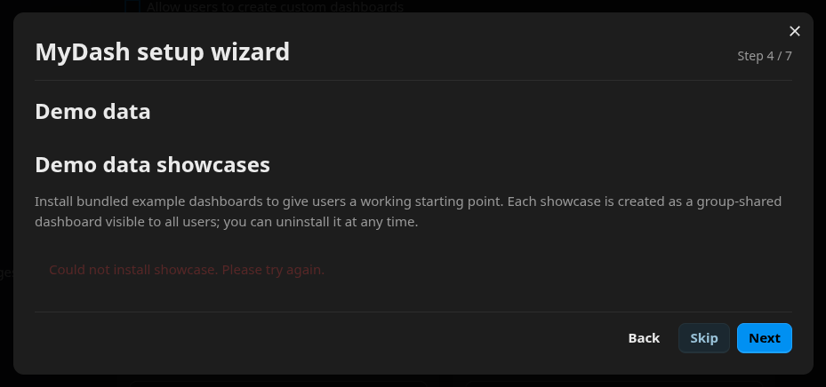
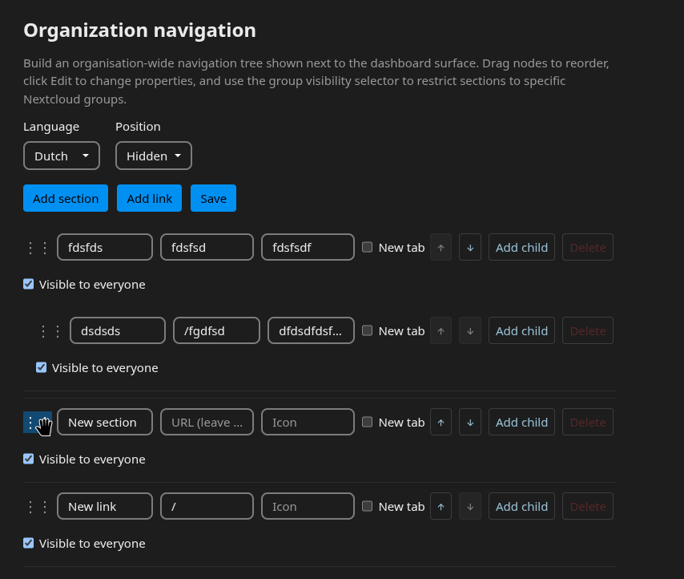

# MyDash issue log

Running tracker of issues found in the **mydash** app. Lightweight on purpose: each entry records that the issue exists, where (symptom, request, error, rough area), and — when the evidence supports it — what the bug is. No proposed fixes.

> **Testing blocked:** further testing of the app is currently not possible — the issues below (notably the admin-settings write failures in MD-001) block progressing past setup and admin configuration.

---

## MD-001 — Every admin-settings write fails (datetime format)

- **App:** mydash
- **Status:** Open
- **Reported:** 2026-05-27

Persisting any admin setting fails. All these writes go through `AdminSettingMapper::setSetting()` into `oc_mydash_admin_settings`, and all fail the same way — the `updated_at` column is given an ISO-8601 / RFC3339 datetime string (the form produced by `DateTime::format('c')` / `DateTime::ATOM`, e.g. `2026-05-27T11:34:26+00:00`), while the MySQL/MariaDB `DATETIME` column only accepts `Y-m-d H:i:s` (no `T` separator, no timezone offset). So the timestamp is written in a shape the column type can't store and the write throws SQLSTATE 22007 / code 1292.

The stack trace from the wizard's final step shows the failing query is an `INSERT` (`QBMapper->insert()` from `AdminSettingMapper::setSetting()`), so on a fresh install the rows don't exist yet and `updated_at` is being formatted wrongly on the insert path by the mapper/entity itself — not derived from the request.

This surfaces in two ways depending on the endpoint. Most endpoints let the `DbalException` bubble up as a raw **500** (the setup-wizard steps and the org-navigation position). The admin settings page (`PUT /api/admin/settings`) catches it in `ResponseHelper::error()` and returns a sanitized **400 `{"error":"Operation failed"}`** (per ADR-005 the real exception is hidden from the client and only written to the server log) — so it looks different but is the same underlying defect.

Not every admin write is broken: saving the language under "Organization navigation" works, while saving the position on the same screen 500s. So the defect is specific to writes that run through `AdminSettingMapper::setSetting()` / the `AdminSetting` entity; whatever path persists the language sidesteps it.

### Setup wizard endpoints (raw 500)

Step 2 — storage selection:

```http
POST https://nextcloud.test/index.php/apps/mydash/api/admin/setup-wizard/storage
```

```json
{"storage": "database"}
```

Step 3 — group activation:

```http
POST https://nextcloud.test/index.php/apps/mydash/api/admin/groups
```

```json
{"groups":["admin"]}
```

Final step — "All set" / Finish (no payload):

```http
POST https://nextcloud.test/index.php/apps/mydash/api/admin/setup-wizard/complete
```

Representative error (identical across all three, only the timestamp differs):

```
Type: OC\DB\Exceptions\DbalException
Code: 1292
Message: An exception occurred while executing a query: SQLSTATE[22007]: Invalid datetime format: 1292 Incorrect datetime value: '2026-05-27T10:16:28+00:00' for column `nextcloud`.`oc_mydash_admin_settings`.`updated_at` at row 1
File: /var/www/html/lib/private/DB/Exceptions/DbalException.php
Line: 50
```

### Organization navigation — position (raw 500)

`PUT /api/admin/org-navigation/position` fails for every position value (not just `left`). Saving the language on the same screen works (see note above).

```http
PUT https://nextcloud.test/index.php/apps/mydash/api/admin/org-navigation/position
```

```json
{"position": "left"}
```

### Admin settings page (sanitized 400)

`PUT /api/admin/settings` updates the four general settings ("Default permission level", "Allow users to create custom dashboards", "Allow users to have multiple dashboards", "Default grid columns"). `AdminSettingsService::updateSettings()` calls `setSetting()` once per supplied field, so the first field hitting the bad write throws — changing any one of the four fails identically.

```http
PUT https://nextcloud.test/index.php/apps/mydash/api/admin/settings
```

```json
{
    "defaultPermLevel": "full",
    "allowUserDash": false,
    "allowMultiDash": true,
    "defaultGridCols": 12
}
```

```json
{"error": "Operation failed"}
```

Rough area: admin settings persistence — `lib/Db/AdminSettingMapper.php` (and the `AdminSetting` entity's `updated_at` handling), reached from `lib/Service/AdminSettingsService.php` and `lib/Service/SetupWizardService.php`.

---

## MD-002 — Setup wizard step 4 showcase images 404

- **App:** mydash
- **Status:** Open
- **Reported:** 2026-05-27

On step 4 the wizard requests showcase preview images and they all 404, leaving the showcase cards without images. The image files do exist in the app at `img/showcases/` (e.g. `de-bron.png`, `de-linden.png`, `gemeente-duin.png`, `horizon-labs.png`, `van-der-berg.png`), so the requested URL path does not match how the assets are served.

```http
GET https://nextcloud.test/apps/mydash/img/showcases/de-bron.png
```

Rough area: showcase image URL generation in the wizard frontend vs. the app's served asset path.

---

## MD-003 — Demo showcase install returns 500

- **App:** mydash
- **Status:** Open
- **Reported:** 2026-05-27

On step 4, pressing install on a showcase posts to the install endpoint and the backend returns a 500 with `Showcase installation failed`. The bundled showcase data is present in the app at `data/demo-showcases/de-bron/de-bron.zip`.

```http
POST https://nextcloud.test/index.php/apps/mydash/api/admin/demo-showcases/de-bron/install?lang=nl
```

```json
{"error":"Showcase installation failed"}
```

Rough area: `lib/Controller/AdminDemoShowcasesController.php`, `lib/Service/DemoShowcasesService.php`.

---

## MD-004 — Showcase install failure replaces the install cards (no retry possible)

- **App:** mydash
- **Status:** Open
- **Reported:** 2026-05-27

When a showcase install fails (see MD-003), the wizard replaces all of the install cards with a single message: *"Could not install showcase. Please try again."* Because the cards are gone, there is no way to actually retry from that screen despite the message asking the user to.



Rough area: error-state rendering in the setup wizard frontend (demo data / showcases step).

---

## MD-005 — Organization navigation drag handle looks draggable but isn't

- **App:** mydash
- **Status:** Open
- **Reported:** 2026-05-27

The Organization navigation editor (admin settings) lets you build a nested tree of sections, links and children to any depth. That part works correctly — items can be created, customized, and saved without issues. The only problem is the reorder affordance: each row shows a `::` drag handle on the left and the cursor changes to a grab hand over it, signalling drag-to-reorder. Dragging does nothing — the row can't be moved and the `::` just gets selected as text.

This is a false affordance rather than a broken feature: drag-and-drop was never implemented. The handle (`.org-nav-row__handle` in `OrgNavigationEditorRow.vue`) is styled `cursor: grab` but carries no `draggable` attribute or drag listeners, so the browser falls back to selecting the glyph as text. Comments in `OrgNavigationEditor.vue` confirm reordering is intended to go through the up/down buttons (REQ-ONAV-007) with drag-and-drop deferred to a future change, yet the grab cursor and the panel's "Drag nodes to reorder" help text still advertise a capability that isn't there.



Rough area: `src/components/admin/OrgNavigationEditorRow.vue` (handle styling), `src/components/admin/OrgNavigationEditor.vue` (help text / reorder model).
