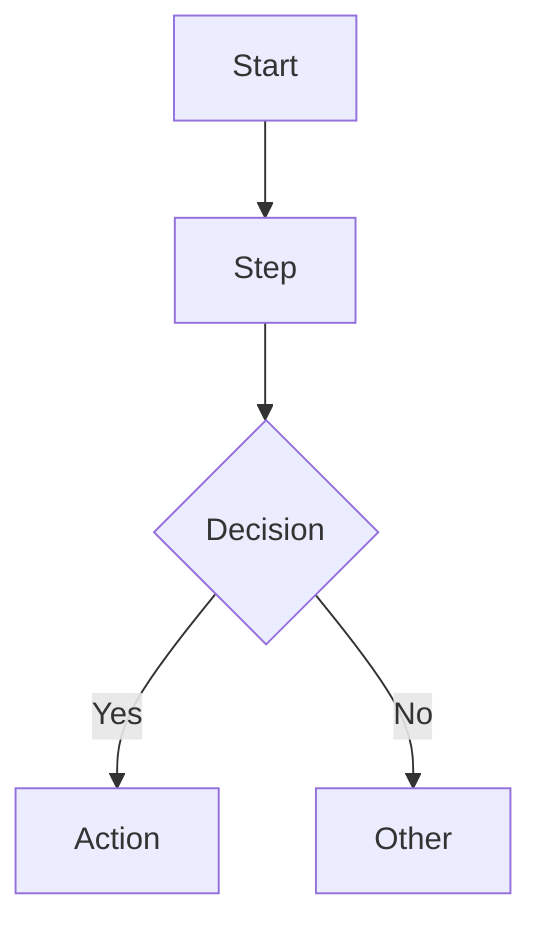

# Competitive Analysis — Execution Plan

## Goal

Deep-dive analysis of 27 open-source competitors across 3 products (Procest, Pipelinq, OpenRegister). For each competitor, produce detailed OpenSpec-format feature specs stored in `concurrentie-analyse/` (kept separate from app repos to avoid leaking sensitive data like screenshots into committed code).

## Competitors

### Procest (8 competitors)

| # | Competitor | Codebase | Notes |
|---|-----------|----------|-------|
| 1 | OpenZaak | https://github.com/open-zaak/open-zaak | Maykin Media — ZGW reference implementation |
| 2 | Valtimo (GZAC) | https://github.com/valtimo-platform | Ritense — process automation on Camunda 7 |
| 3 | Dimpact ZAC | https://github.com/infonl/dimpact-zaakafhandelcomponent + https://gitlab.com/zaaksysteem/zaaksysteem | Cooperative-driven zaakafhandelcomponent |
| 4 | xxllnc Zaken | https://gitlab.com/xxllnc/zaakgericht/zaken/start | SaaS zaaksysteem with process builder |
| 5 | CaseFabric (Cafienne) | https://github.com/cafienne | 100% CMMN 1.1 compliant |
| 6 | ArkCase | https://github.com/ArkCase/ArkCase | US government case management |
| 7 | Flowable | https://github.com/flowable/flowable-engine | BPMN/CMMN/DMN engine |
| 8 | Open Formulieren | https://github.com/open-formulieren/open-forms | Maykin Media — smart e-forms / case intake |

### Pipelinq (9 competitors)

| # | Competitor | Codebase | Notes |
|---|-----------|----------|-------|
| 1 | Twenty | https://github.com/twentyhq/twenty | Modern open-source CRM |
| 2 | EspoCRM | https://github.com/espocrm/espocrm | Lightweight self-hosted CRM |
| 3 | Krayin | https://github.com/krayin/laravel-crm | Laravel-based CRM |
| 4 | Monica | https://github.com/monicahq/monica | Personal relationship management |
| 5 | KISS | https://github.com/Klantinteractie-Servicesysteem | Dutch government klantinteractie |
| 6 | BottleCRM | https://github.com/MicroPyramid/Django-CRM | Lightweight pipeline CRM |
| 7 | Erxes | https://github.com/erxes/erxes | Open-source XOS (CRM + marketing) |
| 8 | Open Klant | https://github.com/maykinmedia/open-klant | Maykin Media — VNG Klantinteracties API |
| 9 | Open VTB | https://github.com/maykinmedia/open-vtb | Maykin Media — Verzoeken, Taken en Berichten |

### OpenRegister (10 competitors)

| # | Competitor | Codebase | Notes |
|---|-----------|----------|-------|
| 1 | Directus | https://github.com/directus/directus | SQL wrapper with REST/GraphQL APIs |
| 2 | Strapi | https://github.com/strapi/strapi | Schema-driven headless CMS |
| 3 | NocoDB | https://github.com/nocodb/nocodb | No-code database with auto APIs |
| 4 | Baserow | https://github.com/baserow/baserow | Open-source Airtable alternative |
| 5 | NocoBase | https://github.com/nocobase/nocobase | Low-code platform with data modeling |
| 6 | PocketBase | https://github.com/pocketbase/pocketbase | Lightweight single-binary backend |
| 7 | CKAN | https://github.com/ckan/ckan | Government open data platform |
| 8 | Objects API + Objecttypes API | https://github.com/maykinmedia/objects-api + https://github.com/maykinmedia/objecttypes-api | Maykin Media — schema-driven object storage (nearly 1:1 with OpenRegister) |
| 9 | Open Beheer | https://github.com/maykinmedia/open-beheer | Maykin Media — unified admin across registrations |
| 10 | Open Product | https://github.com/maykinmedia/open-product | Maykin Media — product type/instance registry |

---

## Output Structure

All output stays in `concurrentie-analyse/` — **not** in the app repos. This keeps sensitive data (screenshots, scraped docs, cloned code analysis) separate from committed application code.

```
concurrentie-analyse/
├── procest/
│   ├── concurrentie-analyse.md          # Overview with all competitors
│   ├── openzaak/
│   │   ├── openzaak.md                  # Summary (already exists)
│   │   ├── overview.md                  # Architecture, tech stack, deep-dive summary
│   │   ├── specs/
│   │   │   ├── {feature-1}/spec.md      # OpenSpec format per feature
│   │   │   ├── {feature-2}/spec.md
│   │   │   └── ...
│   │   ├── business-logic/
│   │   │   ├── {flow-1}.md              # Mermaid diagrams of business logic flows
│   │   │   └── ...
│   │   ├── docs/
│   │   │   ├── {document}.pdf           # Downloaded PDFs (whitepapers, guides, API docs)
│   │   │   ├── {document}.md            # Scraped online documentation converted to markdown
│   │   │   └── ...
│   │   └── screenshots/
│   │       ├── {page-name}.png          # UI screenshots from browser walkthrough
│   │       └── ...
│   ├── valtimo/
│   │   └── ...
│   └── ...
├── pipelinq/
│   ├── concurrentie-analyse.md
│   ├── twenty/
│   │   ├── twenty.md
│   │   ├── overview.md
│   │   ├── specs/
│   │   │   ├── contact-management/spec.md
│   │   │   ├── deal-pipeline/spec.md
│   │   │   └── ...
│   │   ├── business-logic/
│   │   │   ├── lead-to-deal-flow.md
│   │   │   └── ...
│   │   └── screenshots/
│   │       ├── dashboard.png
│   │       ├── contacts-list.png
│   │       └── ...
│   └── ...
└── openregister/
    ├── concurrentie-analyse.md
    ├── directus/
    │   └── ...
    └── ...
```

## Spec Format (OpenSpec)

Each `spec.md` follows the project's OpenSpec format:

```markdown
---
status: draft
source: competitive-analysis
competitor: {competitor-name}
analyzed_date: 2026-03-11
---

# {Feature Name} — {Competitor Name}

## Purpose

Competitive analysis spec documenting how {Competitor} implements {feature}.

- **Product**: {competitor name} {version}
- **Category**: {feature category}
- **Relevance to {our product}**: {why this matters for our roadmap}

## Architecture Overview

{ASCII diagram or description of how this feature is architected}

## Data Model

| Entity/Field | Type | Description |
|-------------|------|-------------|
| ... | ... | ... |

## Business Logic

{Mermaid diagram of the main flow}



## Requirements (as observed)

### REQ-CA-001: {Requirement Title}

**Implementation**: {How the competitor implements this}

#### Scenario CA-001a: {Scenario title}

- GIVEN {context}
- WHEN {action}
- THEN {outcome}

## UI Reference

Screenshots: `../screenshots/{page}.png`

{Description of UI patterns, form layouts, interaction patterns}

## Comparison Notes

| Aspect | {Competitor} | {Our Product} |
|--------|-------------|---------------|
| ... | ... | ... |
```

---

## Execution Method

### Per competitor: 3 parallel agents

Each competitor is analyzed by launching **3 sub-agents simultaneously**:

#### Agent 1: Codebase Analysis

**Tools**: Git clone, Read, Grep, Glob

1. Clone the repository into a temporary directory
2. Map the project structure (frameworks, languages, directory layout)
3. Walk through **every file** systematically:
   - **Data models / schemas** — entities, fields, types, relations, migrations
   - **API routes / controllers** — endpoints, HTTP methods, request/response shapes
   - **Services / business logic** — workflows, state machines, validation rules, calculations
   - **Frontend components** — pages, forms, tables, modals, navigation structure
   - **Configuration** — permissions, roles, feature flags, environment variables
   - **Tests** — what's tested reveals what's important
4. For each distinct feature discovered, create a spec in OpenSpec format
5. Create Mermaid diagrams for every business logic flow found
6. Write the overview.md with architecture summary

#### Agent 2: Documentation Analysis

**Tools**: WebFetch, WebSearch, Read

1. Fetch the project's documentation site (README, docs/, wiki, official docs URL)
2. **Check for Read the Docs** — search for `{project}.readthedocs.io` or similar hosted docs; crawl and save all pages as markdown to `docs/`
3. Fetch API documentation (OpenAPI/Swagger specs if available)
4. Fetch changelogs / release notes for feature history
5. **Download and save any PDFs found** (whitepapers, architecture guides, API references, user manuals) to `docs/` directory
6. **Save key online documentation pages** as markdown to `docs/` directory for offline reference
6. Cross-reference with codebase agent's findings
7. Enrich specs with:
   - Official feature descriptions and intended behavior
   - API reference details (auth, pagination, filtering, error codes)
   - Configuration options and deployment architecture
   - Roadmap items / planned features
8. Add any features documented but not yet found in code

#### Agent 3: Browser Walkthrough

**Tools**: Docker (Bash), Browser MCP (browser-2..5,7)

1. Set up the application via Docker:
   - Use the competitor's `docker-compose.yml` or official Docker image
   - Create on an isolated Docker network
   - Map to an available port (9001+)
2. Navigate through **every page** of the application:
   - Take screenshots of every distinct view
   - Document every form (fields, validation, submit behavior)
   - Document every table/list (columns, sorting, filtering, pagination)
   - Document every button and action (what it does, confirmation dialogs, side effects)
   - Document navigation structure (sidebar, menus, breadcrumbs)
   - Document modals, drawers, popups
3. Test key workflows end-to-end:
   - Create, read, update, delete operations
   - Search and filtering
   - Permission/role differences (if possible with different users)
   - Import/export functionality
4. Save screenshots to `screenshots/` directory
5. Write UI observations into relevant spec files

### Execution Order

Run competitors **one at a time**, all 3 agents in parallel per competitor.

**Round 1 — Procest competitors (8):**
1. OpenZaak
2. Valtimo (GZAC)
3. Dimpact ZAC
4. xxllnc Zaken
5. CaseFabric (Cafienne)
6. ArkCase
7. Flowable
8. Open Formulieren

**Round 2 — Pipelinq competitors (9):**
9. Twenty
10. EspoCRM
11. Krayin
12. Monica
13. KISS
14. BottleCRM
15. Erxes
16. Open Klant
17. Open VTB

**Round 3 — OpenRegister competitors (10):**
18. Directus
19. Strapi
20. NocoDB
21. Baserow
22. NocoBase
23. PocketBase
24. CKAN
25. Objects API + Objecttypes API
26. Open Beheer
27. Open Product

### Post-analysis per competitor

After the 3 agents complete for a competitor:
1. **Merge findings** — cross-reference code, docs, and UI discoveries
2. **Gap analysis** — identify features the competitor has that we don't
3. **Update the competitor summary** — enrich the existing competitor markdown with deep-dive findings
4. **Clean up Docker** — stop and remove the competitor's containers
5. **Clean up cloned repo** — remove the temporary clone

### Post-analysis per product

After all 7 competitors for a product are done:
1. **Cross-competitor comparison** — which features appear across multiple competitors
2. **Feature priority matrix** — map competitor features to our roadmap relevance
3. **Summary report** — overall competitive positioning in `concurrentie-analyse/{app}/summary.md`

---

## Resource Requirements

- **Disk**: ~2-10 GB per cloned repo (temporary), screenshots ~50-200 MB per competitor
- **Docker**: One competitor container at a time, ports 9001+
- **Browser**: Agents use browser-2 through browser-5 and browser-7 (headless)
- **Time estimate**: ~30-60 minutes per competitor (3 agents parallel), ~15-25 hours total for 27 competitors

## Risks and Mitigations

| Risk | Mitigation |
|------|-----------|
| Large codebases (Flowable, Strapi) overwhelm context | Analyze directory-by-directory, multiple agent passes |
| Docker setup fails for a competitor | Fall back to documentation + code-only analysis, skip browser |
| GitLab repos require auth | Use public access, fall back to code-only if gated |
| Screenshots directory gets large | Compress PNGs, only keep distinct views |
| Some competitors have monorepo structure | Focus on relevant packages/modules only |

---

## Progress Tracker

Update this section as each competitor is completed. Mark with date when done.

### Round 1 — Procest

| # | Competitor | Initial Research | Codebase Analysis | Docs Analysis | Browser Walkthrough | Merged |
|---|-----------|:---:|:---:|:---:|:---:|:---:|
| 1 | OpenZaak | done | 2026-03-13 | 2026-03-13 | 2026-03-13 | 2026-03-13 |
| 2 | Valtimo (GZAC) | done | 2026-03-13 | 2026-03-13 | 2026-03-13 | 2026-03-13 |
| 3 | Dimpact ZAC | done | - | - | - | - |
| 4 | xxllnc Zaken | done | - | - | - | - |
| 5 | CaseFabric (Cafienne) | done | - | - | - | - |
| 6 | ArkCase | done | - | - | - | - |
| 7 | Flowable | done | - | - | - | - |
| 8 | Open Formulieren | done | 2026-03-13 | 2026-03-13 | 2026-03-13 | 2026-03-13 |

### Round 2 — Pipelinq

| # | Competitor | Initial Research | Codebase Analysis | Docs Analysis | Browser Walkthrough | Merged |
|---|-----------|:---:|:---:|:---:|:---:|:---:|
| 9 | Twenty | done | - | - | - | - |
| 10 | EspoCRM | done | - | - | - | - |
| 11 | Krayin | done | - | - | - | - |
| 12 | Monica | done | - | - | - | - |
| 13 | KISS | done | 2026-03-13 | 2026-03-13 | 2026-03-13 | 2026-03-13 |
| 14 | BottleCRM | done | - | - | - | - |
| 15 | Erxes | done | - | - | - | - |
| 16 | Open Klant | done | 2026-03-13 | 2026-03-13 | 2026-03-13 | 2026-03-13 |
| 17 | Open VTB | done | 2026-03-13 | 2026-03-13 | 2026-03-13 | 2026-03-13 |

### Round 3 — OpenRegister

| # | Competitor | Initial Research | Codebase Analysis | Docs Analysis | Browser Walkthrough | Merged |
|---|-----------|:---:|:---:|:---:|:---:|:---:|
| 18 | Directus | done | - | - | - | - |
| 19 | Strapi | done | - | - | - | - |
| 20 | NocoDB | done | - | - | - | - |
| 21 | Baserow | done | - | - | - | - |
| 22 | NocoBase | done | - | - | - | - |
| 23 | PocketBase | done | - | - | - | - |
| 24 | CKAN | done | - | - | - | - |
| 25 | Objects API | done | 2026-03-12 | 2026-03-12 | 2026-03-12 | 2026-03-12 |
| 26 | Open Beheer | done | 2026-03-13 | 2026-03-13 | 2026-03-13 | 2026-03-13 |
| 27 | Open Product | done | 2026-03-13 | 2026-03-13 | 2026-03-13 | 2026-03-13 |

---

## How to Resume

In a new Claude Code session, say:

```
Read concurrentie-analyse/PLAN.md and continue the competitive analysis from where we left off. Check the Progress Tracker to see which competitor is next, then execute the 3-agent analysis (codebase + docs + browser) for that competitor.
```

The plan is fully self-contained:
- **Competitor list** — section "Competitors" has all 27 with codebase URLs
- **Output structure** — section "Output Structure" shows the folder layout
- **Spec format** — section "Spec Format" has the OpenSpec template
- **Agent instructions** — section "Execution Method" has detailed instructions for all 3 agents
- **Progress** — section "Progress Tracker" shows what's done and what's next
- **Post-analysis steps** — sections on merging, gap analysis, and cross-competitor comparison
