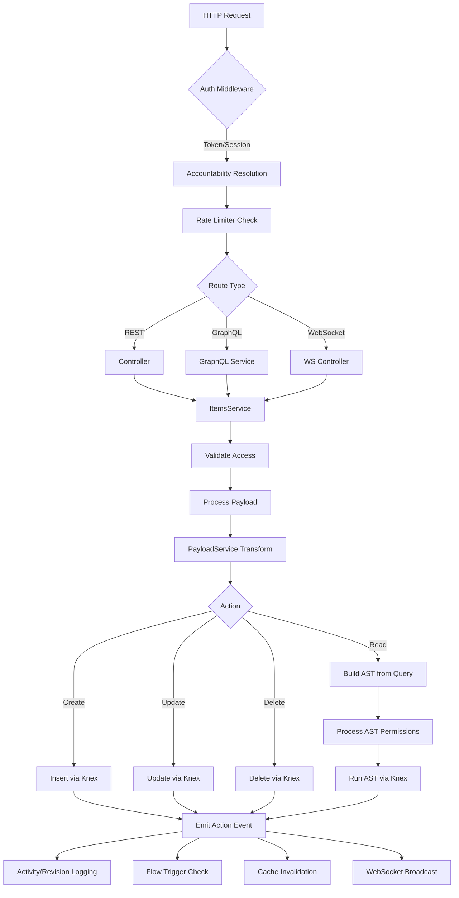
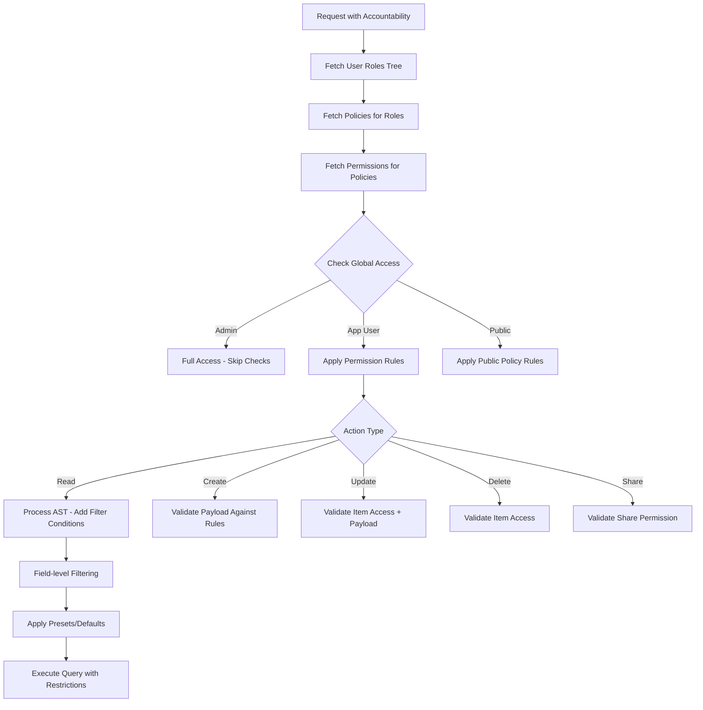
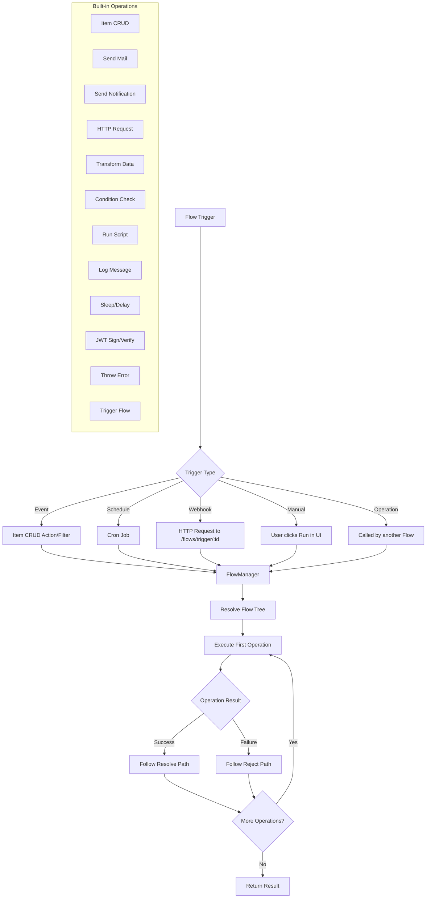
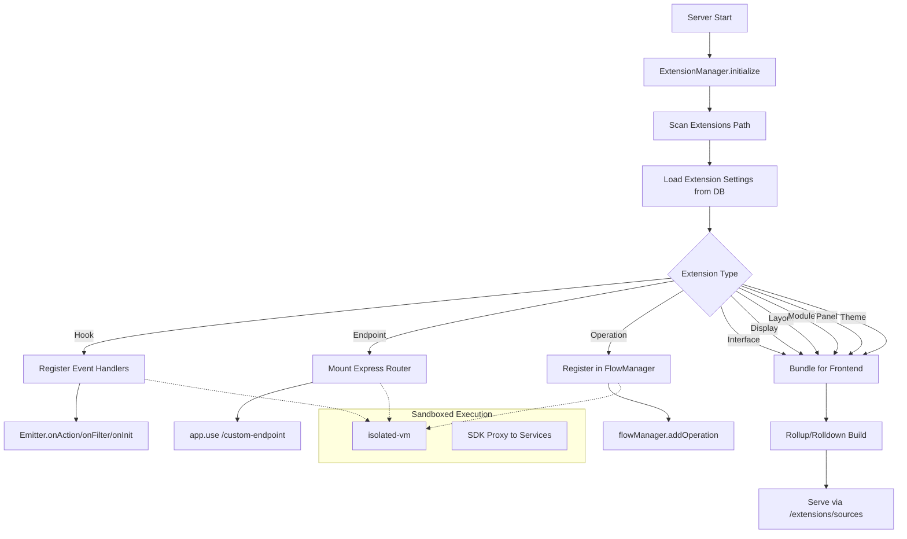
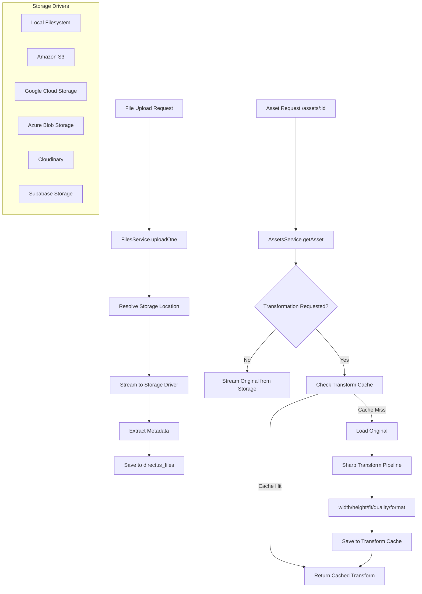
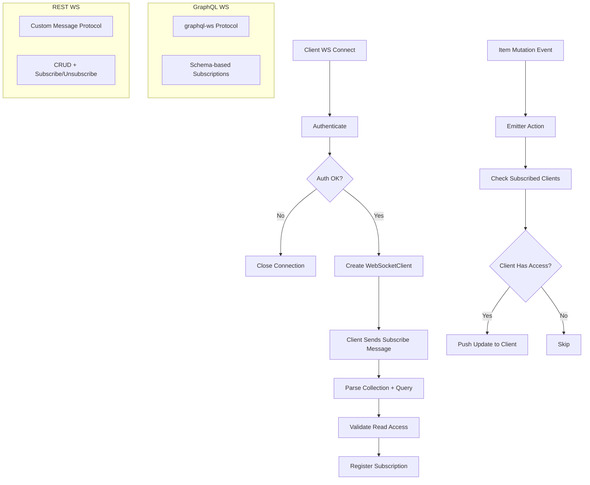
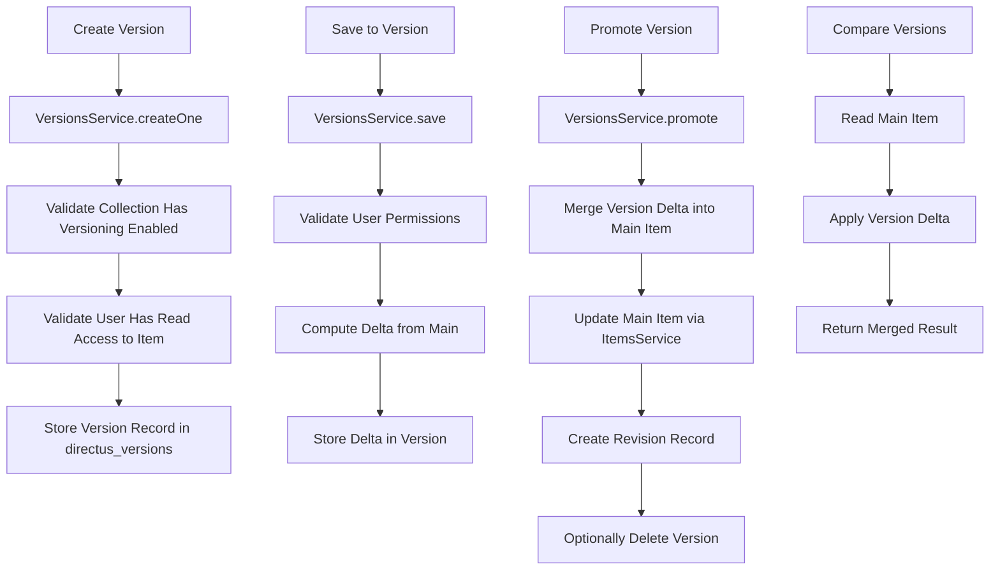

# Directus - Business Logic Flows

## Request Processing Pipeline

## Permission Resolution Flow

## Flows Automation Engine

## Extension Loading Pipeline

## File Upload and Asset Transformation Flow

## WebSocket Subscription Flow

## Content Versioning Flow

