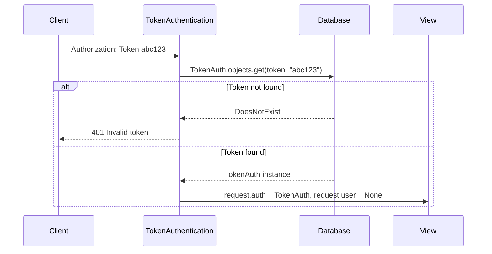
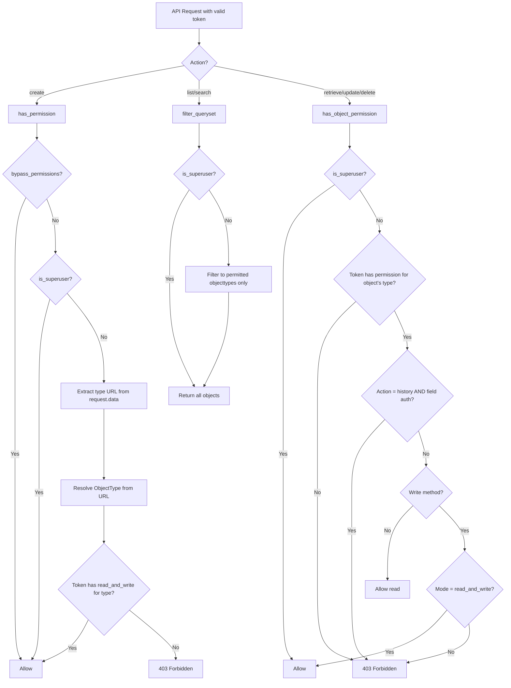
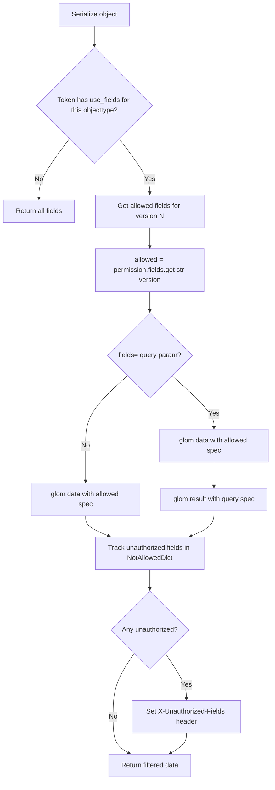

# Authorization Flow

## Token Authentication

```mermaid
sequenceDiagram
    participant C as Client
    participant A as TokenAuthentication
    participant DB as Database
    participant V as View

    C->>A: Authorization: Token abc123
    A->>DB: TokenAuth.objects.get(token="abc123")
    alt Token not found
        DB-->>A: DoesNotExist
        A-->>C: 401 Invalid token
    else Token found
        DB-->>A: TokenAuth instance
        A->>V: request.auth = TokenAuth, request.user = None
    end
```

## Object Permission Check

```mermaid
flowchart TD
    A[API Request with valid token] --> B{Action?}
    B -->|create| C[has_permission]
    B -->|list/search| D[filter_queryset]
    B -->|retrieve/update/delete| E[has_object_permission]

    C --> C1{bypass_permissions?}
    C1 -->|Yes| C2[Allow]
    C1 -->|No| C3{is_superuser?}
    C3 -->|Yes| C2
    C3 -->|No| C4[Extract type URL from request.data]
    C4 --> C5[Resolve ObjectType from URL]
    C5 --> C6{Token has read_and_write for type?}
    C6 -->|Yes| C2
    C6 -->|No| C7[403 Forbidden]

    D --> D1{is_superuser?}
    D1 -->|Yes| D2[Return all objects]
    D1 -->|No| D3[Filter to permitted objecttypes only]
    D3 --> D2

    E --> E1{is_superuser?}
    E1 -->|Yes| E2[Allow]
    E1 -->|No| E3{Token has permission for object's type?}
    E3 -->|No| E4[403 Forbidden]
    E3 -->|Yes| E5{Action = history AND field auth?}
    E5 -->|Yes| E4
    E5 -->|No| E6{Write method?}
    E6 -->|No| E7[Allow read]
    E6 -->|Yes| E8{Mode = read_and_write?}
    E8 -->|Yes| E2
    E8 -->|No| E4
```

## Field-Level Authorization

```mermaid
flowchart TD
    A[Serialize object] --> B{Token has use_fields for this objecttype?}
    B -->|No| C[Return all fields]
    B -->|Yes| D[Get allowed fields for version N]
    D --> E[allowed = permission.fields.get str version]
    E --> F{fields= query param?}
    F -->|No| G[glom data with allowed spec]
    F -->|Yes| H[glom data with allowed spec]
    H --> I[glom result with query spec]
    G --> J[Track unauthorized fields in NotAllowedDict]
    I --> J
    J --> K{Any unauthorized?}
    K -->|Yes| L[Set X-Unauthorized-Fields header]
    K -->|No| M[Return filtered data]
    L --> M
```
