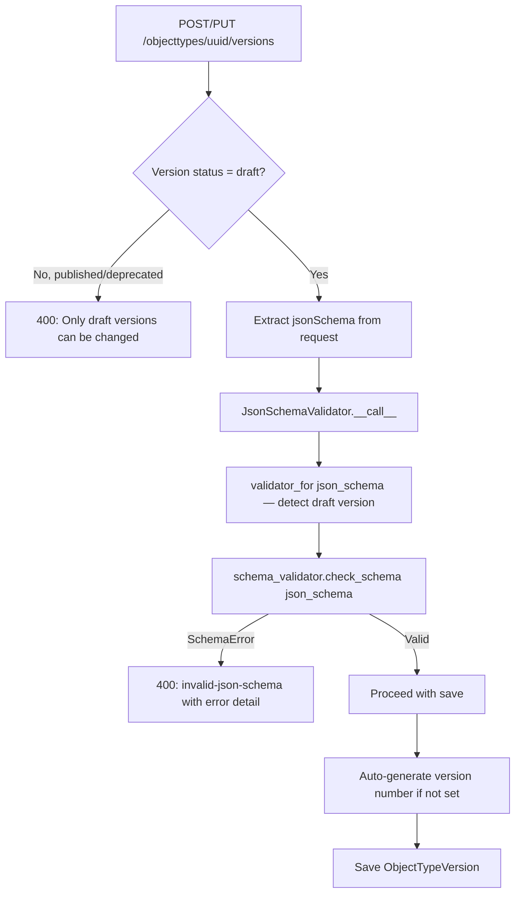
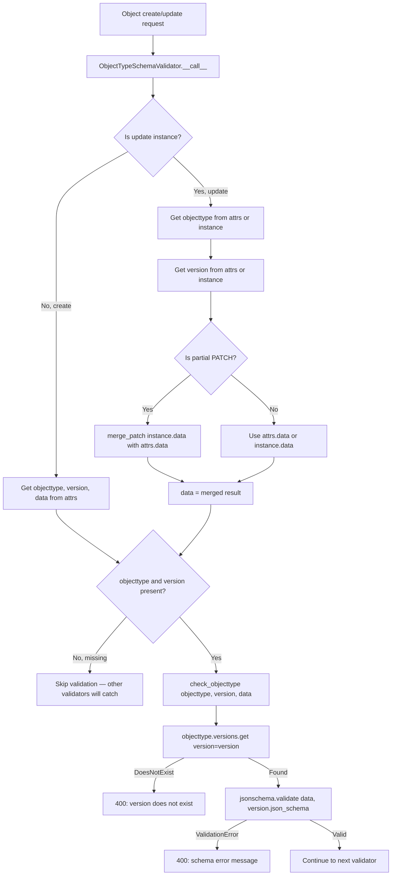
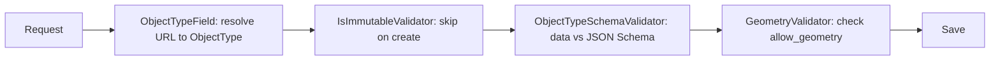

# JSON Schema Validation Flow

## Schema Meta-Validation (on ObjectTypeVersion save)

```mermaid
flowchart TD
    A[POST/PUT /objecttypes/uuid/versions] --> B{Version status = draft?}
    B -->|No, published/deprecated| C[400: Only draft versions can be changed]
    B -->|Yes| D[Extract jsonSchema from request]
    D --> E[JsonSchemaValidator.__call__]
    E --> F[validator_for json_schema — detect draft version]
    F --> G[schema_validator.check_schema json_schema]
    G -->|SchemaError| H[400: invalid-json-schema with error detail]
    G -->|Valid| I[Proceed with save]
    I --> J[Auto-generate version number if not set]
    J --> K[Save ObjectTypeVersion]
```

## Object Data Validation (on Object create/update)

```mermaid
flowchart TD
    A[Object create/update request] --> B[ObjectTypeSchemaValidator.__call__]
    B --> C{Is update instance?}
    C -->|No, create| D[Get objecttype, version, data from attrs]
    C -->|Yes, update| E[Get objecttype from attrs or instance]
    E --> F[Get version from attrs or instance]
    F --> G{Is partial PATCH?}
    G -->|Yes| H[merge_patch instance.data with attrs.data]
    G -->|No| I[Use attrs.data or instance.data]
    H --> J[data = merged result]
    I --> J
    D --> K{objecttype and version present?}
    J --> K
    K -->|No, missing| L[Skip validation — other validators will catch]
    K -->|Yes| M[check_objecttype objecttype, version, data]
    M --> N[objecttype.versions.get version=version]
    N -->|DoesNotExist| O[400: version does not exist]
    N -->|Found| P[jsonschema.validate data, version.json_schema]
    P -->|ValidationError| Q[400: schema error message]
    P -->|Valid| R[Continue to next validator]
```

## Validation Chain for Object Create

```mermaid
flowchart LR
    A[Request] --> B[ObjectTypeField: resolve URL to ObjectType]
    B --> C[IsImmutableValidator: skip on create]
    C --> D[ObjectTypeSchemaValidator: data vs JSON Schema]
    D --> E[GeometryValidator: check allow_geometry]
    E --> F[Save]
```
