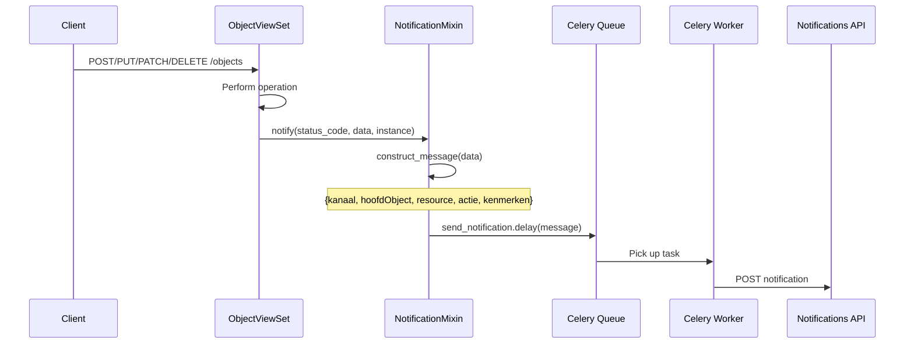
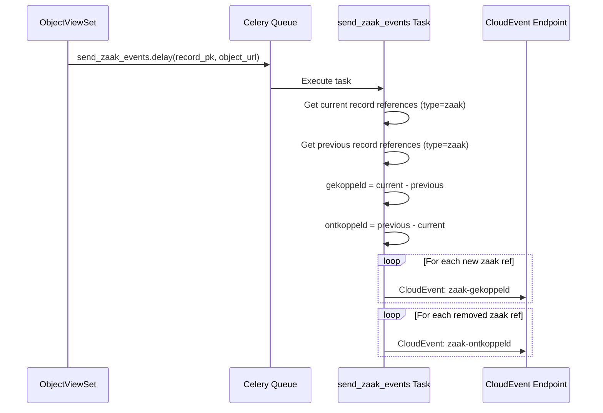
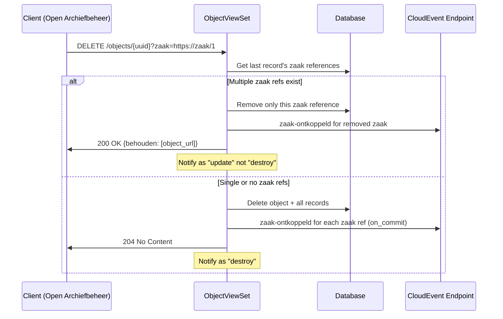

# Notification & Cloud Event Flow

## Standard Notification Flow

```mermaid
sequenceDiagram
    participant C as Client
    participant V as ObjectViewSet
    participant M as NotificationMixin
    participant Q as Celery Queue
    participant W as Celery Worker
    participant N as Notifications API

    C->>V: POST/PUT/PATCH/DELETE /objects
    V->>V: Perform operation
    V->>M: notify(status_code, data, instance)
    M->>M: construct_message(data)
    Note over M: {kanaal, hoofdObject, resource, actie, kenmerken}
    M->>Q: send_notification.delay(message)
    Q->>W: Pick up task
    W->>N: POST notification
```

## Cloud Events Flow (Zaak References)

```mermaid
sequenceDiagram
    participant V as ObjectViewSet
    participant Q as Celery Queue
    participant T as send_zaak_events Task
    participant CE as CloudEvent Endpoint

    V->>Q: send_zaak_events.delay(record_pk, object_url)
    Q->>T: Execute task
    T->>T: Get current record references (type=zaak)
    T->>T: Get previous record references (type=zaak)
    T->>T: gekoppeld = current - previous
    T->>T: ontkoppeld = previous - current

    loop For each new zaak ref
        T->>CE: CloudEvent: zaak-gekoppeld
    end

    loop For each removed zaak ref
        T->>CE: CloudEvent: zaak-ontkoppeld
    end
```

## Delete with Archiving (Multi-Zaak)

```mermaid
sequenceDiagram
    participant C as Client (Open Archiefbeheer)
    participant V as ObjectViewSet
    participant DB as Database
    participant CE as CloudEvent Endpoint

    C->>V: DELETE /objects/{uuid}?zaak=https://zaak/1
    V->>DB: Get last record's zaak references
    
    alt Multiple zaak refs exist
        V->>DB: Remove only this zaak reference
        V->>CE: zaak-ontkoppeld for removed zaak
        V->>C: 200 OK {behouden: [object_url]}
        Note over V: Notify as "update" not "destroy"
    else Single or no zaak refs
        V->>DB: Delete object + all records
        V->>CE: zaak-ontkoppeld for each zaak ref (on_commit)
        V->>C: 204 No Content
        Note over V: Notify as "destroy"
    end
```
