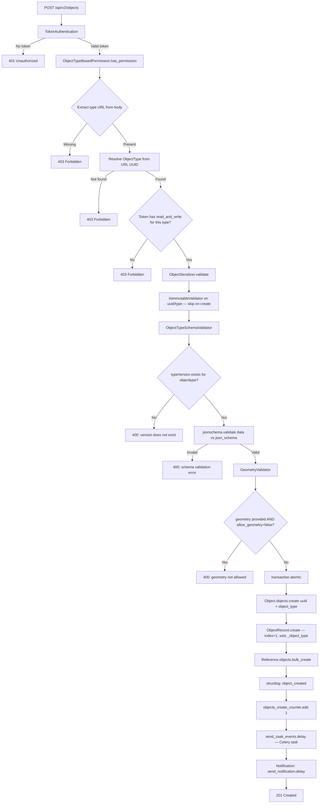
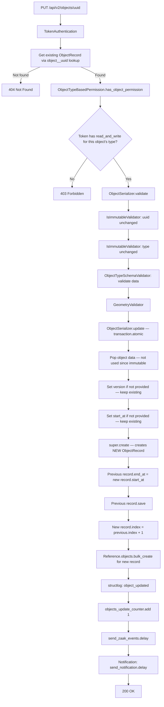
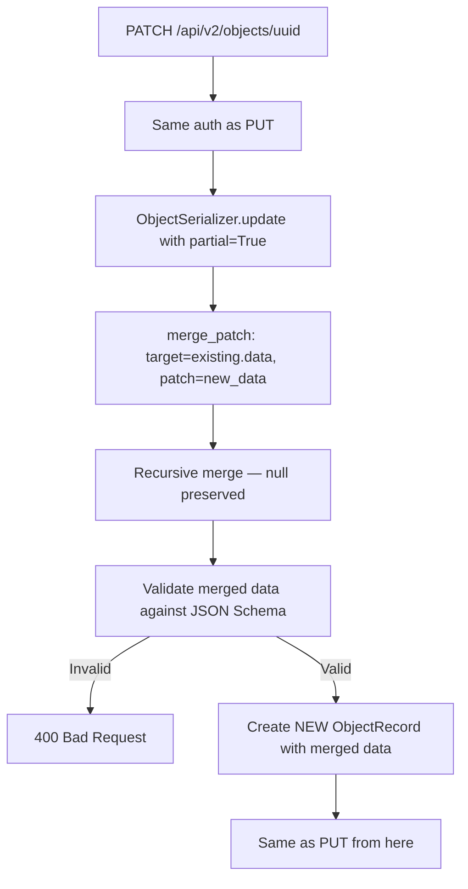
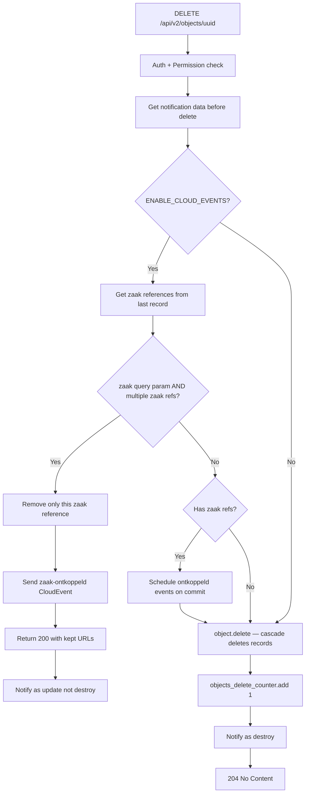
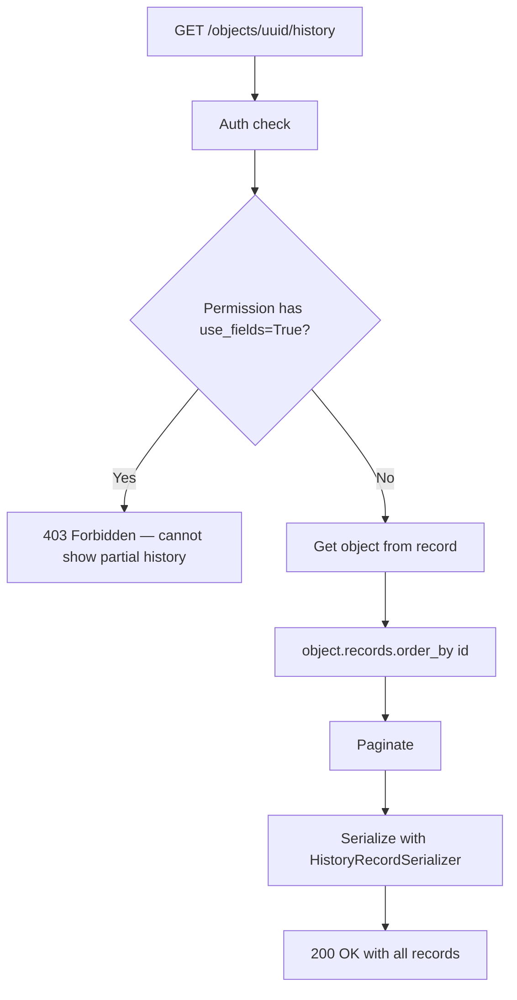

# Object CRUD Lifecycle — Business Logic Diagrams

## Complete Object Create Flow

## Complete Object Update Flow (PUT)

## Complete Object Update Flow (PATCH — Merge Patch)

## Delete Flow (with Cloud Events)

## History Retrieval

