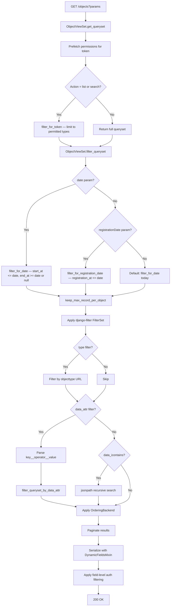
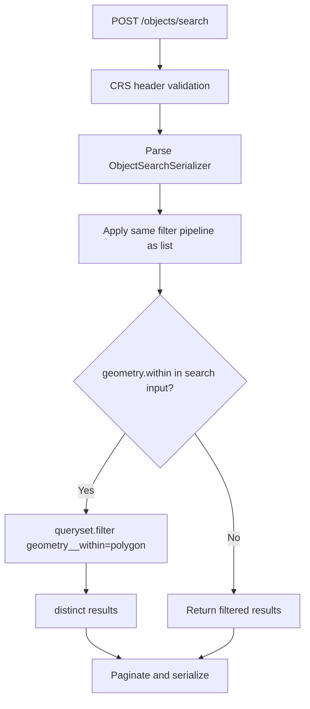
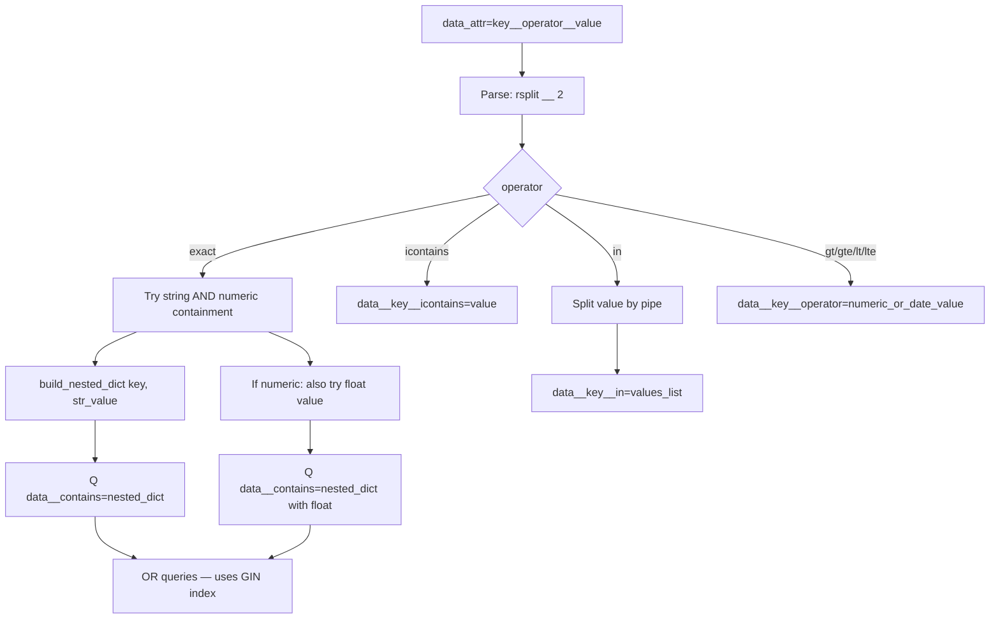

# Search & Filter Flow

## Object List Query Pipeline

```mermaid
flowchart TD
    A[GET /objects?params] --> B[ObjectViewSet.get_queryset]
    B --> C[Prefetch permissions for token]
    C --> D{Action = list or search?}
    D -->|Yes| E[filter_for_token — limit to permitted types]
    D -->|No| F[Return full queryset]
    E --> G[ObjectViewSet.filter_queryset]
    F --> G
    G --> H{date param?}
    H -->|Yes| I[filter_for_date — start_at <= date, end_at >= date or null]
    H -->|No| J{registrationDate param?}
    J -->|Yes| K[filter_for_registration_date — registration_at <= date]
    J -->|No| L[Default: filter_for_date today]
    I --> M[keep_max_record_per_object]
    K --> M
    L --> M
    M --> N[Apply django-filter FilterSet]
    N --> N1{type filter?}
    N1 -->|Yes| N2[Filter by objecttype URL]
    N1 -->|No| N3[Skip]
    N2 --> N4{data_attr filter?}
    N3 --> N4
    N4 -->|Yes| N5[Parse key__operator__value]
    N5 --> N6[filter_queryset_by_data_attr]
    N4 -->|No| N7{data_icontains?}
    N7 -->|Yes| N8[jsonpath recursive search]
    N7 -->|No| O[Apply OrderingBackend]
    N6 --> O
    N8 --> O
    O --> P[Paginate results]
    P --> Q[Serialize with DynamicFieldsMixin]
    Q --> R[Apply field-level auth filtering]
    R --> S[200 OK]
```

## Geo Search Flow

```mermaid
flowchart TD
    A[POST /objects/search] --> B[CRS header validation]
    B --> C[Parse ObjectSearchSerializer]
    C --> D[Apply same filter pipeline as list]
    D --> E{geometry.within in search input?}
    E -->|Yes| F[queryset.filter geometry__within=polygon]
    F --> G[distinct results]
    E -->|No| H[Return filtered results]
    G --> I[Paginate and serialize]
    H --> I
```

## Data Attribute Filter Detail

```mermaid
flowchart TD
    A[data_attr=key__operator__value] --> B[Parse: rsplit __ 2]
    B --> C{operator}
    C -->|exact| D[Try string AND numeric containment]
    D --> D1[build_nested_dict key, str_value]
    D1 --> D2[Q data__contains=nested_dict]
    D --> D3[If numeric: also try float value]
    D3 --> D4[Q data__contains=nested_dict with float]
    D2 --> D5[OR queries — uses GIN index]
    D4 --> D5
    C -->|icontains| E[data__key__icontains=value]
    C -->|in| F[Split value by pipe]
    F --> G[data__key__in=values_list]
    C -->|gt/gte/lt/lte| H[data__key__operator=numeric_or_date_value]
```
