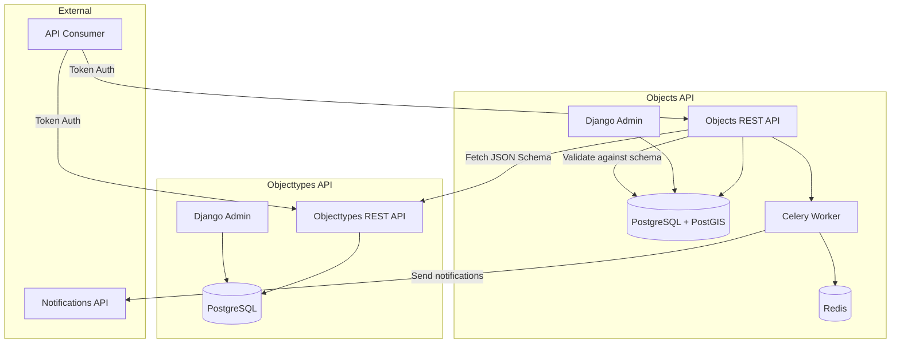
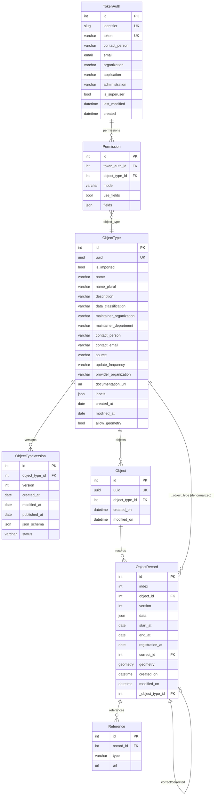

# Objects API & Objecttypes API — Competitive Analysis Overview

**Analyzed**: 2026-03-12
**Repos**: [objects-api](https://github.com/maykinmedia/objects-api) | [objecttypes-api](https://github.com/maykinmedia/objecttypes-api)
**Product by**: Maykin Media (Netherlands)
**License**: EUPL-1.2

## Tech Stack

| Component | Technology |
|-----------|-----------|
| Language | Python 3.12 |
| Framework | Django 4.x + Django REST Framework |
| Database | PostgreSQL with PostGIS (GeoDjango) |
| Task Queue | Celery + Redis |
| Auth | Token-based (custom `TokenAuth` model) + OIDC for admin |
| API Spec | OpenAPI 3.x via drf-spectacular |
| GIS | django.contrib.gis, rest_framework_gis |
| JSON Schema | `jsonschema` library (draft-07) |
| Notifications | `notifications-api-common` (VNG standard) |
| Observability | OpenTelemetry, Prometheus, Grafana, Promtail |
| Deployment | Docker, Kubernetes, uWSGI |
| Frontend | SCSS + minimal JS (admin only) |
| API Version | v2 (current: 2.6.0) |

## Architecture: Two Separate APIs

The product is split into **two independent Django applications** that communicate via HTTP:



**Key design decision**: Objecttypes (schemas) and Objects (data) are in SEPARATE deployments. This allows:
- National/shared objecttype registries
- Multiple Objects APIs using one Objecttypes API
- Independent scaling and authorization

**Note**: As of v4.0, the Objects API has been merging objecttypes INTO the Objects API (local storage), while still supporting external objecttypes APIs. This is the `import_objecttypes` management command.

## Database Schema

### Objects API Database



### Database Indexes (ObjectRecord)

| Index | Fields | Type |
|-------|--------|------|
| `idx_objectrecord_data_gin` | `data` | GIN (for JSON containment queries) |
| `idx_objectrecord_type_index` | `_object_type_id, -index` | B-tree |
| `idx_objectrecord_type_id` | `_object_type_id, id` | B-tree |
| `idx_type_start_end_object_idx` | `_object_type_id, start_at, end_at, object, -index` | B-tree (composite) |

### Objecttypes API Database

Nearly identical to Objects API's ObjectType + ObjectTypeVersion tables, but **without** Object, ObjectRecord, Reference, or Permission tables. The Objecttypes API has a simpler TokenAuth without permissions or superuser flag.

## API Surface Area

### Objects API Endpoints

| Method | Path | Description | Auth |
|--------|------|-------------|------|
| GET | `/api/v2/objects` | List objects (current records) | Token + ObjectType permission |
| POST | `/api/v2/objects` | Create object + initial record | Token + read_and_write |
| GET | `/api/v2/objects/{uuid}` | Retrieve object (current record) | Token + ObjectType permission |
| PUT | `/api/v2/objects/{uuid}` | Update object (creates new record) | Token + read_and_write |
| PATCH | `/api/v2/objects/{uuid}` | Partial update (JSON Merge Patch) | Token + read_and_write |
| DELETE | `/api/v2/objects/{uuid}` | Delete object + all records | Token + read_and_write |
| GET | `/api/v2/objects/{uuid}/history` | List all records for object | Token + read_only (no field auth) |
| GET | `/api/v2/objects/{uuid}/{index}` | Get specific record by index | Token |
| POST | `/api/v2/objects/search` | Geo search within polygon | Token + ObjectType permission |
| GET | `/api/v2/objecttypes` | List object types | Token (any) |
| POST | `/api/v2/objecttypes` | Create object type | Token (any) |
| GET | `/api/v2/objecttypes/{uuid}` | Retrieve object type | Token (any) |
| PUT | `/api/v2/objecttypes/{uuid}` | Update object type | Token (any) |
| PATCH | `/api/v2/objecttypes/{uuid}` | Partial update object type | Token (any) |
| DELETE | `/api/v2/objecttypes/{uuid}` | Delete object type (no versions) | Token (any) |
| GET | `/api/v2/objecttypes/{uuid}/versions` | List versions | Token (any) |
| POST | `/api/v2/objecttypes/{uuid}/versions` | Create version | Token (any) |
| GET | `/api/v2/objecttypes/{uuid}/versions/{v}` | Retrieve version | Token (any) |
| PUT | `/api/v2/objecttypes/{uuid}/versions/{v}` | Update version (draft only) | Token (any) |
| PATCH | `/api/v2/objecttypes/{uuid}/versions/{v}` | Partial update version | Token (any) |
| DELETE | `/api/v2/objecttypes/{uuid}/versions/{v}` | Delete version (draft only) | Token (any) |
| GET | `/api/v2/permissions` | List current token's permissions | Token |
| GET | `/api/v2/openapi.yaml` | OpenAPI schema (YAML) | Public |
| GET | `/api/v2/openapi.json` | OpenAPI schema (JSON) | Public |
| GET | `/api/v2/schema/` | ReDoc documentation | Public |

### Query Parameters (Objects List)

| Param | Description |
|-------|-------------|
| `type` | Filter by objecttype URL |
| `typeVersion` | Filter by version number |
| `date` | Material history date (default: today) |
| `registrationDate` | Formal history date |
| `data_attrs` | DEPRECATED: comma-separated key__operator__value |
| `data_attr` | key__operator__value (repeatable) |
| `data_icontains` | Full-text search in JSON data values |
| `ordering` | Comma-separated sort fields (supports JSON nesting) |
| `fields` | Comma-separated field selection |
| `pageSize` | Pagination page size |

## Permission Model

```
TokenAuth (API key) --M:N--> ObjectType (via Permission)
                                  |
                                  +-- mode: read_only | read_and_write
                                  +-- use_fields: bool
                                  +-- fields: {version: [field_paths]}
```

- **Superuser tokens** bypass all permission checks
- **Per-objecttype** granularity (not per-object)
- **Field-level auth**: restrict which fields are visible (read_only mode only)
- **History blocked** when field-level auth is active
- Unauthorized fields reported via `X-Unauthorized-Fields` response header

## Deployment Architecture

- Docker multi-stage build (Python 3.12, Node 24 for frontend assets)
- PostGIS required (GDAL binaries in container)
- Celery worker for async tasks (notifications, cloud events)
- Redis as Celery broker + result backend
- uWSGI as WSGI server
- Supports Kubernetes deployment
- OpenTelemetry for traces/metrics
- Prometheus + Grafana for monitoring
- Keycloak integration for OIDC admin login

## Design Patterns

1. **Append-only records**: Objects are never modified; updates create new ObjectRecords
2. **Dual history**: Material (startAt/endAt) vs Formal (registrationAt) history per StUF 03.01
3. **Correction chains**: Records can reference corrected records via `correct` FK
4. **Denormalized FK**: `ObjectRecord._object_type` avoids JOIN through `Object` table
5. **JSON Merge Patch**: PATCH uses RFC 7396 (modified: null doesn't delete)
6. **Immutable fields**: UUID and type cannot change after creation (validator)
7. **GIN index on JSON data**: PostgreSQL `@>` containment operator for fast queries
8. **Version lifecycle**: draft -> published -> deprecated (only draft can be modified/deleted)
9. **URL-based references**: ObjectType referenced by URL, resolved to UUID internally
