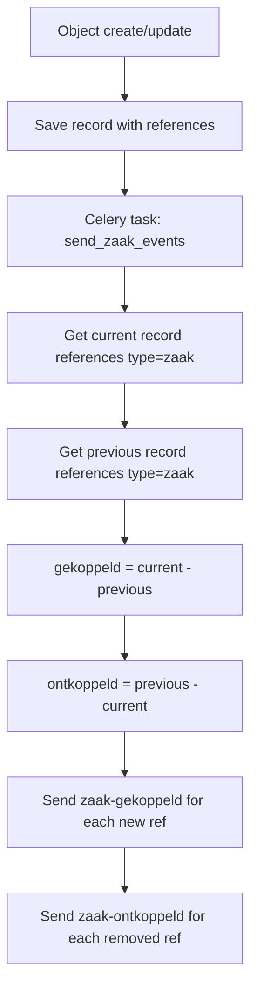
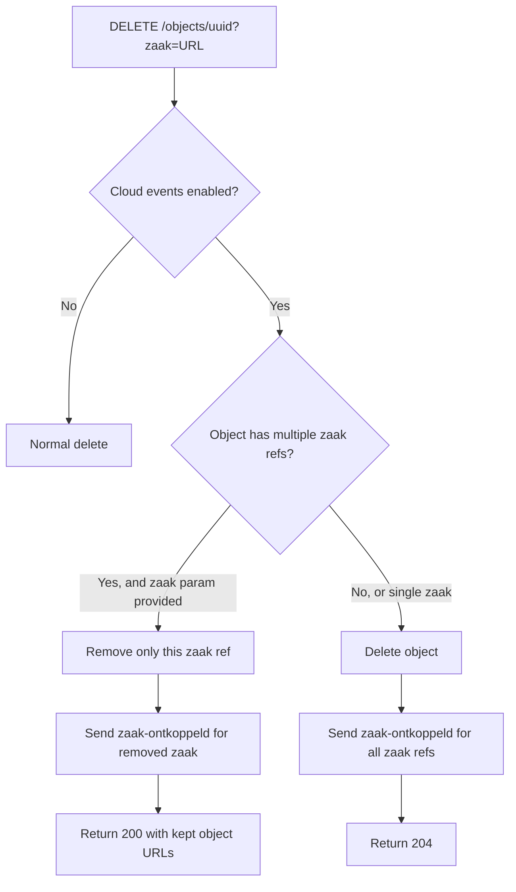

# Cloud Events & Zaak Integration — Objects API

## Purpose
EXPERIMENTAL: Send CloudEvents when objects are linked/unlinked to/from Zaken (cases). Supports the Dutch government's archiving workflow where destroying a zaak must handle objects linked to multiple zaken.

- **Product**: Objects API
- **Category**: Integration / Events
- **Relevance to OpenRegister**: Shows integration pattern with case management systems

## Architecture Overview
Objects can have `Reference` entries linking them to external resources (currently only type "zaak"). When references change between record versions, cloud events are sent:
- `nl.overheid.zaken.zaak-gekoppeld` — zaak linked to object
- `nl.overheid.zaken.zaak-ontkoppeld` — zaak unlinked from object

The comparison is done in a Celery task that diffs current vs previous record's references.

**Feature flag**: `ENABLE_CLOUD_EVENTS` environment variable (default: false).

## Business Logic

## OpenRegister Comparison
| Aspect | Objects API | OpenRegister |
|--------|-----------|--------------|
| External references | Reference model (type + url) | Relations to external sources |
| Cloud events | Standard CloudEvents format | n8n-based events |
| Archiving flow | Special delete behavior for multi-zaak | No equivalent |

**Already in OpenRegister**: External source references
**Not yet in OpenRegister**: CloudEvents integration, zaak-specific link/unlink events, conditional delete behavior based on external references, archiving workflow support
