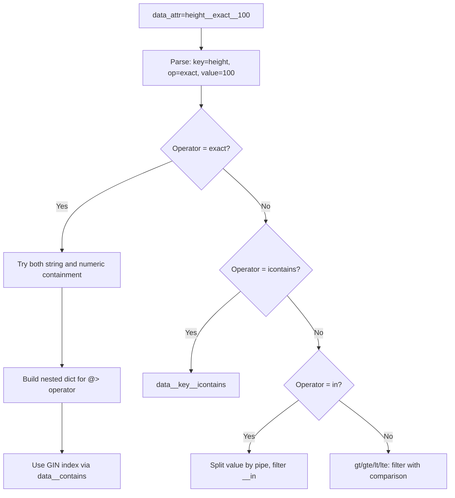

# Data Attribute Filtering — Objects API

## Purpose
Filter objects by values within their JSON data field. Supports nested attributes, multiple operators (exact, gt, gte, lt, lte, icontains, in), and full-text search across all string values.

- **Product**: Objects API
- **Category**: Search & Filtering
- **Relevance to OpenRegister**: OpenRegister has faceted search; this shows deep JSON querying

## Architecture Overview
Two filter parameters:
1. `data_attr` (new, repeatable): `key__operator__value` format
2. `data_attrs` (deprecated): comma-separated expressions
3. `data_icontains`: full-text search using PostgreSQL jsonpath

Uses PostgreSQL's GIN index on `data` column and `@>` containment operator for exact matches.

**Key files**:
- `objects/api/v2/filters.py` — ObjectRecordFilterSet, filter_queryset_by_data_attr
- `objects/api/validators.py` — validate_data_attr, validate_data_attrs
- `objects/api/constants.py` — Operators enum

## Operators
| Operator | Description | Value Types |
|----------|-------------|-------------|
| `exact` | Equal to | string, numeric, date |
| `gt` | Greater than | numeric, date only |
| `gte` | Greater than or equal | numeric, date only |
| `lt` | Less than | numeric, date only |
| `lte` | Less than or equal | numeric, date only |
| `icontains` | Case-insensitive partial match | string |
| `in` | In list (pipe-separated) | string |

## Business Logic



**data_icontains implementation** (full-text search):
```sql
WHERE core_objectrecord.data @? CONCAT('$.** ? (@ like_regex "', value, '" flag "i")')::jsonpath
```
This uses PostgreSQL's jsonpath to search recursively through ALL string values in the JSON data.

**Nested attributes**: Use `__` separator. Example: `dimensions__height__exact__100` queries `data.dimensions.height = 100`.

**Exact operator optimization**: Uses PostgreSQL `@>` containment with `build_nested_dict()` to construct proper nested JSON for GIN index utilization. Also tries both string and numeric representations.

## Requirements (as observed)
### REQ-CA-022: Deep JSON Filtering
**Implementation**: Nested key parsing with containment queries.
#### Scenario CA-022a: Filter nested attribute
- GIVEN objects with data `{"dimensions": {"height": 100}}`
- WHEN GET /objects?data_attr=dimensions__height__exact__100
- THEN matching objects are returned

### REQ-CA-023: Multiple Filter Expressions
**Implementation**: data_attr is repeatable.
#### Scenario CA-023a: AND logic for multiple filters
- GIVEN various objects
- WHEN GET /objects?data_attr=height__exact__100&data_attr=name__icontains__boom
- THEN only objects matching BOTH conditions are returned

### REQ-CA-024: Full-Text JSON Search
**Implementation**: PostgreSQL jsonpath recursive search.
#### Scenario CA-024a: Search across all string values
- GIVEN objects with various string data
- WHEN GET /objects?data_icontains=boom
- THEN objects with "boom" in any string value are returned

## OpenRegister Comparison
| Aspect | Objects API | OpenRegister |
|--------|-----------|--------------|
| JSON filtering | key__operator__value params | Faceted search + direct property filters |
| Operators | 7 comparison operators | Depends on search backend |
| GIN index | Explicit GIN on data column | Depends on database |
| Full-text | jsonpath recursive search | Elasticsearch/Solr integration |
| Nested attrs | __ separator for nesting | Dot notation or similar |
| Optimization | @> containment for exact matches | Search engine optimized |

**Already in OpenRegister**: Object filtering by properties, search functionality
**Not yet in OpenRegister**: Dedicated data_attr query parameter with operator syntax, GIN-optimized JSON containment queries, jsonpath full-text search, explicit comparison operators (gt, gte, lt, lte, in), pipe-separated IN operator
