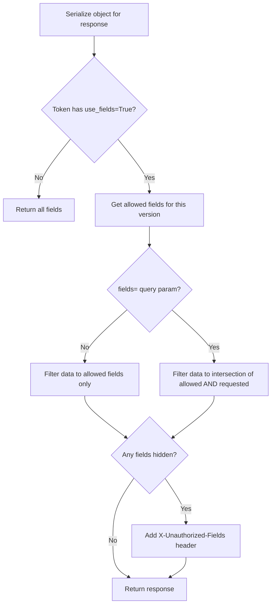

# Field-Level Authorization — Objects API

## Purpose
Restricts which fields of an object are visible to a token, at per-objecttype-version granularity. Only available in read_only mode. Unauthorized fields are stripped from responses and reported via a response header.

- **Product**: Objects API
- **Category**: Fine-Grained Authorization
- **Relevance to OpenRegister**: OpenRegister has no field-level access control

## Architecture Overview
When a Permission has `use_fields=True`, the `fields` JSON stores a mapping of `{version_number: [allowed_field_paths]}`. The `DynamicFieldsMixin` on the serializer strips unauthorized fields from the response using the `glom` library.

**Key files**:
- `objects/token/models.py` — Permission.use_fields, Permission.fields
- `objects/utils/serializers.py` — DynamicFieldsMixin
- `objects/api/filter_backends.py` — OrderingBackend (checks field auth on sort)

## Data Model
| Entity/Field | Type | Description |
|-------------|------|-------------|
| Permission.use_fields | bool | Enable field restrictions |
| Permission.fields | JSON | `{"1": ["url", "type", "record__startAt"], "2": ["url", "record"]}` |

Field paths use `__` for nesting (e.g., `record__data__name`).

## Business Logic

**Constraints**:
- Field-level auth is ONLY available with `mode=read_only` (validation error if used with read_and_write)
- When field auth is active, the `/history` endpoint returns 403 (cannot partially show history)
- Ordering by unauthorized fields is also blocked (OrderingBackend checks)
- The `fields` query parameter lets clients select a SUBSET of their allowed fields

**X-Unauthorized-Fields header format**: `field1,field2,field3` or `objecttype_url(version)=field1,field2`

## Requirements (as observed)
### REQ-CA-019: Version-Specific Field Restrictions
**Implementation**: Fields JSON keyed by version number.
#### Scenario CA-019a: Different fields per version
- GIVEN permission with fields `{"1": ["url", "uuid"], "2": ["url", "record"]}`
- WHEN retrieving object at version 1
- THEN only url and uuid are visible

### REQ-CA-020: Unauthorized Fields Header
**Implementation**: NotAllowedDict tracked during serialization.
#### Scenario CA-020a: Header reports hidden fields
- GIVEN field auth allowing only url, type, record__startAt
- WHEN GET /objects/{uuid}
- THEN response includes X-Unauthorized-Fields header listing uuid, record__data, etc.

### REQ-CA-021: History Blocked with Field Auth
**Implementation**: ObjectTypeBasedPermission.has_object_permission checks.
#### Scenario CA-021a: Cannot access history
- GIVEN read_only permission with use_fields=True
- WHEN GET /objects/{uuid}/history
- THEN 403 Forbidden

## OpenRegister Comparison
| Aspect | Objects API | OpenRegister |
|--------|-----------|--------------|
| Field-level auth | Per-version field lists | Not available |
| Response filtering | Dynamic field stripping via glom | N/A |
| Unauthorized header | X-Unauthorized-Fields | N/A |
| Field selection | ?fields= query param | Not available |
| Sort restriction | Checks field auth on ordering | N/A |
| Constraint | Read-only mode only | N/A |

**Already in OpenRegister**: N/A
**Not yet in OpenRegister**: Field-level authorization, per-version field restrictions, dynamic field selection query parameter, unauthorized fields response header, ordering restrictions based on field auth
