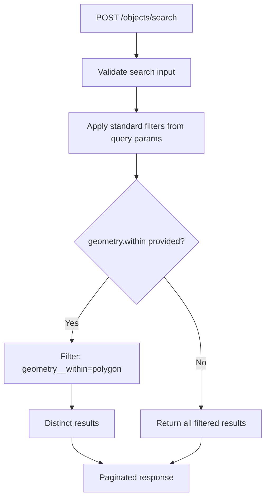

# Geo-Spatial Search — Objects API

## Purpose
Store and query geographic coordinates (Point, LineString, Polygon) on objects. Supports "within polygon" spatial search via a dedicated POST endpoint.

- **Product**: Objects API
- **Category**: GIS / Spatial
- **Relevance to OpenRegister**: OpenRegister has no GIS support

## Architecture Overview
Uses Django's GeoDjango with PostGIS backend. Each ObjectRecord has an optional `geometry` field. The `ObjectViewSet` inherits `GeoMixin` for CRS negotiation. A `POST /objects/search` endpoint accepts GeoJSON polygons for spatial queries.

**Dependencies**: PostGIS, GDAL, django.contrib.gis, rest_framework_gis

## Data Model
| Entity/Field | Type | Description |
|-------------|------|-------------|
| ObjectRecord.geometry | GeometryField | Point, LineString, or Polygon (SRID 4326) |
| ObjectType.allow_geometry | bool | Whether objects can have coordinates |

## API Endpoints
| Method | Path | Description | Auth |
|--------|------|-------------|------|
| POST | /objects/search | Geo search with polygon filter | Token + Permission |

Request body:
```json
{
  "geometry": {
    "within": {
      "type": "Polygon",
      "coordinates": [[[lng, lat], [lng, lat], ...]]
    }
  }
}
```

### CRS Headers
- `Content-Crs`: Required for POST/PUT/PATCH (must be EPSG:4326)
- `Accept-Crs`: Optional for GET (must be EPSG:4326 if provided)

## Business Logic



**Geometry validation on create/update**: If objecttype has `allow_geometry=false` and geometry is provided, HTTP 400 is returned.

## Requirements (as observed)
### REQ-CA-025: Spatial Within Query
**Implementation**: PostGIS `ST_Within` via Django ORM `geometry__within`.
#### Scenario CA-025a: Objects within polygon
- GIVEN objects at various coordinates
- WHEN POST /objects/search with polygon covering Amsterdam Centrum
- THEN only objects within that polygon are returned

### REQ-CA-026: Geometry Type Control
**Implementation**: allow_geometry flag on ObjectType.
#### Scenario CA-026a: Geometry rejected when not allowed
- GIVEN objecttype with allow_geometry=false
- WHEN creating object with geometry
- THEN HTTP 400 "This object type doesn't support geometry"

## OpenRegister Comparison
| Aspect | Objects API | OpenRegister |
|--------|-----------|--------------|
| GIS support | Full PostGIS integration | None |
| Geometry types | Point, LineString, Polygon | N/A |
| Spatial queries | Within polygon search | N/A |
| CRS | EPSG:4326 (WGS84) | N/A |
| Per-type control | allow_geometry flag | N/A |

**Already in OpenRegister**: N/A
**Not yet in OpenRegister**: Geometry field on objects, PostGIS spatial queries, within-polygon search endpoint, CRS header negotiation, per-objecttype geometry control
