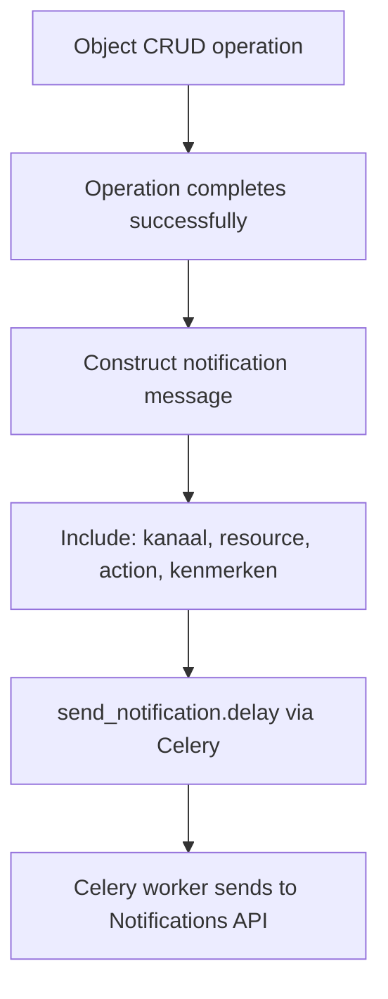

# Notifications & Webhooks — Objects API

## Purpose
Publishes notifications when objects are created, updated, or deleted. Uses the VNG Notifications API standard ("Notificaties API") to publish events on the "objecten" channel.

- **Product**: Objects API
- **Category**: Events / Webhooks
- **Relevance to OpenRegister**: OpenRegister uses n8n for event-driven flows; this shows a standards-based alternative

## Architecture Overview
Uses `notifications-api-common` library with `NotificationCreateMixin` and `NotificationDestroyMixin`. Notifications are sent asynchronously via Celery tasks. The notification includes the channel ("objecten"), resource URL, action, timestamp, and "kenmerken" (attributes for filtering, specifically the objecttype URL).

**Key files**:
- `objects/api/mixins.py` — ObjectNotificationMixin
- `objects/api/kanalen.py` — KANAAL_OBJECTEN definition

## Notification Format
```json
{
  "kanaal": "objecten",
  "hoofdObject": "https://api.example.com/api/v2/objects/{uuid}",
  "resource": "object",
  "resourceUrl": "https://api.example.com/api/v2/objects/{uuid}",
  "actie": "create|update|partial_update|destroy",
  "aanmaakdatum": "2018-09-07T02:00:00+02:00",
  "kenmerken": {
    "objectType": "https://api.example.com/api/v2/objecttypes/{uuid}"
  }
}
```

## Business Logic



**kenmerken** allow subscribers to filter notifications by objecttype — they only receive notifications for objecttypes they care about.

## Requirements (as observed)
### REQ-CA-027: VNG-Standard Notifications
**Implementation**: notifications-api-common library integration.
#### Scenario CA-027a: Create notification
- GIVEN a Notifications API is configured
- WHEN an object is created
- THEN a notification with actie="create" is sent to the "objecten" channel

## OpenRegister Comparison
| Aspect | Objects API | OpenRegister |
|--------|-----------|--------------|
| Event system | VNG Notifications API standard | n8n workflow triggers |
| Transport | HTTP POST to Notifications API | n8n webhook/polling |
| Async | Celery task | n8n handles async |
| Channel | "objecten" with kenmerken filtering | Per-workflow configuration |
| Standard | VNG/Common Ground compliant | Custom |

**Already in OpenRegister**: Event-driven flows via n8n
**Not yet in OpenRegister**: Standards-based notification channel (VNG), kenmerken-based subscriber filtering, dedicated notification API integration
