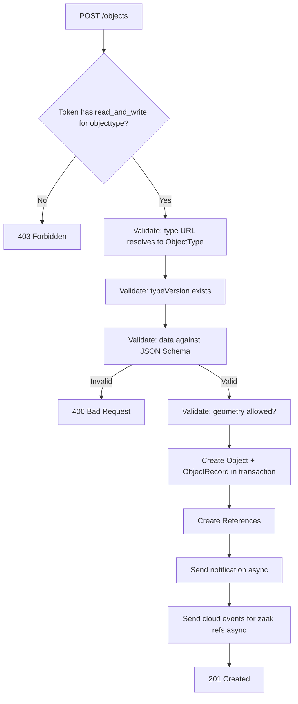
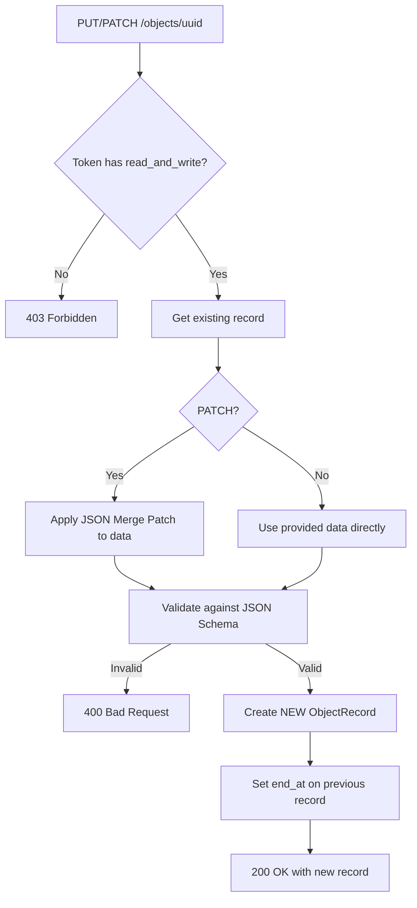

# Object CRUD Lifecycle — Objects API

## Purpose
Core CRUD operations for objects. An Object is a container identified by UUID; it holds one or more Records (versions of its data). Creating/updating an Object always creates a new Record. Deleting removes the Object and ALL its Records.

- **Product**: Objects API
- **Category**: Core Data Operations
- **Relevance to OpenRegister**: Direct competitor to OpenRegister's Object entity CRUD

## Architecture Overview
The Object model is a thin wrapper (UUID + FK to ObjectType). All data lives in ObjectRecord. The API serializer (`ObjectSerializer`) operates on `ObjectRecord` but exposes it as if it were an Object with a nested record.

**Models**: `Object`, `ObjectRecord`, `Reference`
**Views**: `ObjectViewSet`
**Serializers**: `ObjectSerializer`, `ObjectRecordSerializer`

## Data Model
| Entity/Field | Type | Description |
|-------------|------|-------------|
| Object.uuid | UUID4 | Unique identifier, immutable |
| Object.object_type | FK(ObjectType) | PROTECT on delete |
| Object.created_on | DateTimeField | Auto-set |
| Object.modified_on | DateTimeField | Auto-set |
| ObjectRecord.index | PositiveInt | Auto-incremented per object |
| ObjectRecord.version | PositiveSmallInt | ObjectType version used |
| ObjectRecord.data | JSONField | The actual object data |
| ObjectRecord.start_at | DateField | Legal start date |
| ObjectRecord.end_at | DateField | Legal end date (auto-set on next record) |
| ObjectRecord.registration_at | DateField | When registered in system |
| ObjectRecord.correct | FK(ObjectRecord) | Correction chain |
| ObjectRecord.geometry | GeometryField | Point/LineString/Polygon |
| ObjectRecord._object_type | FK(ObjectType) | Denormalized for query performance |
| Reference.type | CharField | Currently only "zaak" |
| Reference.url | URLField | URL to external resource |

## API Endpoints
| Method | Path | Description | Auth |
|--------|------|-------------|------|
| GET | /objects | List with current records | Token + Permission |
| POST | /objects | Create object + first record | Token + read_and_write |
| GET | /objects/{uuid} | Retrieve with current record | Token + Permission |
| PUT | /objects/{uuid} | Full update (new record) | Token + read_and_write |
| PATCH | /objects/{uuid} | Partial update (merge patch) | Token + read_and_write |
| DELETE | /objects/{uuid} | Delete object + all records | Token + read_and_write |

## Business Logic

**Key implementation details**:
- Update is actually CREATE of new record (append-only pattern)
- Previous record's `end_at` is set to new record's `start_at`
- Record index auto-increments from last_record.index + 1
- Object.type and Object.uuid are IMMUTABLE (cannot change via update)
- `_object_type` on ObjectRecord is denormalized on save for query performance

### Delete with Zaak References (experimental)
When cloud events are enabled and an object has zaak references:
- If DELETE has `?zaak=URL` param AND object has multiple zaak refs: only remove that zaak ref, keep object (200 OK)
- If DELETE has `?zaak=URL` param AND object has single zaak ref: delete object normally (204)
- If DELETE without zaak param: delete object, send ontkoppeld events for all zaak refs

## Requirements (as observed)
### REQ-CA-004: Append-Only Records
**Implementation**: PUT/PATCH never modify existing records; they create new ObjectRecords.
#### Scenario CA-004a: Update creates new record
- GIVEN an object with 1 record at index 1
- WHEN PUT is called with new data
- THEN a new record at index 2 is created, previous record gets end_at set

### REQ-CA-005: Immutable Object Identity
**Implementation**: `IsImmutableValidator` on uuid and type fields.
#### Scenario CA-005a: Cannot change object type
- GIVEN an object of type A
- WHEN PATCH is sent with type B
- THEN HTTP 400 "This field can't be changed"

### REQ-CA-006: Transactional Create/Update
**Implementation**: `@transaction.atomic` on serializer create/update.
#### Scenario CA-006a: Failed validation rolls back
- GIVEN a create request with invalid data
- WHEN validation fails
- THEN no Object or ObjectRecord is created

## OpenRegister Comparison
| Aspect | Objects API | OpenRegister |
|--------|-----------|--------------|
| Update pattern | Append-only (new record per update) | In-place update of object |
| Version history | Built-in via ObjectRecord chain | Audit log, not first-class records |
| Object identity | UUID (immutable) | UUID (can be set) |
| Geometry | GeometryField (Point/Line/Polygon) | Not built-in |
| References | Reference model (currently zaak only) | Relations between objects |
| Merge patch | RFC 7396 (modified: null kept) | Not applicable |
| Denormalization | _object_type on record | No denormalization |
| Deletion | Object + all records deleted | Soft or hard delete |

**Already in OpenRegister**: Object CRUD, UUID identifiers, JSON data storage, schema validation on save, type immutability
**Not yet in OpenRegister**: Append-only record pattern with automatic history, geometry/GIS support, correction chains between records, reference linking to external systems (zaak), JSON Merge Patch for partial updates, denormalized FK optimization, cloud event integration on delete
