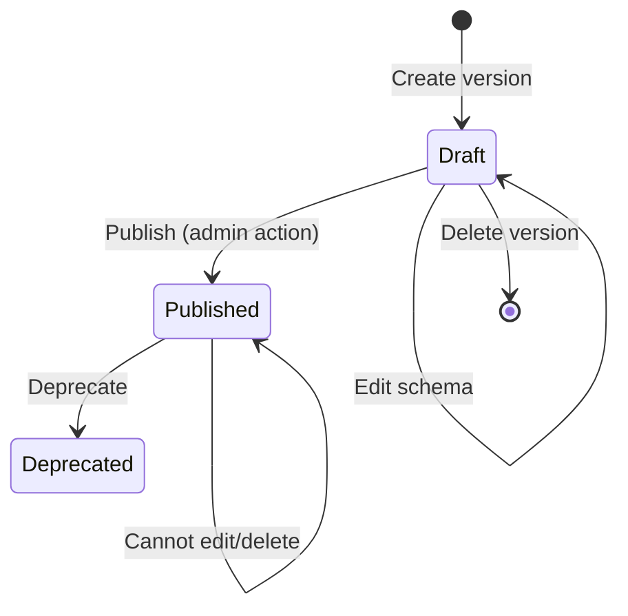

# Object Type Management — Objects API / Objecttypes API

## Purpose
Defines and manages reusable data schemas (ObjectTypes) that govern what objects can store. Each ObjectType has versioned JSON schemas with a lifecycle (draft/published/deprecated).

- **Product**: Objects API / Objecttypes API
- **Category**: Schema Management
- **Relevance to OpenRegister**: Direct competitor to OpenRegister's Schema entity

## Architecture Overview
ObjectTypes exist in both APIs. The Objecttypes API is the canonical registry; the Objects API can import them or manage them locally (since v4.0). Each ObjectType has metadata (name, classification, maintainer) and multiple versions, each containing a JSON Schema.

**Models**: `ObjectType`, `ObjectTypeVersion`
**Views**: `ObjectTypeViewSet`, `ObjectTypeVersionViewSet`
**Serializers**: `ObjectTypeSerializer`, `ObjectTypeVersionSerializer`

## Data Model
| Entity/Field | Type | Description |
|-------------|------|-------------|
| ObjectType.uuid | UUID4 | Unique identifier, immutable after creation |
| ObjectType.name | CharField(100) | Display name |
| ObjectType.name_plural | CharField(100) | Plural name |
| ObjectType.description | CharField(1000) | Description |
| ObjectType.data_classification | Enum | open/intern/confidential/strictly_confidential |
| ObjectType.maintainer_organization | CharField(200) | Responsible organization |
| ObjectType.maintainer_department | CharField(200) | Responsible department |
| ObjectType.contact_person | CharField(200) | Contact name |
| ObjectType.contact_email | CharField(200) | Contact email |
| ObjectType.source | CharField(200) | Originating system |
| ObjectType.update_frequency | Enum | real_time/hourly/daily/weekly/monthly/yearly/unknown |
| ObjectType.provider_organization | CharField(200) | Publishing organization |
| ObjectType.documentation_url | URLField | Documentation link |
| ObjectType.labels | JSONField | Key-value keyword pairs |
| ObjectType.allow_geometry | BooleanField | Whether objects can have coordinates |
| ObjectType.created_at | DateField | Auto-set on creation |
| ObjectType.modified_at | DateField | Auto-set on update |
| ObjectTypeVersion.version | PositiveSmallInt | Auto-incrementing integer |
| ObjectTypeVersion.json_schema | JSONField | The JSON Schema definition |
| ObjectTypeVersion.status | Enum | draft/published/deprecated |
| ObjectTypeVersion.published_at | DateField | Set when status changes to published |

## API Endpoints
| Method | Path | Description | Auth |
|--------|------|-------------|------|
| GET | /objecttypes | List all objecttypes | Token |
| POST | /objecttypes | Create objecttype | Token |
| GET | /objecttypes/{uuid} | Retrieve objecttype | Token |
| PUT | /objecttypes/{uuid} | Full update | Token |
| PATCH | /objecttypes/{uuid} | Partial update | Token |
| DELETE | /objecttypes/{uuid} | Delete (requires no versions) | Token |
| GET | /objecttypes/{uuid}/versions | List versions | Token |
| POST | /objecttypes/{uuid}/versions | Create new version | Token |
| GET | /objecttypes/{uuid}/versions/{v} | Retrieve version | Token |
| PUT | /objecttypes/{uuid}/versions/{v} | Update (draft only) | Token |
| DELETE | /objecttypes/{uuid}/versions/{v} | Delete (draft only) | Token |

## Business Logic

**Version number generation**: Auto-incremented from MAX(version) + 1 for the objecttype.

**Constraints**:
- Cannot delete objecttype if it has versions
- Cannot modify or delete a published/deprecated version
- UUID is immutable after creation (validated by `IsImmutableValidator`)
- JSON Schema is validated against meta-schema on save (`check_json_schema`)

## Requirements (as observed)
### REQ-CA-001: ObjectType Versioning
**Implementation**: Integer version numbers, auto-incremented. Each version has its own JSON Schema.
#### Scenario CA-001a: Create new version
- GIVEN an ObjectType with version 1 published
- WHEN a new version is created via POST /objecttypes/{uuid}/versions
- THEN version 2 is created in draft status with auto-generated version number

### REQ-CA-002: Version Lifecycle
**Implementation**: Status field with draft/published/deprecated choices.
#### Scenario CA-002a: Prevent editing published version
- GIVEN a version with status "published"
- WHEN a PUT request is made to update the version
- THEN HTTP 400 is returned with code "non-draft-version-update"

### REQ-CA-003: Rich Metadata
**Implementation**: 14 metadata fields including classification, maintainer info, labels.
#### Scenario CA-003a: Data classification
- GIVEN an ObjectType
- WHEN created with dataClassification "confidential"
- THEN the classification is stored and returned in API responses

## OpenRegister Comparison
| Aspect | Objects API | OpenRegister |
|--------|-----------|--------------|
| Schema storage | Separate ObjectTypeVersion table | Schema entity with JSON properties |
| Version numbers | Auto-incrementing integers | Semantic versioning (via updates) |
| Version lifecycle | draft/published/deprecated | No explicit lifecycle status |
| Metadata fields | 14 fields (classification, maintainer, etc.) | Title, description, source |
| JSON Schema support | Full draft-07 with meta-schema validation | JSON Schema validation on objects |
| Labels/Tags | JSON key-value labels field | Not on schemas |
| Geometry flag | per-objecttype allow_geometry | Per-schema (via property definition) |
| Separate API | Objecttypes API is independent service | Schemas integrated in same app |
| Import from external | import_objecttypes command | No equivalent |

**Already in OpenRegister**: Schema CRUD, JSON Schema storage, version tracking, UUID identifiers
**Not yet in OpenRegister**: Data classification enum, maintainer metadata fields, explicit version lifecycle (draft/published/deprecated), labels/tags on schemas, dedicated import from external objecttype registries, allow_geometry flag, separate objecttypes registry concept
