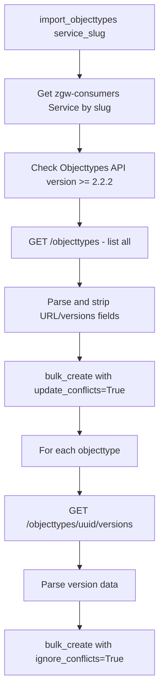

# ObjectType Import — Objects API

## Purpose
Import objecttypes and their versions from an external Objecttypes API into the local Objects API database. This enables the Objects API to work standalone without a live connection to an Objecttypes API.

- **Product**: Objects API
- **Category**: Data Import / Migration
- **Relevance to OpenRegister**: Shows pattern for schema federation/import

## Architecture Overview
Management command `import_objecttypes` connects to an external Objecttypes API via `zgw-consumers` service client, fetches all objecttypes and their versions, and bulk creates/updates them locally.

**Key files**:
- `objects/core/management/commands/import_objecttypes.py`
- `objects/setup_configuration/steps/objecttypes.py`

## Business Logic

**Idempotent**: Uses `update_conflicts=True` with UUID as unique field — re-running updates existing records.

**Setup configuration**: Also available via `ObjectTypesConfigurationStep` for automated deployment setup.

## OpenRegister Comparison
| Aspect | Objects API | OpenRegister |
|--------|-----------|--------------|
| Schema import | Management command from external API | No equivalent |
| Federation | Multiple APIs can share objecttypes | No federation |
| Idempotent | bulk_create with conflict handling | N/A |

**Already in OpenRegister**: N/A
**Not yet in OpenRegister**: Schema import from external registries, schema federation between instances, automated setup configuration steps
