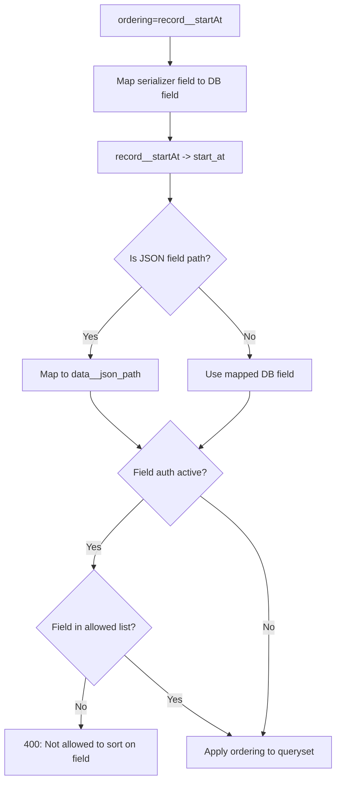

# Ordering & Sorting — Objects API

## Purpose
Sort object results by any serializer field, including nested fields and attributes within the JSON data column. Supports ascending/descending and field-auth restrictions on sorting.

- **Product**: Objects API
- **Category**: Query / Sorting
- **Relevance to OpenRegister**: OpenRegister has basic sorting; this shows deep JSON-field sorting

## Architecture Overview
Custom `OrderingBackend` extends DRF's `OrderingFilter`. Maps serializer field names to DB field paths. Supports JSON field ordering via PostgreSQL's `->>` operator (implicit via Django ORM).

**Query parameter**: `ordering=record__startAt,-record__data__name`
- Prefix `-` for descending
- Use `__` for nested fields
- Supports `record__data__<any_json_path>` for JSON data ordering

## Business Logic

## OpenRegister Comparison
| Aspect | Objects API | OpenRegister |
|--------|-----------|--------------|
| Sort parameter | ordering= with __ nesting | Basic sort support |
| JSON field sort | record__data__<path> | Not available |
| Multi-field sort | Comma-separated | Limited |
| Auth check | Field auth restrictions apply | N/A |
| Direction | - prefix for descending | Standard |

**Already in OpenRegister**: Basic ordering support
**Not yet in OpenRegister**: JSON data field ordering, multi-field sorting with nesting, field-auth checks on ordering, serializer-to-DB field mapping
