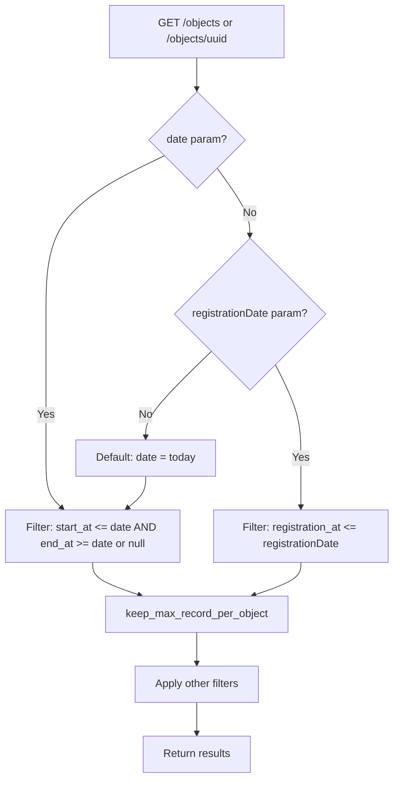

# Record Versioning & History — Objects API

## Purpose
Implements dual-perspective history (material and formal) per the Dutch StUF 03.01 standard. Every object maintains a chain of records representing its state over time, queryable from both "what was reality" and "what was administratively known" perspectives.

- **Product**: Objects API
- **Category**: Versioning / History
- **Relevance to OpenRegister**: OpenRegister has audit logging but not first-class temporal versioning

## Architecture Overview
Each Object has multiple ObjectRecords. The "current" record is determined by date filtering. Two history perspectives exist:
- **Material history** (`date` param): filters by `start_at <= date` AND (`end_at >= date` OR `end_at IS NULL`)
- **Formal history** (`registrationDate` param): filters by `registration_at <= date`, keeping latest record per object

**QuerySet methods**: `filter_for_date()`, `filter_for_registration_date()`, `keep_max_record_per_object()`

## Data Model
| Entity/Field | Type | Description |
|-------------|------|-------------|
| ObjectRecord.index | int | Sequential number within object |
| ObjectRecord.start_at | date | Legal effective start date |
| ObjectRecord.end_at | date | Legal effective end date |
| ObjectRecord.registration_at | date | Administrative registration date |
| ObjectRecord.correct | FK(self) | Points to record this corrects |
| ObjectRecord.corrected | reverse FK | The record that corrected this one |

## API Endpoints
| Method | Path | Description | Auth |
|--------|------|-------------|------|
| GET | /objects?date=YYYY-MM-DD | Material history view | Token |
| GET | /objects?registrationDate=YYYY-MM-DD | Formal history view | Token |
| GET | /objects/{uuid}/history | Full record chain | Token (no field auth) |
| GET | /objects/{uuid}/{index} | Specific record by index | Token |

## Business Logic

**Correction mechanism**:
- A record can declare it corrects a previous record via `correctionFor` (pointing to record index)
- The corrected record gets a back-reference via `correctedBy`
- Corrections do NOT alter the corrected record; they create a new record in the chain
- Both appear in history; the correction chain is visible

**Default behavior**: Without date parameters, the API returns objects as they are TODAY (material history perspective).

**Mutual exclusivity**: `date` and `registrationDate` cannot be used together (validated in FilterForm).

## Requirements (as observed)
### REQ-CA-007: Material History (StUF 2.1)
**Implementation**: Filter by start_at/end_at date range.
#### Scenario CA-007a: Query past state
- GIVEN an object with record 1 (start_at=2020-01-01, end_at=2021-01-01) and record 2 (start_at=2021-01-01)
- WHEN GET /objects/{uuid}?date=2020-06-15
- THEN record 1 is returned

### REQ-CA-008: Formal History (StUF 2.2)
**Implementation**: Filter by registration_at, return latest registered record.
#### Scenario CA-008a: Query what was known at a date
- GIVEN records registered at different dates
- WHEN GET /objects/{uuid}?registrationDate=2001-10-01
- THEN the latest record registered on or before that date is returned

### REQ-CA-009: Correction Chains (StUF 2.3)
**Implementation**: OneToOneField `correct` pointing to corrected record.
#### Scenario CA-009a: Correction record
- GIVEN record 10 exists
- WHEN record 40 is created with correctionFor=10
- THEN record 10's correctedBy shows 40, material history returns record 40

## OpenRegister Comparison
| Aspect | Objects API | OpenRegister |
|--------|-----------|--------------|
| History model | First-class ObjectRecord chain | Audit log entries |
| Material history | Date-range filtering on records | Not implemented |
| Formal history | Registration date filtering | Not implemented |
| Corrections | Explicit correction chain (FK) | Object update (overwrites) |
| StUF compliance | Full StUF 03.01 support (tested) | Not applicable |
| Default date | Today (material perspective) | N/A |
| Record index | Auto-incrementing per object | N/A |

**Already in OpenRegister**: Audit logging of changes
**Not yet in OpenRegister**: Append-only record chain, material/formal dual history, correction chains, date-parameterized queries, StUF 03.01 compliance, record indexing
