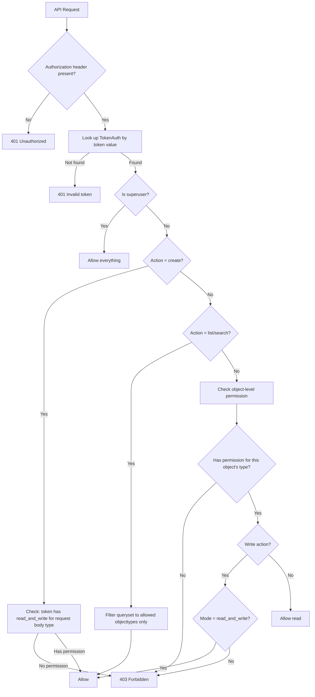

# Token Authorization — Objects API

## Purpose
API authentication and per-objecttype authorization via bearer tokens. Tokens are created in the admin interface and grant specific permissions per object type. Superuser tokens bypass all checks.

- **Product**: Objects API
- **Category**: Authentication & Authorization
- **Relevance to OpenRegister**: OpenRegister uses Nextcloud auth; this shows a standalone token model alternative

## Architecture Overview
Custom `TokenAuth` model with `TokenAuthentication` DRF backend. Tokens are linked to ObjectTypes via `Permission` through-table with mode (read_only/read_and_write) and optional field restrictions.

**Models**: `TokenAuth`, `Permission`
**Auth**: `TokenAuthentication` (extends DRF's TokenAuthentication)
**Permissions**: `ObjectTypeBasedPermission`, `IsTokenAuthenticated`

## Data Model
| Entity/Field | Type | Description |
|-------------|------|-------------|
| TokenAuth.identifier | SlugField | Human-friendly label (unique) |
| TokenAuth.token | CharField(40) | 40-char hex token (auto-generated via secrets.token_hex(20)) |
| TokenAuth.contact_person | CharField(200) | Required: who owns this token |
| TokenAuth.email | EmailField | Required: contact email |
| TokenAuth.organization | CharField(200) | Optional: organization |
| TokenAuth.application | CharField(200) | Optional: consuming application |
| TokenAuth.administration | CharField(200) | Optional: administration unit |
| TokenAuth.is_superuser | BooleanField | Bypass all permission checks |
| Permission.token_auth | FK(TokenAuth) | Which token |
| Permission.object_type | FK(ObjectType) | Which object type |
| Permission.mode | Enum | read_only / read_and_write |
| Permission.use_fields | BooleanField | Enable field-level restrictions |
| Permission.fields | JSONField | Version-specific field lists |

## API Endpoints
| Method | Path | Description | Auth |
|--------|------|-------------|------|
| GET | /permissions | List permissions for current token | Token |

Header format: `Authorization: Token <40-char-hex>`

## Business Logic

**Token generation**: `secrets.token_hex(20)` produces 40-char hex string.

**Permission resolution**:
1. Request authenticated via `TokenAuthentication`
2. `request.auth` is set to `TokenAuth` instance (not the user)
3. `ObjectTypeBasedPermission.has_permission()` checks create permission
4. `ObjectTypeBasedPermission.has_object_permission()` checks detail actions
5. List/search: queryset filtered to only permitted objecttypes via `filter_for_token()`

**Objecttypes API**: Simpler auth — any valid token can access all objecttypes (no per-objecttype permissions).

## Requirements (as observed)
### REQ-CA-015: Token-Based Authentication
**Implementation**: Custom TokenAuthentication extending DRF's.
#### Scenario CA-015a: No token
- GIVEN a request without Authorization header
- WHEN any endpoint is called
- THEN 401 Unauthorized

### REQ-CA-016: Per-ObjectType Authorization
**Implementation**: Permission model linking token to objecttype with mode.
#### Scenario CA-016a: Read-only token cannot write
- GIVEN a token with read_only permission for objecttype X
- WHEN PUT /objects/{uuid} (where object is type X)
- THEN 403 Forbidden

### REQ-CA-017: Superuser Bypass
**Implementation**: is_superuser flag on TokenAuth.
#### Scenario CA-017a: Superuser can do anything
- GIVEN a superuser token
- WHEN any object is accessed regardless of permissions
- THEN 200 OK

### REQ-CA-018: List Filtering by Permission
**Implementation**: QuerySet filtered by token's permitted objecttypes.
#### Scenario CA-018a: Only see permitted objects
- GIVEN token has permission for objecttype A but not B
- WHEN GET /objects
- THEN only objects of type A are returned

## OpenRegister Comparison
| Aspect | Objects API | OpenRegister |
|--------|-----------|--------------|
| Auth mechanism | Custom bearer token | Nextcloud session/token |
| Auth granularity | Per-objecttype (via Permission) | Nextcloud sharing/permissions |
| Superuser | Token flag | Nextcloud admin role |
| Token generation | secrets.token_hex(20) | Nextcloud token system |
| Permission model | M:N TokenAuth-ObjectType with mode | Nextcloud ACL system |
| Token metadata | contact_person, email, org, app | Nextcloud user profile |
| Self-service | Admin-created only | User-created via Nextcloud |
| API endpoint | GET /permissions | No equivalent |

**Already in OpenRegister**: Authentication (via Nextcloud), basic authorization
**Not yet in OpenRegister**: Per-schema/register permission modes (read_only vs read_and_write), superuser token flag, self-service permission introspection endpoint (/permissions), dedicated token model with contact/org metadata
