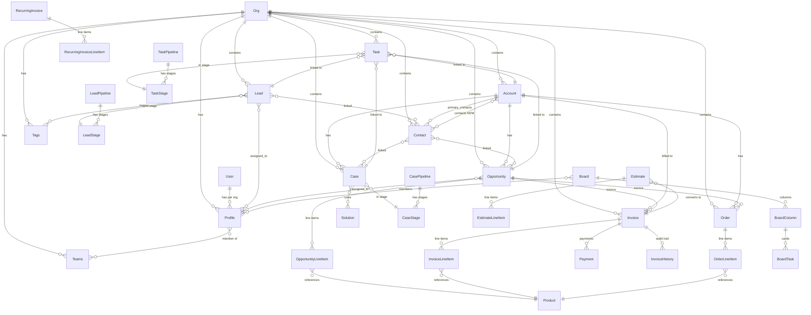
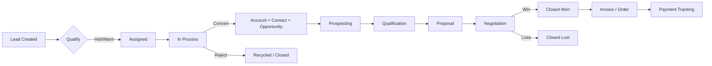

# BottleCRM (Django-CRM) -- Competitive Analysis

**Repository:** https://github.com/MicroPyramid/Django-CRM
**License:** MIT (100% open source, no premium tier)
**Analyzed:** 2026-03-14

## Product Summary

BottleCRM is a modern, open-source CRM platform built with Django REST Framework (backend) and SvelteKit (frontend). It targets startups and small businesses with a full sales pipeline, invoicing, and customer support workflow. It also ships a Flutter mobile app (Android/iOS).

### Tech Stack

| Layer | Technology |
|-------|-----------|
| Backend | Django 5.x + Django REST Framework |
| Frontend | SvelteKit 2.x + Svelte 5 (runes) + TailwindCSS 4 + shadcn-svelte |
| Mobile | Flutter (Dart) -- Android + iOS |
| Database | PostgreSQL 14+ with Row-Level Security (RLS) |
| Cache/Broker | Redis |
| Background Jobs | Celery |
| Auth | JWT (access + refresh tokens, magic links) |
| File Storage | AWS S3 |
| Email | AWS SES |
| API Docs | drf-spectacular (Swagger / Redoc) |
| Container | Docker Compose (backend, frontend, postgres, redis, celery) |

### Architecture Pattern

```
SvelteKit Frontend (5173) --> Django REST API (8000) --> PostgreSQL (RLS)
Flutter Mobile App -------/                              |
                                                         Redis (cache/broker)
                                                         Celery (async tasks)
```

## Module Map

| Module | Django App | Description |
|--------|-----------|-------------|
| Leads | `leads/` | Lead capture, qualification, pipeline kanban, conversion |
| Accounts | `accounts/` | Company/organization records, email tracking |
| Contacts | `contacts/` | Individual person records linked to accounts |
| Opportunities | `opportunity/` | Sales deals with stage pipeline, line items, deal aging |
| Cases | `cases/` | Customer support tickets with SLA tracking, knowledge base |
| Tasks | `tasks/` | Task management with kanban boards, CRM entity linking |
| Invoices | `invoices/` | Full invoicing: products, estimates, recurring, payments, PDF |
| Orders | `orders/` | Sales orders linked to accounts/opportunities |
| Common | `common/` | Users, orgs, profiles, teams, tags, comments, attachments, audit |

## Data Model Overview (Mermaid)



## Sales Pipeline Flow



## Key Differentiators vs Pipelinq

| Capability | BottleCRM | Pipelinq |
|-----------|-----------|----------|
| Multi-tenancy | PostgreSQL RLS (enterprise-grade) | Nextcloud org-scoped |
| Pipeline stages | Fixed stages + custom kanban pipelines | Schema-driven dynamic |
| Lead conversion | Automated (lead -> account+contact+opportunity) | Manual |
| Invoicing | Full suite (invoices, estimates, recurring, payments, PDF) | Not built-in |
| Orders | Dedicated order module | Not built-in |
| Mobile app | Flutter (Android + iOS) | None |
| Deal aging | Per-stage config with green/yellow/red indicators | Not built-in |
| Sales goals | Revenue/deals-closed targets with pace tracking | Not built-in |
| Duplicate detection | Email, phone, name, company, website matching | Not built-in |
| Knowledge base | Solution articles linked to cases | Not built-in |
| SLA tracking | First-response + resolution SLA with breach detection | Not built-in |
| Background jobs | Celery + Redis | n8n workflows |
| Security audit | Dedicated SecurityAuditLog (login, org switch, etc.) | Nextcloud audit |
| API style | REST (DRF) with Swagger | REST (Nextcloud) |
| Frontend | SvelteKit + shadcn-svelte | Vue 2 (Nextcloud) |
| Deployment | Docker Compose / self-hosted | Nextcloud app store |
| Integration | AWS SES/S3, standalone | Nextcloud ecosystem (files, n8n, etc.) |

## Strengths

1. **Complete sales lifecycle** -- Lead capture through invoicing and payment in one platform
2. **Enterprise-grade multi-tenancy** -- PostgreSQL RLS with security audit logging
3. **Modern tech stack** -- Svelte 5 + TailwindCSS 4 + Django 5 with excellent DX
4. **Rich invoicing** -- Templates, estimates, recurring invoices, payments, client portal
5. **Deal intelligence** -- Stage aging, sales goals, win probability auto-calculation
6. **Duplicate detection** -- Built-in service for contacts, leads, and accounts
7. **Mobile app** -- Flutter app with leads, deals, tasks, and dashboard
8. **Full test coverage** -- pytest with dedicated test modules per app

## Weaknesses

1. **No workflow automation** -- No visual workflow builder (just Celery tasks for emails)
2. **No document generation** -- PDF invoices only; no contract/proposal templates
3. **No calendar integration** -- No Google/Outlook calendar sync (mentioned in features page but not in code)
4. **No email sync** -- Only outbound SES; no inbox integration or email tracking
5. **No custom fields** -- Schema is fixed; no user-defined fields on entities
6. **No reporting/analytics** -- Dashboard exists but no configurable reports
7. **Pipeline stages are mostly fixed** -- Opportunity stages are hardcoded (6 stages); only leads/cases/tasks have custom pipelines
8. **Limited integrations** -- AWS-only; no Zapier, no webhook system
9. **Single-developer project risk** -- Primarily maintained by MicroPyramid

## Relevance to Pipelinq

BottleCRM's strongest competitive advantage over Pipelinq is the **complete sales-to-invoice lifecycle** in a single app. Features Pipelinq should consider adopting:

- **Lead conversion workflow** -- Automated creation of account + contact + opportunity from a lead
- **Deal aging indicators** -- Visual green/yellow/red indicators for stale deals
- **Sales goals/quotas** -- Period-based targets with pace tracking
- **Estimate-to-invoice flow** -- Quote generation that converts to invoices
- **Duplicate detection** -- Prevent data pollution with email/phone/name matching
- **SLA tracking on cases** -- First-response and resolution deadlines with breach alerts
