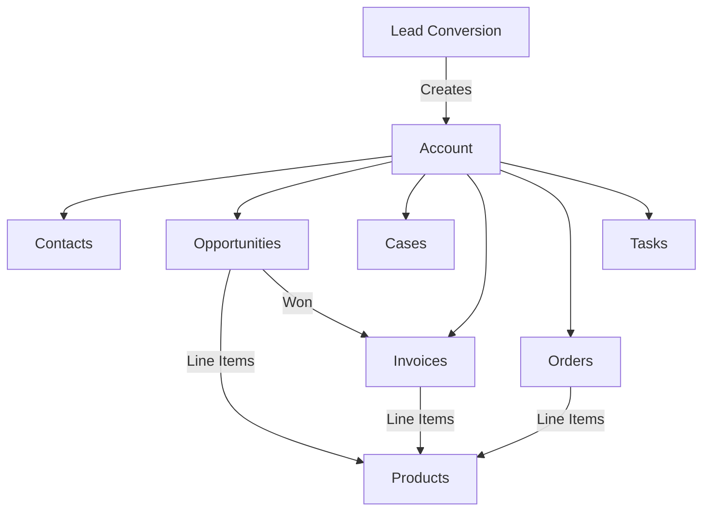

# Accounts Management

## Overview

Accounts represent companies or organizations in BottleCRM. They are the central entity linking contacts, opportunities, cases, invoices, and orders. Accounts hold business metadata (industry, revenue, employees) and serve as the billing entity for invoices.

## Data Model

### Account Entity

| Field | Type | Description |
|-------|------|-------------|
| name | CharField(255) | Required, unique per org (case-insensitive) |
| email | EmailField | Company email |
| phone | CharField(25) | Validated phone |
| website | URLField | Company website |
| industry | CharField(255) | From INDCHOICES (28 industries) |
| number_of_employees | PositiveIntegerField | Company size |
| annual_revenue | DecimalField(15,2) | Must be >= 0 |
| currency | CharField(3) | Currency code |
| address_line, city, state, postcode, country | Address fields | Flat address |
| description | TextField | Notes |
| is_active | BooleanField | Soft delete |

### Relationships

- **Contacts**: M2M (`contacts`) -- all linked contacts
- **Primary Contacts**: Reverse FK from Contact.account -- contacts whose primary account this is
- **Opportunities**: Reverse FK from Opportunity.account
- **Cases**: Reverse FK from Case (accounts_cases)
- **Invoices**: Reverse FK from Invoice.account (PROTECT on delete)
- **Orders**: Reverse FK from Order.account
- **Tasks**: Reverse FK from Task.account
- **Assigned To / Teams / Tags**: Standard M2M assignment fields

### Supporting Models

- **AccountEmail**: Scheduled/sent emails from account to contacts (subject, body, timezone, recipients)
- **AccountEmailLog**: Tracks delivery status per contact per email

### Constraints

- `unique_account_name_per_org`: Case-insensitive unique name per organization
- `account_revenue_non_negative`: Annual revenue must be >= 0 or null

## API Endpoints

```
GET    /api/accounts/           -- List with filtering
POST   /api/accounts/           -- Create
GET    /api/accounts/<pk>/      -- Detail
PUT    /api/accounts/<pk>/      -- Update
DELETE /api/accounts/<pk>/      -- Delete (blocked if invoices exist via PROTECT)
POST   /api/accounts/comment/<pk>/
POST   /api/accounts/attachment/<pk>/
```

## Key Features

1. **Email Campaigns**: AccountEmail model supports scheduling emails to multiple contacts with delivery tracking per recipient
2. **Revenue Tracking**: Annual revenue field with currency, used for account scoring/segmentation
3. **Industry Classification**: 28 predefined industry categories for segmentation
4. **Duplicate Detection**: `DuplicateDetector.find_duplicate_accounts()` matches on name (exact + partial first word), email, website (domain normalized), and phone
5. **Invoice Protection**: CASCADE protection prevents deleting accounts with invoices

## Account-Centric Data Flow



## Relevance to Pipelinq

- The **account-centric data model** (account as hub for all CRM entities) is a proven CRM pattern worth studying
- **Email campaign tracking** at the account level is unique -- most CRMs handle this at contact level
- The **invoice protection** (PROTECT on FK delete) prevents orphaned financial records
