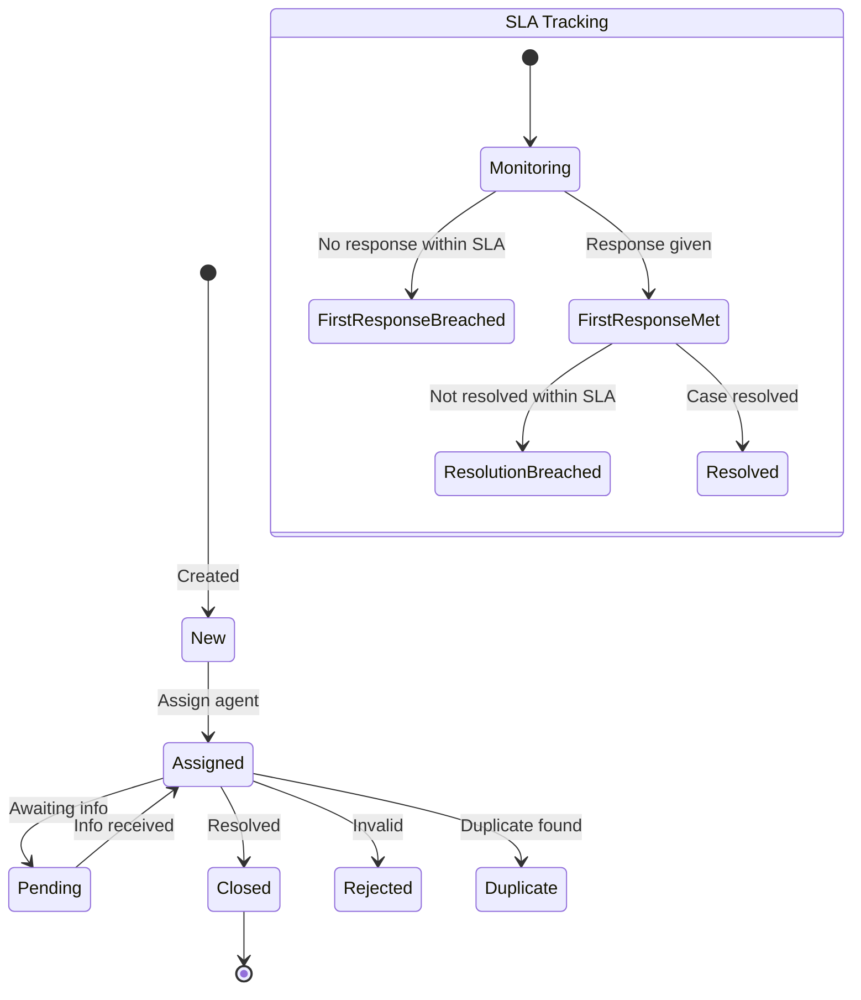

# Cases (Customer Support)

## Overview

Cases handle customer support tickets in BottleCRM with SLA tracking, priority-based routing, kanban pipelines, and a knowledge base (Solutions). Cases link to accounts and contacts for full customer context.

## Data Model

### Case Entity

| Field | Type | Description |
|-------|------|-------------|
| name | CharField(64) | Case name/subject |
| status | CharField | New, Assigned, Pending, Closed, Rejected, Duplicate |
| priority | CharField | Low, Normal, High, Urgent |
| case_type | CharField | Question, Incident, Problem |
| account | FK(Account) | Related account |
| contacts | M2M(Contact) | Related contacts |
| closed_on | DateField | Close date (required when closing) |
| description | TextField | Case details |
| **SLA Fields** | | |
| first_response_at | DateTimeField | When first response was given |
| resolved_at | DateTimeField | When case was resolved |
| sla_first_response_hours | PositiveIntegerField | Target hours (default by priority) |
| sla_resolution_hours | PositiveIntegerField | Target hours (default by priority) |
| **Kanban Fields** | | |
| stage | FK(CaseStage) | Custom pipeline stage |
| kanban_order | DecimalField(15,6) | Drag-drop ordering |

### SLA Defaults by Priority

| Priority | First Response | Resolution |
|----------|---------------|------------|
| Low | 8 hours | 48 hours |
| Normal | 4 hours | 24 hours |
| High | 2 hours | 8 hours |
| Urgent | 1 hour | 4 hours |

### SLA Properties

| Property | Logic |
|----------|-------|
| `is_sla_first_response_breached` | No first_response_at AND now > created_at + sla_hours |
| `is_sla_resolution_breached` | No resolved_at AND now > created_at + sla_hours |
| `first_response_sla_deadline` | created_at + sla_first_response_hours |
| `resolution_sla_deadline` | created_at + sla_resolution_hours |

### Case Pipeline Models

**CasePipeline**: Named pipeline per org (e.g., "Support", "Engineering", "Billing")
- One default per org (unique constraint)

**CaseStage**: Kanban column within pipeline
- `stage_type`: open, closed, rejected
- `maps_to_status`: Auto-updates Case.status on stage entry
- `wip_limit`: Maximum cases per stage
- `color`: Hex color for UI

### Knowledge Base (Solutions)

| Field | Type | Description |
|-------|------|-------------|
| title | CharField(255) | Solution title |
| description | TextField | Solution content |
| status | CharField | draft, reviewed, approved |
| is_published | BooleanField | Public visibility |
| cases | M2M(Case) | Linked cases |

Solutions follow a review workflow: draft -> reviewed -> approved -> published.
Only approved solutions can be published.

## Case Lifecycle

## Relevance to Pipelinq

1. **SLA tracking** with priority-based defaults is a strong feature for service-oriented CRM
2. **Knowledge base** (Solutions) provides institutional memory for recurring issues
3. **Custom pipelines per org** allow different support workflows (support, engineering, billing)
4. **Stage-to-status mapping** keeps status consistent across kanban and list views
