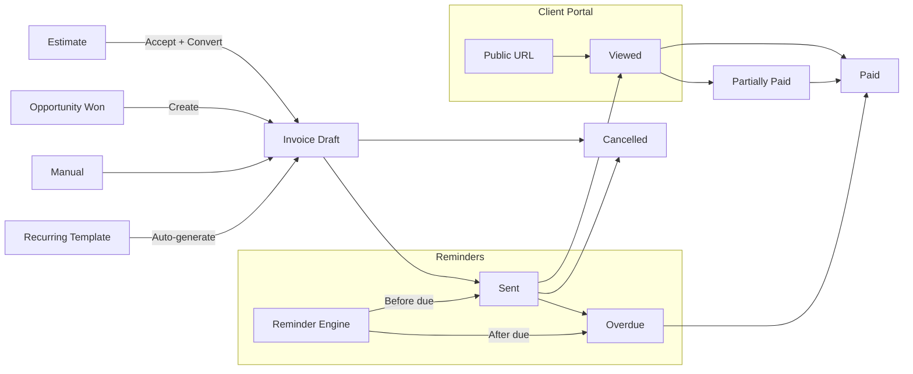

# Invoicing System

## Overview

BottleCRM has a comprehensive invoicing subsystem covering products, invoices, estimates, recurring invoices, payments, templates, and a client portal. This is one of the most feature-rich modules and a major differentiator from simpler CRMs.

## Module Components

### Product Catalog

| Field | Type | Description |
|-------|------|-------------|
| name | CharField(255) | Product name |
| description | TextField | Description |
| sku | CharField(100) | Unique per org |
| price | DecimalField(12,2) | Default price |
| currency | CharField(3) | Currency |
| category | CharField(100) | Product category |
| is_active | BooleanField | Active status |

Products are referenced by Invoice, Estimate, Opportunity, and Order line items.

### Invoice

Full invoice with CRM integration:

- **CRM Links**: Account (required, PROTECT), Contact (required via validation), Opportunity (optional)
- **Addresses**: Billing (company from) + Client (bill to) addresses, denormalized for PDF/history
- **Financials**: Subtotal, discount (% or fixed), tax, shipping, total, amount_paid, amount_due
- **Payment Terms**: Due on Receipt, Net 15/30/45/60, Custom
- **Status Flow**: Draft -> Sent -> Viewed -> Paid (or Partially Paid, Overdue, Cancelled)
- **Timestamps**: sent_at, viewed_at, paid_at, cancelled_at
- **Reminders**: Configurable days before/after due, frequency (once, weekly, custom)
- **Client Portal**: Public token-based URL for client viewing (no auth required)
- **Template**: FK to InvoiceTemplate for PDF styling
- **Auto-numbering**: INV-YYYYMMDD-XXXX with race-condition-safe sequence (select_for_update)

### Invoice Line Items

Per-item pricing with discount and tax:
- quantity * unit_price = subtotal
- Per-item discount (% or fixed)
- Per-item tax rate
- total = (subtotal - discount) + tax

### Payments

| Field | Type | Description |
|-------|------|-------------|
| invoice | FK | Parent invoice |
| amount | DecimalField(12,2) | Payment amount |
| payment_date | DateField | Date of payment |
| payment_method | CharField | Cash, Check, Credit Card, Bank Transfer, PayPal, Stripe, Other |
| reference_number | CharField(100) | Transaction reference |
| notes | TextField | Payment notes |

Payments auto-update invoice: recalculates amount_paid, amount_due, and transitions status to Paid or Partially_Paid.

### Estimates (Quotes)

Mirrors Invoice structure but with estimate-specific fields:
- **Status**: Draft, Sent, Viewed, Accepted, Declined, Expired
- **Expiry Date**: Auto-expiration support
- **Conversion**: `converted_to_invoice` FK -- estimates can be converted to invoices
- **Client Portal**: Separate public token for client viewing
- **Auto-numbering**: EST-YYYYMMDD-XXXX

### Recurring Invoices

Template for auto-generating invoices on a schedule:
- **Frequencies**: Weekly, Bi-weekly, Monthly, Quarterly, Semi-annually, Yearly, Custom (N days)
- **Schedule**: start_date, end_date, next_generation_date
- **Auto-send**: Option to automatically send generated invoices
- **Statistics**: invoices_generated counter
- Own line item template (RecurringInvoiceLineItem)

### Invoice Templates

Customizable PDF templates:
- Logo, primary/secondary colors
- Custom HTML/CSS for layout
- Default notes, terms, footer text
- One default template per org

### Invoice History (Audit Trail)

Snapshots key fields on every change:
- invoice_title, invoice_number, status
- client_name, client_email
- total_amount, amount_due, currency, due_date
- updated_by, change details

## Invoice Lifecycle



## Public Portal Endpoints

```
GET /api/public/invoice/<token>/   -- View invoice (no auth)
GET /api/public/estimate/<token>/  -- View estimate (no auth)
```

## Relevance to Pipelinq

The invoicing module is the single largest competitive gap between BottleCRM and Pipelinq:

1. **Estimate-to-invoice flow** -- Quoting that converts to billing
2. **Recurring invoices** -- Subscription/retainer billing automation
3. **Client portal** -- Token-based public links for client self-service
4. **Payment tracking** with auto-status updates
5. **PDF templates** with custom branding
6. **Audit trail** on every invoice change

For Pipelinq, integration with Nextcloud's existing tools (e.g., docudesk for PDF generation) could provide similar capabilities without building from scratch.
