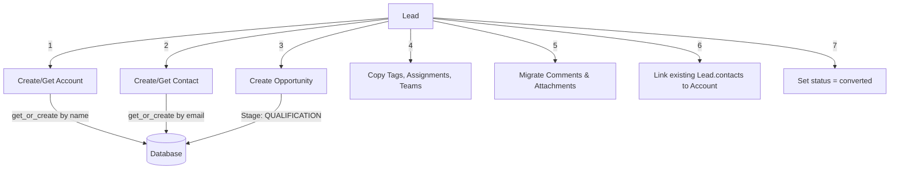

# Lead Management

## Overview

Leads are unqualified sales prospects in BottleCRM. They carry personal and business information, progress through a pipeline (either status-based or kanban-based), and can be converted into Account + Contact + Opportunity entities. The lead module is the entry point of the sales funnel.

## Data Model

### Lead Entity

| Field | Type | Description |
|-------|------|-------------|
| title | CharField(255) | Lead name/subject |
| salutation | CharField(64) | Mr, Mrs, Ms, Dr |
| first_name | CharField(255) | Person first name |
| last_name | CharField(255) | Person last name |
| email | EmailField | Unique per org (case-insensitive) |
| phone | CharField(25) | Validated phone |
| job_title | CharField(255) | Person's role |
| website | CharField(255) | Company/personal website |
| linkedin_url | URLField(500) | LinkedIn profile |
| company_name | CharField(255) | Company name (text field) |
| **Pipeline Fields** | | |
| status | CharField | assigned, in process, converted, recycled, closed |
| source | CharField | call, email, existing customer, partner, PR, campaign, other |
| industry | CharField | From INDCHOICES |
| rating | CharField | HOT, WARM, COLD |
| opportunity_amount | DecimalField(12,2) | Estimated deal value |
| currency | CharField(3) | Currency code |
| probability | IntegerField | Win probability 0-100% |
| close_date | DateField | Expected close date |
| **Activity Tracking** | | |
| last_contacted | DateField | Last contact date |
| next_follow_up | DateField | Next follow-up date |
| **Kanban Fields** | | |
| stage | FK(LeadStage) | Custom pipeline stage |
| kanban_order | DecimalField(15,6) | Drag-drop ordering |

### Lead Pipeline Models

**LeadPipeline**: Custom named pipeline per organization (e.g., "Inbound", "Outbound", "Enterprise")
- `is_default`: Only one default pipeline per org (enforced by unique constraint)
- `is_active`: Soft disable

**LeadStage**: Stage within a pipeline (kanban column)
- `order`: Display position
- `color`: Hex color for UI
- `stage_type`: open | won | lost
- `maps_to_status`: Automatically updates Lead.status when entering this stage
- `win_probability`: Default probability when lead enters this stage
- `wip_limit`: Maximum leads allowed (WIP limit for kanban)

### Constraints

- `unique_lead_email_per_org`: Case-insensitive unique email per org
- `lead_probability_range`: 0-100
- `lead_amount_non_negative`: >= 0 or null

## Lead Conversion

The `convert_lead_to_account()` service function performs a comprehensive conversion:



Key conversion behaviors:
- Account name: Uses `company_name` or falls back to `first_name + last_name`
- Account: `get_or_create` (respects unique name constraint -- reuses existing)
- Contact: `get_or_create` by email (links to account if existing contact found)
- Opportunity: Created at QUALIFICATION stage with lead's amount/probability/source
- Comments and Attachments: **Migrated** from lead to account (ContentType update)
- All M2M relations (tags, assigned_to, teams) are copied to created entities

## Computed Properties

| Property | Logic |
|----------|-------|
| `days_since_last_contact` | Days since last_contacted or created_at |
| `is_stale` | >30 days without contact and not converted/closed |
| `days_until_follow_up` | Days until next_follow_up (negative = overdue) |
| `is_follow_up_overdue` | next_follow_up date has passed |

## API Endpoints

```
GET    /api/leads/              -- List with filtering
POST   /api/leads/              -- Create
GET    /api/leads/<pk>/         -- Detail
PUT    /api/leads/<pk>/         -- Update
DELETE /api/leads/<pk>/         -- Delete
POST   /api/leads/<pk>/convert/ -- Convert to Account+Contact+Opportunity
GET    /api/leads/kanban/       -- Kanban board view
PATCH  /api/leads/kanban/move/  -- Drag-drop move card
```

## Relevance to Pipelinq

This is the most competitively relevant module for Pipelinq:

1. **Lead conversion workflow** is the standout feature -- automated creation of 3 entities with data migration
2. **Dual pipeline system** (status-based + custom kanban stages) gives flexibility
3. **Stale lead detection** and follow-up tracking are valuable for sales teams
4. **WIP limits** on kanban stages prevent bottleneck blindness
5. **Stage-to-status mapping** keeps the status field consistent regardless of which pipeline view is used
