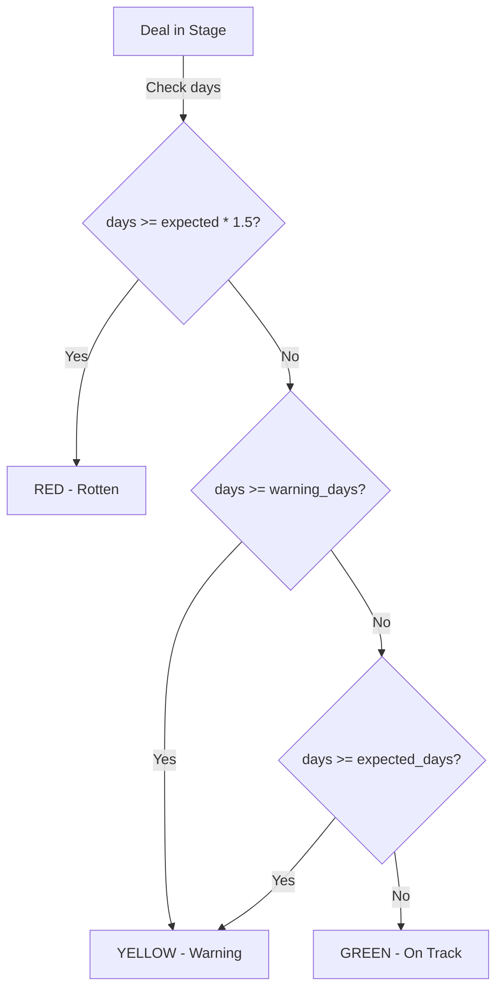

# Opportunities (Deals) Management

## Overview

Opportunities represent active sales deals in BottleCRM. They track the sales pipeline from prospecting through to close, with financial data, line items, deal aging, and sales goal tracking. This is the core revenue pipeline module.

## Data Model

### Opportunity Entity

| Field | Type | Description |
|-------|------|-------------|
| name | CharField(255) | Deal name |
| account | FK(Account) | Parent account |
| stage | CharField(64) | PROSPECTING, QUALIFICATION, PROPOSAL, NEGOTIATION, CLOSED_WON, CLOSED_LOST |
| opportunity_type | CharField(64) | NEW_BUSINESS, EXISTING_BUSINESS, RENEWAL, UPSELL |
| amount | DecimalField(12,2) | Deal value (manual or calculated from line items) |
| amount_source | CharField | MANUAL or CALCULATED |
| currency | CharField(3) | Currency code |
| probability | IntegerField | Win probability 0-100% (auto-set from stage) |
| closed_on | DateField | Expected/actual close date |
| lead_source | CharField | Origin of the deal |
| closed_by | FK(Profile) | Who closed the deal |
| stage_changed_at | DateTimeField | Timestamp of last stage change |
| description | TextField | Notes |

### Stage Probability Auto-Mapping

```
PROSPECTING:   10%
QUALIFICATION: 25%
PROPOSAL:      50%
NEGOTIATION:   75%
CLOSED_WON:   100%
CLOSED_LOST:    0%
```

Probability is auto-set on save when the current value is 0 or null.

### Deal Aging System

**StageAgingConfig** (per org, per stage):
- `expected_days`: Number of days a deal should stay in this stage
- `warning_days`: Optional earlier warning threshold

**Aging Status Calculation:**



Default expected days: Prospecting 14, Qualification 14, Proposal 10, Negotiation 10.
Rotten multiplier: 1.5x expected days.

### Opportunity Line Items

| Field | Type | Description |
|-------|------|-------------|
| opportunity | FK | Parent opportunity |
| product | FK(Product) | Optional product catalog link |
| name | CharField(255) | Item name (auto-fills from product) |
| description | CharField(500) | Item description |
| quantity | DecimalField(10,2) | Quantity |
| unit_price | DecimalField(12,2) | Per-unit price (auto-fills from product) |
| discount_type | CharField | PERCENTAGE or FIXED |
| discount_value | DecimalField(12,2) | Discount amount/percentage |
| discount_amount | DecimalField(12,2) | Calculated discount |
| subtotal | DecimalField(12,2) | quantity * unit_price |
| total | DecimalField(12,2) | subtotal - discount |
| order | PositiveIntegerField | Display order |

**Auto-recalculation**: When line items are added/updated/deleted, the opportunity's `amount` is automatically recalculated and `amount_source` set to CALCULATED.

### Sales Goals

| Field | Type | Description |
|-------|------|-------------|
| name | CharField(255) | Goal name |
| goal_type | CharField | REVENUE or DEALS_CLOSED |
| target_value | DecimalField(12,2) | Target amount or count |
| period_type | CharField | MONTHLY, QUARTERLY, YEARLY, CUSTOM |
| period_start / period_end | DateField | Goal period |
| assigned_to | FK(Profile) | Individual goal (optional) |
| team | FK(Teams) | Team goal (optional) |
| milestone_50/90/100_notified | BooleanField | Notification tracking |

**Progress Computation:**
- Queries CLOSED_WON opportunities within period
- Filters by assigned_to or team members
- Returns current_value, progress_percent (capped at 100%), and status (on_track, at_risk, behind, completed)
- Status uses pace tracking: compares progress % against expected % based on elapsed time in period

## Validation Rules

- Closed stages require `closed_on` date
- CLOSED_WON requires `amount`
- Probability must be 0-100
- Amount must be non-negative

## API Endpoints

```
GET    /api/opportunities/              -- List
POST   /api/opportunities/              -- Create
GET    /api/opportunities/<pk>/         -- Detail
PUT    /api/opportunities/<pk>/         -- Update
DELETE /api/opportunities/<pk>/         -- Delete
GET    /api/opportunities/<pk>/aging/   -- Deal aging status
GET    /api/opportunities/goals/        -- Sales goals
POST   /api/opportunities/goals/        -- Create goal
GET    /api/opportunities/<pk>/line-items/   -- Line items
POST   /api/opportunities/<pk>/line-items/   -- Add line item
```

## Relevance to Pipelinq

The opportunity module has several features highly relevant to Pipelinq:

1. **Deal aging** with configurable per-stage thresholds is a key sales intelligence feature
2. **Sales goals with pace tracking** provide accountability and forecasting
3. **Line items with product catalog** enable quoting directly from opportunities
4. **Auto-probability mapping** reduces data entry friction
5. **Amount source tracking** (manual vs calculated) prevents confusion when line items exist
6. **Stage change tracking** (`stage_changed_at`) enables aging without a separate history table
