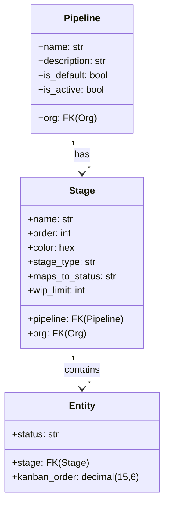

# Pipeline and Kanban System

## Overview

BottleCRM implements a reusable pipeline/kanban pattern across three modules (Leads, Cases, Tasks) plus a standalone Board system for Opportunities. Each module follows the same three-model pattern: Pipeline -> Stage -> Entity.

## Architectural Pattern

### Three-Model Pattern (Leads, Cases, Tasks)



### Per-Module Implementations

| Module | Pipeline Model | Stage Model | Stage Types | Status Choices |
|--------|---------------|-------------|-------------|----------------|
| Leads | LeadPipeline | LeadStage | open, won, lost | assigned, in process, converted, recycled, closed |
| Cases | CasePipeline | CaseStage | open, closed, rejected | New, Assigned, Pending, Closed, Rejected, Duplicate |
| Tasks | TaskPipeline | TaskStage | open, in_progress, completed | New, In Progress, Completed |

### Opportunity Pipeline (Fixed)

Opportunities use a **hardcoded stage set** (no custom Pipeline/Stage models):
- PROSPECTING -> QUALIFICATION -> PROPOSAL -> NEGOTIATION -> CLOSED_WON / CLOSED_LOST

This is simpler but less flexible than the three-model pattern used by other modules.

## Key Design Decisions

### 1. Dual View Mode

Entities support both status-based and stage-based kanban views:
- **Status-based**: Uses the entity's `status` field as columns (no Pipeline/Stage needed)
- **Stage-based**: Uses `stage` FK with custom Pipeline/Stage configuration
- The `stage` field is nullable -- when null, the status-based view is used

### 2. Stage-to-Status Mapping

Each Stage has an optional `maps_to_status` field. When an entity enters a stage:
- The entity's `status` field is automatically updated to the mapped status
- This keeps the status field consistent regardless of view mode

### 3. Kanban Ordering

All kanban-enabled entities have a `kanban_order` field (DecimalField 15,6):
- Uses decimal to allow inserting between existing items without reordering all
- Six decimal places provide fine-grained positioning
- Indexed for performance: `(status, kanban_order)` and `(stage, kanban_order)`

### 4. WIP Limits

Stages can have optional WIP (Work In Progress) limits:
- `wip_limit`: Maximum entities allowed in this stage
- Null means unlimited
- Frontend enforces this (backend does not reject -- it's advisory)

### 5. One Default Pipeline Per Org

Each module enforces at most one default pipeline per organization via unique constraint:
```sql
UniqueConstraint(fields=["org"], condition=Q(is_default=True))
```

### 6. Standalone Board System

For project-style kanban (not tied to CRM pipeline stages):
- Board -> BoardColumn -> BoardTask
- Separate membership model (BoardMember with owner/admin/member roles)
- BoardTasks can optionally link to CRM entities (account, contact, opportunity)

## Frontend Components

```
frontend/src/lib/components/ui/
    kanban/
        KanbanBoard.svelte      -- Generic kanban board
        KanbanColumn.svelte     -- Generic column
    lead-kanban/
        LeadCard.svelte         -- Lead-specific card
        LeadKanban.svelte       -- Lead kanban wrapper
    case-kanban/
        CaseCard.svelte         -- Case-specific card
        CaseKanban.svelte       -- Case kanban wrapper
    task-kanban/
        TaskCard.svelte         -- Task-specific card
        TaskKanban.svelte       -- Task kanban wrapper
    view-toggle/
        ViewToggle.svelte       -- Switch between list/kanban/calendar
```

## Kanban API Pattern

```
GET    /api/{module}/kanban/         -- Board data (stages + entities)
PATCH  /api/{module}/kanban/move/    -- Move card (stage + order update)
```

The move endpoint updates:
1. The entity's `stage` FK (if moving between columns)
2. The entity's `kanban_order` (new position)
3. The entity's `status` (if the target stage has `maps_to_status`)

## Relevance to Pipelinq

This is the most architecturally relevant analysis for Pipelinq:

1. **Three-model pattern** (Pipeline -> Stage -> Entity) is clean and reusable -- Pipelinq uses schema-driven dynamic stages which is more flexible but harder to implement
2. **Decimal kanban ordering** (15,6) is a proven pattern for drag-drop -- avoids reordering all items on each move
3. **Stage-to-status mapping** solves the "two views, one source of truth" problem elegantly
4. **WIP limits** are a valuable Lean/kanban feature often missing from CRMs
5. **View toggle** (list/kanban/calendar) gives users choice without data model changes
6. The **fixed vs custom pipeline** split (Opportunities = fixed, Leads/Cases/Tasks = custom) shows a pragmatic tradeoff -- not everything needs to be customizable
