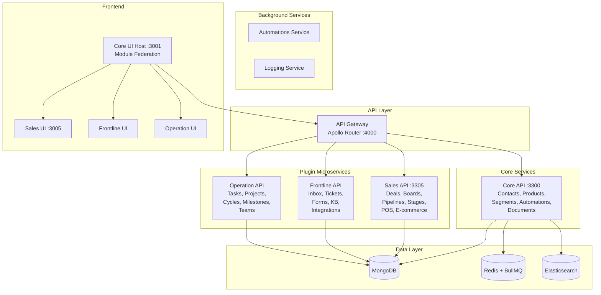
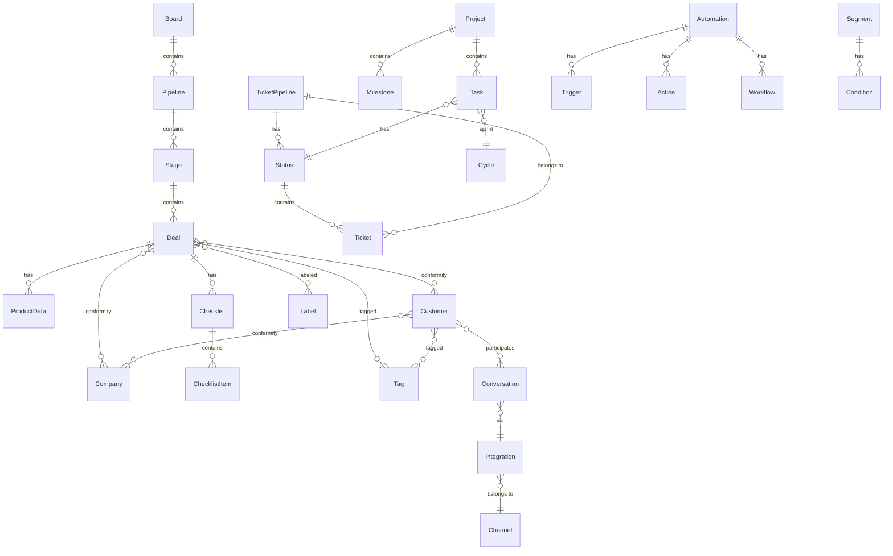

# Erxes Competitive Analysis for Pipelinq

## Product Overview

**Erxes** (pronounced "erk-sis") is an open-source Experience Operating System (XOS) that unifies marketing, sales, operations, and support. It positions itself as a replacement for HubSpot, Zendesk, Linear, and Wix combined.

- **License:** AGPLv3 (core), Enterprise Edition for premium plugins
- **Repository:** https://github.com/erxes/erxes
- **Tech Stack:** Node.js/TypeScript monorepo (Nx), React 18, MongoDB, Redis, GraphQL Federation, Module Federation
- **Architecture:** Microservices with plugin-based extensibility
- **Self-hosted:** Yes, Docker-based deployment
- **Analysis Date:** 2026-03-14

## Architecture Summary

Erxes is built as an Nx-powered monorepo with three layers:

1. **Backend** -- GraphQL Federation gateway (Apollo Router, port 4000) + Core API (port 3300) + plugin microservices (ports 3305+)
2. **Frontend** -- Module Federation host (React 18, Rspack, port 3001) + plugin micro-frontends (ports 3005+)
3. **Apps** -- Standalone applications (Next.js customer portal, POS client, widgets)

Each plugin is a self-contained microservice (backend) + micro-frontend (frontend), registered via Redis-based service discovery.

## Plugin Ecosystem

### Open Source (AGPLv3)
| Plugin | Description | Pipelinq Relevance |
|--------|-------------|-------------------|
| **Sales** | Deals, boards, pipelines, stages, POS, e-commerce | **Direct competitor** |
| **Frontline** | Inbox, tickets, forms, knowledge base, integrations | Indirect (support) |
| **Operation** | Tasks, projects, cycles, milestones, teams | **Direct competitor** |

### Enterprise Edition (Paid)
| Plugin | Description |
|--------|-------------|
| Content | Headless CMS, websites, help center |
| Accounting | Financial management, salary |
| Tourism | Booking, property management |
| Property | Real estate management |
| Team | HR, time tracking, training |
| Finance | Banking, core banking |

### Core Modules (included in every deployment)
- **Contacts** -- Customers (leads/visitors/customers) + Companies
- **Products** -- Product catalog with categories
- **Segments** -- Dynamic audience segmentation with conditions
- **Automations** -- Workflow engine with triggers and actions
- **Documents** -- Document templates and generation

## Data Model Overview

## Key Strengths (vs Pipelinq)

1. **Mature sales pipeline** -- Board > Pipeline > Stage > Deal hierarchy with full Kanban, Gantt, and time tracking
2. **Product-aware deals** -- Deals embed product data with quantity, pricing, tax, discount calculations
3. **Multi-entity conformities** -- Generic relation system linking deals to customers, companies, and cross-entity
4. **Comprehensive automation** -- Trigger/action engine with stage probability-based triggers for deals
5. **Omnichannel inbox** -- Unified conversations across Facebook, email (IMAP), phone, and chat
6. **Plugin architecture** -- Clean microservice boundaries with GraphQL Federation and Module Federation
7. **Client portal** -- Next.js customer-facing portal with deal and ticket access
8. **Real-time updates** -- GraphQL subscriptions for deal changes, conversations, etc.
9. **Segment engine** -- Dynamic audiences with property, event, and sub-segment conditions
10. **Growth hacking** -- RICE/ICE/PIE scoring built into pipelines

## Key Weaknesses

1. **MongoDB-only** -- No SQL database support; harder for government/enterprise environments requiring PostgreSQL
2. **Complex deployment** -- Requires MongoDB, Redis, Elasticsearch, and multiple microservices
3. **Enterprise lock-in** -- Key features (content, accounting, team) are EE-only
4. **Heavy monorepo** -- Large codebase (~100+ packages) with significant build complexity
5. **No government compliance** -- No NL Design System, no WCAG-specific features, no government API standards
6. **Ticket system is new** -- The frontline ticket module is a simpler, newer design compared to the mature sales pipeline
7. **Operation module is basic** -- Linear-style tasks without the depth of dedicated PM tools

## Relevance to Pipelinq

Erxes's sales pipeline is the most directly comparable feature to Pipelinq. Key takeaways:

- **Board/Pipeline/Stage hierarchy** is more structured than a simple Kanban -- consider if Pipelinq needs board grouping
- **Product data on deals** with financial calculations (tax, discount, amount) is a strong pattern
- **Conformities** (generic relations) are a clean way to link entities without hard-coded foreign keys
- **Stage probability** (10%-90%, Won, Lost) provides pipeline analytics that Pipelinq should evaluate
- **Automation triggers** on stage changes/probability changes are powerful for workflow automation
- **Checklists** embedded in deals are a common CRM pattern worth considering

## Feature Specs

- [Sales Pipeline](specs/sales-pipeline/spec.md) -- Boards, pipelines, stages, deals
- [Contacts CRM](specs/contacts-crm/spec.md) -- Customers, companies, conformities
- [Tickets & Support](specs/tickets-support/spec.md) -- Ticket system, knowledge base
- [Project Operations](specs/project-operations/spec.md) -- Tasks, projects, cycles, milestones
- [Automation Engine](specs/automation-engine/spec.md) -- Triggers, actions, workflows
- [Omnichannel Inbox](specs/omnichannel-inbox/spec.md) -- Conversations, integrations, channels
