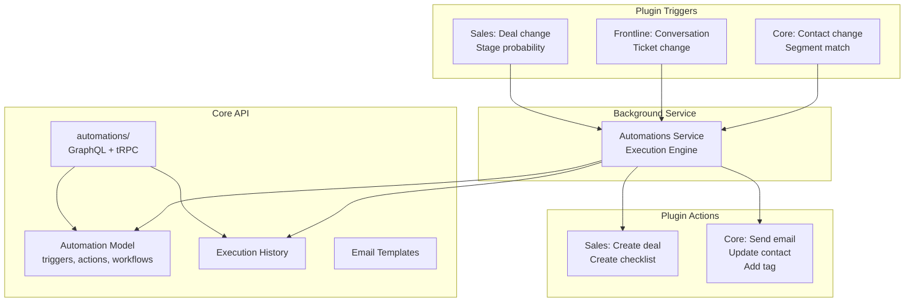

# Automation Engine

## Overview

Erxes has a workflow automation engine in the core API that supports trigger-action workflows across all plugins. Automations consist of triggers, actions, and workflows, with execution history tracking. Each plugin registers its own triggers and actions with the core engine.

## Data Model

### Automation
- `name`, `status`, `tagIds`
- `triggers[]` -- array of trigger definitions
- `actions[]` -- array of action definitions
- `workflows[]` -- visual workflow definitions
- `createdBy`, `updatedBy`, timestamps

### Trigger
- `id`, `type`, `label`, `description`, `icon`
- `style`, `config` (JSON), `position` (JSON) -- visual editor metadata
- `workflowId`, `actionId`
- `isCustom` -- for plugin-specific triggers
- `count` -- number of times triggered

### Action
- `id`, `type`, `label`, `description`, `icon`
- `style`, `config` (JSON), `position` (JSON)
- `nextActionId`, `targetActionId` -- action chaining
- `workflowId`

### Workflow
- `id`, `automationId`, `name`, `description`
- `config` (JSON), `position` (JSON)

### AutomationHistory (Execution Log)
- `automationId`, `triggerId`, `triggerType`, `triggerConfig`
- `nextActionId`, `targetId`, `target` (JSON)
- `status`, `description`
- `actions[]` -- array of executed action results
- `startWaitingDate`, `waitingActionId` -- for delayed actions
- Timestamps

### AutomationEmailTemplate
- `name`, `description`, `content`, `createdBy`

## Sales Plugin Automation Registration

The sales plugin registers these triggers and actions:

### Triggers
1. **Sales pipeline** -- triggers when a deal changes in any way
2. **Sales pipeline stage probability based** -- triggers when a deal moves to a stage with specific probability (custom trigger)

### Actions
1. **Create deal** -- creates a new deal (supports target source chaining)
2. **Create sales checklist** -- creates a checklist on a deal

### Implementation Files
- `automationHandlers.ts` -- main handler logic
- `action/createAction.ts` -- deal creation automation
- `action/createChecklist.ts` -- checklist creation automation
- `action/getItems.ts` -- fetch items for automation context
- `action/getRelatedValue.ts` -- resolve related entity values
- `trigger/checkStageProbabilityTrigger.ts` -- probability-based trigger logic

## Background Execution

Automations run in a dedicated background service (`backend/services/automations/`), separate from the API services. This ensures:
- Non-blocking execution
- Retry capability
- Execution history tracking
- Waiting/delayed action support

## Architecture

## Key Patterns

### Visual Workflow Editor
Automations store `position` and `style` data for each node, indicating a visual drag-and-drop workflow editor in the frontend.

### Action Chaining
Actions have `nextActionId` and `targetActionId`, enabling sequential and branching workflows.

### Plugin Meta Registration
Each plugin declares its triggers and actions via `meta` configuration in `startPlugin()`. The core engine discovers and orchestrates them.

### Target Source Propagation
Actions can be marked as `isTargetSource` with `allowTargetFromActions`, meaning the output of one action (e.g., a created deal) becomes the input for the next action.

### AI Agent Integration
The automation types include `TrainingProgress` and `AiAgentMessage` types, indicating AI assistant integration within automation workflows.

## Pipelinq Comparison

| Feature | Erxes | Pipelinq Implication |
|---------|-------|---------------------|
| Visual editor | Position/style metadata | Workflow visual builder |
| Stage probability triggers | Trigger on win probability | Stage-aware automations |
| Action chaining | nextActionId linking | Sequential workflow steps |
| Execution history | Full audit trail | Automation logging |
| Waiting/delayed actions | startWaitingDate | Time-delayed steps |
| Email templates | Automation-specific templates | Email action support |
| Plugin extensibility | Meta registration pattern | Plugin-contributed triggers |
| Background execution | Separate service | Async execution (n8n equivalent) |
