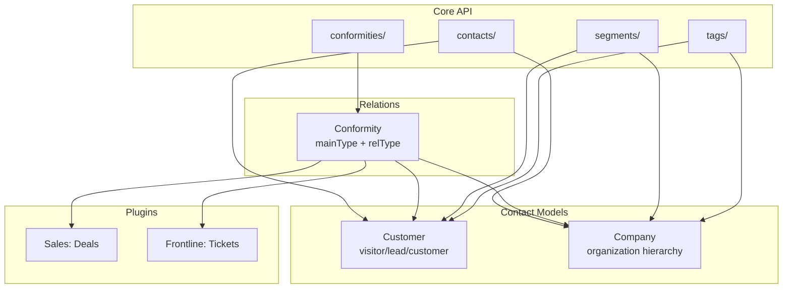

# Contacts CRM

## Overview

Erxes has a two-entity contact model: **Customers** (individuals) and **Companies** (organizations). They are linked to each other and to deals/tickets via a generic **Conformity** system. Contacts are part of the core API, available to all plugins.

## Data Model

### Customer
Represents an individual contact, progressing through states:
- **Identity:** `firstName`, `lastName`, `middleName`, `avatar`, `code`, `birthDate`, `sex`
- **State:** `state` (visitor -> lead -> customer), `status` (Active/Deleted), `leadStatus`
- **Communication:** `primaryEmail`, `emails[]`, `primaryPhone`, `phones[]`, `primaryAddress`, `addresses[]`
- **Validation:** `emailValidationStatus`, `phoneValidationStatus` -- track deliverability
- **Preferences:** `doNotDisturb`, `isSubscribed`, `hasAuthority`
- **Organization:** `position`, `department`, `ownerId` (assigned sales rep)
- **Tracking:** `isOnline`, `lastSeenAt`, `sessionCount`, `visitorId`, `location` (country, city, userAgent)
- **Integration:** `integrationId`, `relatedIntegrationIds` -- source channel tracking
- **Custom data:** `customFieldsData`, `trackedData`, `propertiesData`, `deviceTokens`
- **Dedup:** `mergedIds` -- tracks merged customer records
- **Classification:** `tagIds`, `searchText`, `links` (social media URLs)

### Company
Represents an organization:
- **Identity:** `primaryName`, `names[]`, `avatar`, `code`, `website`
- **Details:** `size`, `industry[]`, `employees`, `businessType`, `description`, `location`
- **Communication:** `primaryEmail`, `emails[]`, `primaryPhone`, `phones[]`, `primaryAddress`, `addresses[]`
- **Organization:** `parentCompanyId` -- company hierarchy, `ownerId`
- **Classification:** `tagIds`, `status`, `score`
- **Preferences:** `doNotDisturb`, `isSubscribed`
- **Custom data:** `customFieldsData`, `trackedData`, `propertiesData`
- **Dedup:** `mergedIds`

### Conformity (Relation System)
Generic many-to-many linking between any entity types:
- `mainType` + `mainTypeId` -- source entity (e.g., "deal", "dealId123")
- `relType` + `relTypeId` -- related entity (e.g., "customer", "custId456")
- Indexed for fast lookup in both directions
- Used to link: deal-customer, deal-company, customer-company, ticket-customer, etc.

## Key Features

### Lead Management
Customers have a `leadStatus` field and progress through states:
- `visitor` -- anonymous website visitor tracked by visitorId
- `lead` -- identified prospect
- `customer` -- qualified/converted contact

### Contact Merging
Both customers and companies support `mergedIds` to track deduplication. When duplicates are merged, the surviving record keeps references to all merged IDs for historical tracking.

### Visitor Tracking
Real-time online status, session counting, location detection (IP-based), and user agent tracking for anonymous visitors before they become known contacts.

### Import/Export
Full import/export support with dedicated handlers:
- Customer export with custom headers and row building
- Company export with equivalent structure
- Bulk import with validation

### Segmentation Integration
Contacts participate in the core Segment engine, which supports:
- Property conditions (field operator value)
- Event conditions (occurrence-based)
- Sub-segment composition
- `and`/`or` conjunction logic

## Architecture

## Pipelinq Comparison

| Feature | Erxes | Pipelinq Implication |
|---------|-------|---------------------|
| Contact states | visitor > lead > customer | Consider contact lifecycle |
| Company hierarchy | parentCompanyId | Parent-child organizations |
| Generic relations | Conformity system | Flexible entity linking |
| Email/phone validation | Built-in status tracking | Deliverability tracking |
| Visitor tracking | Real-time online status | Web tracking integration |
| Contact merging | mergedIds dedup | Duplicate management |
| Custom fields | Flexible schema per contact | Already in OpenRegister |
| Lead scoring | score field on companies | Evaluate scoring model |
