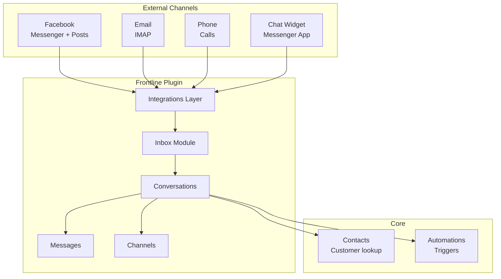

# Omnichannel Inbox

## Overview

The erxes frontline plugin provides a unified inbox for customer conversations across multiple channels. It integrates Facebook Messenger, email (IMAP), phone calls, and chat widgets into a single interface. Conversations are linked to customers via the core contacts system.

## Data Model

### Conversation
- `content` -- last message text
- `customerId`, `visitorId` -- the customer/visitor in the conversation
- `userId`, `assignedUserId` -- agent handling the conversation
- `participatedUserIds`, `readUserIds`
- `integrationId` -- which integration/channel this came from
- `status` -- conversation state
- `operatorStatus` -- human vs bot handling
- `messageCount`, `number`
- **SLA tracking:** `firstRespondedUserId`, `firstRespondedDate`, `isCustomerRespondedLast`
- **Bot:** `isBot`, `botId`
- `tagIds`, `closedAt`, `closedUserId`
- `customsData` -- custom fields
- `userRelevance` -- for routing

### Conversation Message
Defined in `conversationMessages.ts` -- individual messages within a conversation.

### Integration
Source channel configuration:
- Defines how to connect to external services (Facebook, IMAP, etc.)
- Referenced by `integrationId` on conversations

### Channel
Grouping of integrations:
- Contains channel-level configuration
- Referenced by ticket pipelines

### Messenger App
Custom messenger widget configuration for embedding on websites.

## Supported Integrations

| Integration | Module | Description |
|------------|--------|-------------|
| **Facebook** | `integrations/facebook/` | Messenger + comment tracking, post automation |
| **IMAP Email** | `integrations/imap/` | Email inbox via IMAP protocol |
| **Phone/Call** | `integrations/call/` | Phone call tracking and management |
| **Messenger** | `frontline-widgets/` | Embeddable chat widget |

### Facebook Integration Details
The most complex integration with:
- OAuth controller for Facebook API
- Post and comment tracking
- Automated responses for comments and messages
- Middleware for webhook handling
- After-process handlers for conversation syncing

## Architecture

## Key Patterns

### Conversation Query Builder
Dedicated `conversationQueryBuilder.ts` at the plugin root level provides complex filtering:
- Filter by integration, channel, brand, tag
- Filter by status, agent, participation
- Date range filtering
- Full-text search

### Bot Handoff
Conversations track `isBot` and `botId` with `operatorStatus` to manage automated-to-human handoffs.

### Real-time Updates
GraphQL subscriptions for:
- New conversations
- Message updates
- Agent assignment changes
- Conversation status changes

### Response Templates
Pre-built response templates (`response/` module) for quick agent replies.

### Knowledge Base Integration
`knowledgebase/` module provides:
- Articles organized by categories and topics
- Used for self-service and agent reference

### Reports
`reports/` module for conversation analytics and SLA tracking.

## Pipelinq Comparison

| Feature | Erxes | Pipelinq Implication |
|---------|-------|---------------------|
| Unified inbox | Multi-channel conversations | Not core for Pipelinq |
| Facebook integration | Deep Messenger + posts | Social media not priority |
| Email inbox | IMAP-based | Email as pipeline source |
| Chat widget | Embeddable messenger | Customer communication |
| Bot support | Automated conversation handling | AI-assisted interactions |
| Response templates | Quick replies | Template-based responses |
| SLA tracking | First response time | SLA metrics for tickets |
| Knowledge base | Self-service articles | Help center feature |
