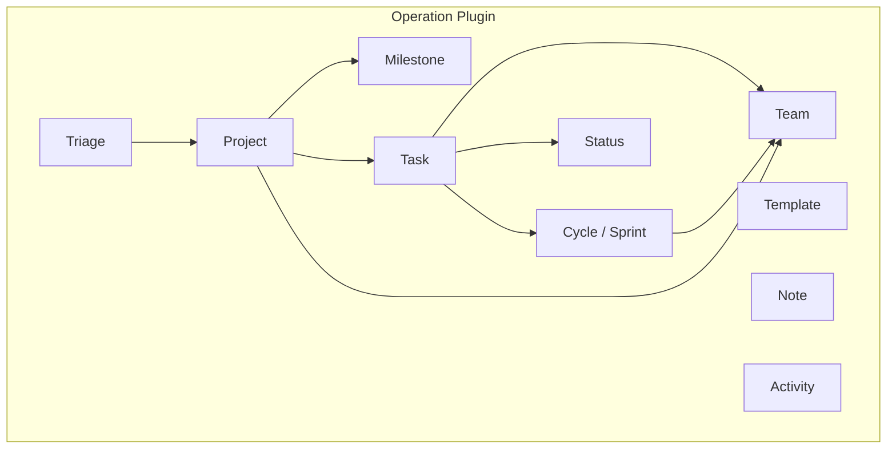

# Project Operations

## Overview

The operation plugin provides Linear-style project management with projects, tasks, cycles (sprints), milestones, teams, and statuses. It is a newer module targeting internal operations rather than customer-facing sales.

## Data Model

### Project
- `name`, `description`, `status` (numeric), `priority` (numeric)
- `icon` (default: "IconBox"), `teamIds` (required, array)
- `tagIds`, `memberIds`, `leadId`, `createdBy`
- `startDate`, `targetDate`
- `convertedFromId` -- tracks conversion from another entity

### Task
- `name`, `description`, `status` (ObjectId reference), `priority` (numeric)
- `teamId` (required), `assigneeId` (single), `createdBy`
- `labelIds`, `tagIds`
- `startDate`, `targetDate`, `statusChangedDate`
- `cycleId` -- sprint/cycle reference
- `projectId`, `milestoneId`
- `estimatePoint` -- story points (numeric)
- `number`, `statusType`

### Cycle (Sprint)
- `name`, `description`, `startDate`, `endDate`
- `teamId`, `isCompleted`, `isActive`
- `statistics` (computed), `donePercent`, `number`
- `unFinishedTasks` -- array of task IDs not completed when cycle ends

### Milestone
- `name`, `description`, `targetDate`
- `projectId` (required), `createdBy`

### Team
Team-based organization for task assignment and project scoping.

### Status
Custom status definitions per team/project.

### Template
Reusable templates for common project/task patterns.

### Note
Notes attached to tasks/projects.

### Triage
Incoming items that need to be classified and assigned to projects/teams.

## Architecture

## Key Patterns

### Sprint/Cycle Management
Cycles are time-boxed iterations with:
- Active/completed state tracking
- Automatic rollover of unfinished tasks
- Completion percentage and statistics
- One active cycle per team at a time

### Story Points
Tasks have `estimatePoint` for effort estimation, enabling velocity tracking and sprint planning.

### Triage System
Incoming items enter a triage queue before being assigned to projects and teams. This ensures nothing falls through the cracks.

### Daily Check Workers
Background worker (`dailyCheckCycles.ts`) runs daily to check cycle status and update statistics.

## Pipelinq Comparison

| Feature | Erxes | Pipelinq Implication |
|---------|-------|---------------------|
| Sprint/cycles | Time-boxed iterations | Consider sprint support |
| Story points | Task estimation | Effort estimation feature |
| Milestones | Project milestones with dates | Goal/milestone tracking |
| Triage | Incoming item queue | Intake/triage workflow |
| Team-scoped | Tasks belong to teams | Team-based organization |
| Project conversion | convertedFromId | Cross-entity conversion |
| Templates | Reusable task/project templates | Template library |
