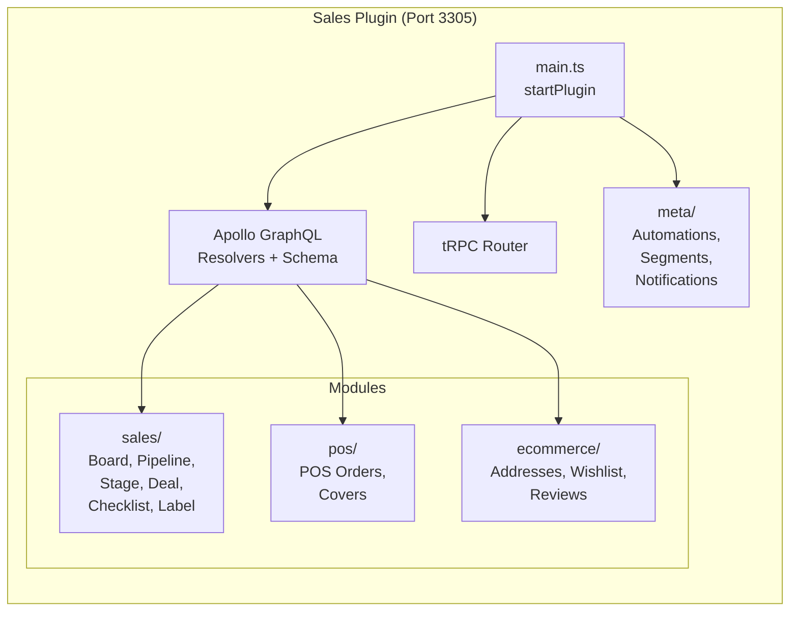

# Sales Pipeline

## Overview

The erxes sales pipeline is a four-level hierarchy: **Board > Pipeline > Stage > Deal**. Boards group related pipelines, pipelines represent sales processes, stages are Kanban columns within a pipeline, and deals are individual cards that move through stages.

This is the most mature module in erxes and the closest competitor to Pipelinq's pipeline functionality.

## Data Model

### Board
Container for related pipelines. Minimal schema:
- `name`, `userId` (creator), `order`, `type` (default: "deal")
- Timestamps

### Pipeline
A sales process with configurable visibility and membership:
- `name`, `boardId`, `status` (active/archived), `visibility` (public/private)
- `memberIds`, `watchedUserIds`, `bgColor`
- `departmentIds`, `branchIds` -- organizational scoping
- **Growth hacking:** `hackScoringType` (RICE/ICE/PIE), `startDate`, `endDate`, `metric`
- **Numbering:** `numberConfig`, `numberSize`, `nameConfig`, `lastNum` -- auto-generated deal numbers
- **Date/user filtering:** `isCheckDate`, `isCheckUser`, `isCheckDepartment`, `excludeCheckUserIds`
- **POS integration:** `initialCategoryIds`, `excludeCategoryIds`, `excludeProductIds`, `paymentIds`, `paymentTypes`
- `templateId`, `tagId`, `erxesAppToken`

### Stage
A column within a pipeline:
- `name`, `pipelineId`, `order`, `status`, `visibility`
- `probability` -- 10% through 90%, Won, Lost, Done, Resolved
- `formId` -- attach a form to a stage for data collection
- `code`, `age` -- for filtering and SLA tracking
- **Access control:** `memberIds`, `canMoveMemberIds`, `canEditMemberIds`, `departmentIds`
- `defaultTick` -- default tick-used state for products

### Deal
An individual sales item/card:
- `name`, `description`, `order`, `stageId`, `initialStageId`
- `parentId` -- supports hierarchical deals
- **Dates:** `startDate`, `closeDate`, `stageChangedDate`, `reminderMinute`
- **Assignment:** `assignedUserIds`, `watchedUserIds`, `userId` (creator), `modifiedBy`
- **Classification:** `priority` (Critical/High/Normal/Low), `status` (active/archived), `score`
- **Products:** `productsData` (embedded array with productId, quantity, unitPrice, tax, discount, amount), `totalAmount`, `paymentsData`
- **Relations:** `relations` (for Gantt chart), `tagIds`, `labelIds`, `branchIds`, `departmentIds`
- **Custom fields:** `customFieldsData`, `propertiesData`
- **Attachments:** embedded attachment array
- **Tracking:** `timeTrack` (startDate, timeSpent, status: started/stopped/paused/completed)
- `isComplete`, `number` (unique), `searchText`, `sourceConversationIds`

### Checklist
Sub-items within a deal:
- `title`, `contentType` (default "deal"), `contentTypeId`, `order`, `userId`
- **ChecklistItem:** `checklistId`, `content`, `isChecked`, `order`, `userId`

### Label
Pipeline-scoped labels for deals:
- `name`, `colorCode`, `pipelineId`, `userId`
- Unique constraint on (pipelineId, name, colorCode)

## GraphQL API

### Queries
- `deals(stageId, pipelineId, customerIds, companyIds, assignedUserIds, productIds, ...)` -- paginated deal list with extensive filtering
- `dealDetail(_id)` -- single deal with resolved relations
- `dealsTotalCount(...)` -- filtered count
- `dealsTotalAmounts(...)` -- aggregate amounts by currency
- `archivedDeals(pipelineId, ...)` -- archived deals
- `salesBoards` / `salesBoardDetail` / `salesBoardGetLast`
- `salesPipelines(boardId)` / `salesPipelineDetail`
- `salesStages(pipelineId)` / `salesStageDetail`
- `salesItemsCountByAssignedUser(pipelineId, stackBy)`
- `salesCheckFreeTimes(pipelineId, intervals)` -- resource scheduling
- Client portal variants: `cpDeals`, `cpDealDetail`, `cpSalesPipelineDetail`, `cpSalesStages`

### Mutations
- `dealsAdd(name, stageId, assignedUserIds, productsData, ...)` -- create deal
- `dealsEdit(_id, ...)` -- update deal
- `dealsChange(itemId, destinationStageId, sourceStageId)` -- move between stages
- `dealsRemove`, `dealsWatch`, `dealsCopy`, `dealsArchive`
- `dealsCreateProductsData`, `dealsEditProductData`, `dealsDeleteProductData` -- product management
- Board/Pipeline/Stage CRUD mutations
- `salesBoardItemUpdateTimeTracking` -- time tracking
- `salesBoardItemsSaveForGanttTimeline` -- Gantt/timeline persistence
- `salesStagesSortItems` -- stage card sorting

### Subscriptions
- Real-time deal changes via GraphQL subscriptions (Redis-backed)

## Architecture

## Key Patterns

### Product-Aware Deals
Deals embed `productsData` with full financial modeling per line item:
- Product reference, quantity, unit price
- Tax percent + absolute tax, VAT percent
- Discount percent + absolute discount
- Computed amount per line
- Per-line assignment (assignUserId, branchId, departmentId)
- Aggregated `totalAmount`, `unUsedTotalAmount`, `bothTotalAmount`

### Stage Probability
Each stage has a win probability (10%-90%, Won, Lost, Done, Resolved). This enables:
- Weighted pipeline value calculations
- Automation triggers based on probability changes
- Pipeline analytics and forecasting

### Conformity-Based Relations
Deals link to customers and companies via the core `Conformity` system (not foreign keys). This allows flexible many-to-many relations between any entity types.

### Growth Hack Scoring
Pipelines support RICE/ICE/PIE scoring frameworks for prioritizing deals/experiments.

## Pipelinq Comparison

| Feature | Erxes | Pipelinq Implication |
|---------|-------|---------------------|
| Board grouping | Yes -- boards group pipelines | Consider pipeline grouping |
| Stage probability | 10%-90% + Won/Lost | Add win probability to stages |
| Product data on deals | Embedded with pricing | Evaluate product-deal linking |
| Time tracking | Built into deals | Consider time tracking feature |
| Gantt charts | Relations + timeline save | Evaluate timeline visualization |
| Deal hierarchies | parentId field | Sub-deal/child-deal support |
| Growth hacking | RICE/ICE/PIE scoring | Niche -- low priority |
| Auto-numbering | Configurable per pipeline | Auto-generated deal numbers |
| Stage forms | formId per stage | Data collection at stage entry |
| Stage access control | Move/edit member restrictions | Role-based stage permissions |
