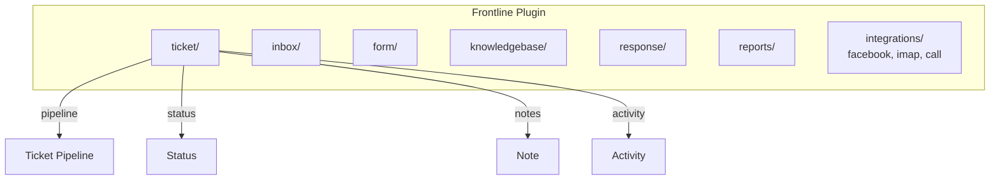

# Tickets & Support

## Overview

The erxes frontline plugin includes a ticket system for issue tracking and customer support. Tickets live in ticket-specific pipelines with configurable statuses, separate from the sales pipeline system. The module is newer and simpler than the sales pipeline.

## Data Model

### Ticket
- `name`, `description`, `number`
- `type` -- enum: bug, ticket, feature, question, incident
- `priority` -- numeric (0-based)
- `state`, `statusId`, `statusType`
- `pipelineId`, `channelId`
- `assigneeId` (single), `createdBy`, `userId`
- `startDate`, `targetDate`, `statusChangedDate`
- `labelIds`, `tagIds`, `subscribedUserIds`
- `attachments`, `propertiesData`

### Ticket Pipeline
- `name`, `description`, `channelId` (required), `order`, `state`
- `visibility`, `memberIds`, `tagId`
- `departmentIds`, `branchIds`
- **Access control:** `isCheckDate`, `isCheckUser`, `isCheckDepartment`, `isCheckBranch`, `isHideName`, `excludeCheckUserIds`
- **Numbering:** `numberConfig`, `numberSize`, `nameConfig`, `lastNum`

### Status
Custom statuses within a pipeline (defined in `status/` module).

### Note
Notes attached to tickets (separate from internal notes in core).

### Activity
Activity log for ticket changes.

## Key Differences from Sales Pipeline

| Aspect | Sales Pipeline | Ticket System |
|--------|---------------|---------------|
| Hierarchy | Board > Pipeline > Stage > Deal | Pipeline > Status > Ticket |
| Assignment | Multiple assignees | Single assignee |
| Products | Embedded product data | No product data |
| Type system | No type field | bug/ticket/feature/question/incident |
| Dates | startDate + closeDate | startDate + targetDate |
| Financial | Amount, payments | None |

## Features

### Ticket Types
Typed classification: bug, ticket, feature, question, incident. This enables filtering and routing by issue type.

### Client Portal Integration
Dedicated mutations and queries for client portal access (`clientPortal.ts`), allowing external users to create and view tickets.

### Permission Validation
Dedicated `permissionValidator.ts` for checking ticket access based on pipeline membership, department, and branch.

### Activity Tracking
Separate activity model for tracking all changes to tickets with full audit trail.

## Architecture

## Pipelinq Comparison

| Feature | Erxes | Pipelinq Implication |
|---------|-------|---------------------|
| Issue types | 5 built-in types | Consider typed items |
| Single assignee | One per ticket | Different from multi-assignee deals |
| Client portal | External user access | Customer-facing ticket view |
| Custom statuses | Per-pipeline statuses | Flexible status configuration |
| Separate from sales | Different data model | Consider unified vs separate models |
