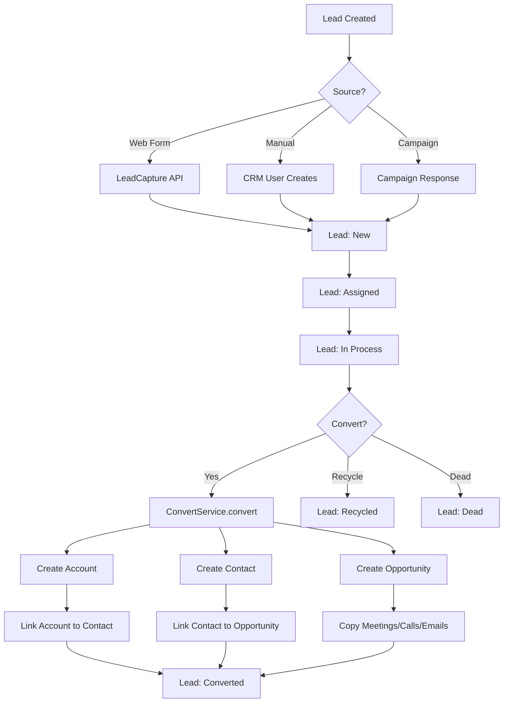
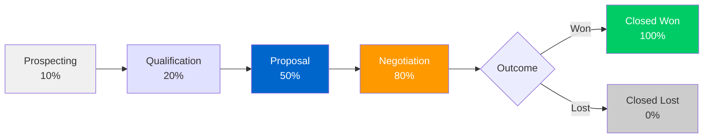

# EspoCRM - Competitive Analysis for Pipelinq

## Product Overview

EspoCRM is a mature open-source CRM application (AGPL-3.0) built in PHP with a custom JavaScript frontend. First released in 2014, it has evolved into a full-featured CRM with sales pipeline management, email integration, campaigns, and extensive customization capabilities.

- **Website:** https://www.espocrm.com
- **Repository:** https://github.com/espocrm/espocrm
- **Documentation:** https://docs.espocrm.com
- **License:** AGPL-3.0
- **Backend:** PHP 8.x (custom MVC framework, custom ORM)
- **Frontend:** Custom JavaScript framework (ES modules, no React/Vue)
- **Database:** MySQL/MariaDB/PostgreSQL
- **GitHub stars:** ~2,827 | Forks: ~808 | Open issues: 57
- **Claimed users:** 50,000+ companies in 163 countries
- **Analysis date:** 2026-03-14

## Architecture Summary

EspoCRM uses a **metadata-driven architecture** where entities, fields, layouts, and behaviors are defined in JSON metadata files rather than hard-coded. This makes it highly extensible without code changes. It is a single-page application where the frontend communicates exclusively via REST API.

### Key Architectural Layers

```
Frontend (client/)          - Custom JS SPA (AMD modules, Backbone-like)
  |
REST API (routes.json)      - Generic CRUD + entity-specific routes
  |
Controllers                 - Thin controllers delegating to services
  |
Record Service Layer        - Generic CRUD with hooks & ACL
  |
ORM Layer                   - Custom ORM with query builder
  |
Database                    - MySQL/MariaDB/PostgreSQL
```

### Module System

- **Core (`Espo/`):** Platform entities (User, Email, Attachment, Team, Role, etc.)
- **CRM Module (`Espo/Modules/Crm/`):** Sales entities (Account, Contact, Lead, Opportunity, etc.)
- **Custom (`custom/`):** User customizations (survives upgrades)
- **Extensions:** Installable packages (e.g., Advanced Pack for BPM/Workflows)

## Core CRM Entities

| Entity | Purpose | Key Fields |
|--------|---------|------------|
| **Account** | Companies/organizations | name, type, industry, website, billing/shipping address |
| **Contact** | People at accounts | name, title, email, phone, account (M:N with roles) |
| **Lead** | Unqualified prospects | name, status, source, industry, opportunityAmount |
| **Opportunity** | Sales deals/pipeline items | name, stage, amount, probability, closeDate, account |
| **Task** | Action items | name, status, priority, dateStart, dateEnd, parent |
| **Meeting** | Calendar events | name, status, dateStart, dateEnd, attendees, reminders |
| **Call** | Phone call logs | Similar to Meeting |
| **Campaign** | Marketing campaigns | type, status, targetLists, budget, email stats |
| **Case** | Support tickets | name, status, priority, account, contact |
| **Document** | File management | name, folder, linked to accounts/contacts/opportunities |

## Deployment & Pricing

### Self-Hosted (Free)
- Core CRM is free and open source (AGPL-3.0)
- Docker, Apache, Nginx, IIS support
- Extensions purchased separately ($95-$395/year each)

### Cloud Hosting
| Plan | Price | Min Users | Storage | Records |
|------|-------|-----------|---------|---------|
| Basic | $15/user/month | 3 | 3GB/user | 100,000 |
| Enterprise | $25/user/month | 5 | 7GB/user | 1,000,000 |
| Ultimate | $69/user/month | 10 | 400GB total | Unlimited |

All extensions included in cloud plans. 30-day free trial.

## Relationship to Pipelinq

Pipelinq competes directly with EspoCRM's **Opportunity pipeline** and **Kanban board** features. Key areas of overlap:

1. **Sales Pipeline** - EspoCRM's Opportunity entity with stage-based progression
2. **Kanban Board** - Generic kanban view available for any entity with enum status fields
3. **Lead Management** - Lead capture, qualification, and conversion to Account+Contact+Opportunity
4. **Activity Tracking** - Meetings, calls, tasks linked to pipeline items
5. **BPM/Workflows** - Process automation (paid Advanced Pack)
6. **Reports** - Sales pipeline charts, by-stage analysis
7. **Entity Customization** - No-code entity/field/layout creation

## Strengths vs Pipelinq

- Mature, battle-tested codebase (11+ years)
- Extensive no-code customization (Entity Manager, Layout Manager, Field Manager)
- Built-in email integration (IMAP/SMTP with per-user accounts)
- Campaign/mass email system with tracking
- Formula engine for computed fields and business logic
- BPMN 2.0 process automation (Advanced Pack)
- Webhook system for integrations
- Portal system for customer-facing interfaces
- Multi-currency support with automatic conversion
- Strong ACL system (roles, teams, field-level security)
- 7 official API client libraries
- OpenAPI spec generation (v9.3+)

## Weaknesses / Opportunities for Pipelinq

- **No native BPM/workflow** in open-source edition (requires paid Advanced Pack, $395/year)
- **Custom JS frontend** - harder to extend than Vue/React-based systems
- **Monolithic architecture** - not designed for Nextcloud/microservice ecosystems
- **No native document collaboration** - only file attachments
- **No government/NL Design support** - no theming for government use cases
- **Pipeline is basic** - single global pipeline stages, no per-team or per-product pipelines
- **No n8n/automation integration** - requires custom HTTP request development
- **No MCP protocol** - no AI/LLM integration capability
- **Reports are limited** in open-source (advanced reporting is paid)
- **No real-time collaboration** - no concurrent editing or presence awareness
- **Integration extensions are paid** for self-hosted ($95-$388/year each)

## Documentation

- [Features & Extensions](docs/features-and-extensions.md) - Complete feature list with pricing
- [Documentation Structure](docs/documentation-structure.md) - Full docs.espocrm.com index
- [BPM & Workflows](docs/bpm-and-workflows.md) - Process automation details
- [API & Developer](docs/api-and-developer.md) - REST API and developer architecture
- [Cloud & Pricing](docs/cloud-and-pricing.md) - Deployment options and pricing

## Feature Specs

### From Code Analysis
- [Data Model](specs/data-model/spec.md) - Entity structure and relationships
- [Sales Pipeline](specs/sales-pipeline/spec.md) - Opportunity stages and pipeline reports
- [Lead Management](specs/lead-management/spec.md) - Lead lifecycle and conversion
- [Email Integration](specs/email-integration/spec.md) - IMAP/SMTP and mass email
- [Campaign & Marketing](specs/campaign-marketing/spec.md) - Campaign management
- [Kanban Board](specs/kanban-board/spec.md) - Generic kanban view system
- [Custom Fields & Layouts](specs/custom-fields-layouts/spec.md) - Entity/Field/Layout Manager

### From Documentation Analysis
- [BPM & Workflow Engine](specs/bpm-workflow-engine/spec.md) - BPMN 2.0 and workflow automation
- [API & Integration](specs/api-integration/spec.md) - REST API, auth, client libraries
- [Reporting & Analytics](specs/reporting-analytics/spec.md) - Reports and dashboards
- [Entity Customization](specs/entity-customization/spec.md) - No-code entity/field management
- [Project Management](specs/project-management/spec.md) - PM extension features

## Business Logic Diagrams

### Lead-to-Opportunity Conversion Flow



### Opportunity Pipeline Flow


