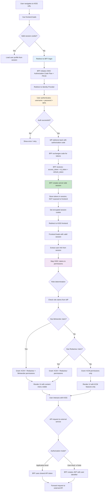
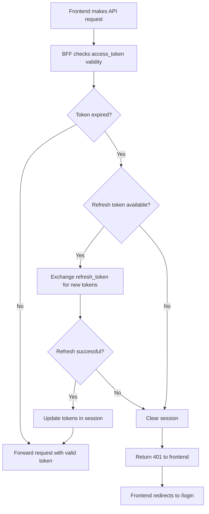
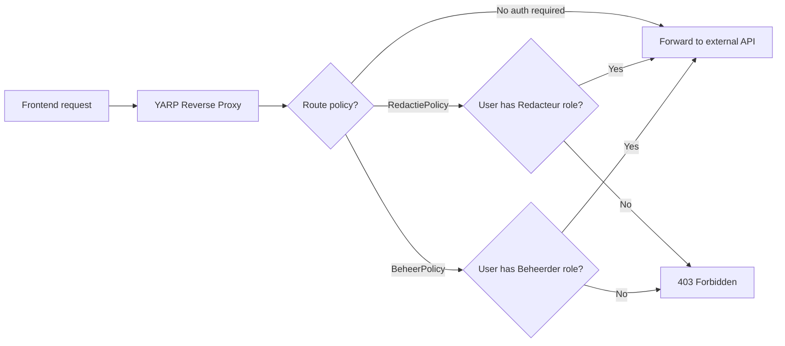

# Authentication Flow - KISS

OIDC login + role-based access control

## Token Refresh Flow

## YARP Proxy Authorization

## Role Permissions Matrix

| Feature | KCM | Redacteur | Beheerder |
|---------|-----|-----------|-----------|
| Create contactmomenten | Yes | Yes | Yes |
| Search BRP/KvK/cases | Yes | Yes | Yes |
| Search knowledge base | Yes | Yes | Yes |
| Create contactverzoeken | Yes | Yes | Yes |
| Manage werkberichten | No | Yes | Yes |
| Manage VACs | No | Yes | Yes |
| Manage kennisartikelen | No | Yes | Yes |
| Manage kanalen | No | No | Yes |
| Manage skills | No | No | Yes |
| Manage links | No | No | Yes |
| Manage gespreksresultaten | No | No | Yes |
| Manage contactverzoek forms | No | No | Yes |
| Access management info API | No | No | Yes |

## Employee Identity Mapping

The `OIDC_MEDEWERKER_IDENTIFICATIE_CLAIM` maps the authenticated user to their employee record in the Objects API (smoelenboek). This is used for:
1. Attributing contactmomenten to the handling KCM
2. Attributing verwerking (audit) log entries
3. Auto-assigning contactverzoeken when an employee creates one for their own department
4. Displaying "logged in as" information in the UI
