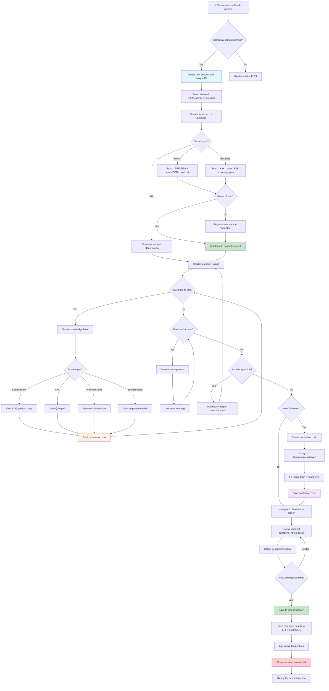

# Contactmoment Flow - KISS

Start interaction -> search -> link -> close

## Key Decision Points

1. **Identification**: KCM can proceed without identifying the citizen, but linking enables contact history view
2. **Source tracking**: Every knowledge article, VAC, or employee consulted is tracked with `shouldStore` flag
3. **Multi-question**: A single call can generate multiple vragen, each with their own linked cases and sources
4. **Contactverzoek**: Created only when the KCM cannot resolve the question directly
5. **Finalization**: All vragen within the contactmoment are saved as a batch
