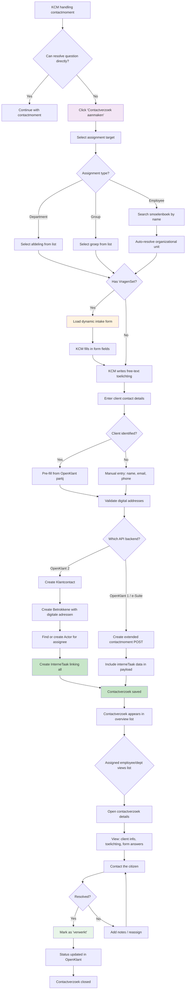

# Contactverzoek Flow - KISS

Create request -> assign -> follow-up

## Key Design Decisions

1. **VragenSets**: Dynamic forms per department ensure the right information is captured upfront, reducing back-and-forth
2. **Actor resolution**: `ensureActoren()` finds or creates Actor records in OpenKlant 2, handling the many-to-many relationship between tasks and actors
3. **Dual API support**: The contactverzoek creation differs significantly between OpenKlant 2 (separate InterneTaak) and e-Suite (embedded in contactmoment POST)
4. **Status model**: Binary only (te_verwerken / verwerkt) — no intermediate states, unlike Pipelinq's multi-stage pipeline
5. **No reassignment tracking**: If a contactverzoek is reassigned, the original assignment is overwritten, not tracked as a history
