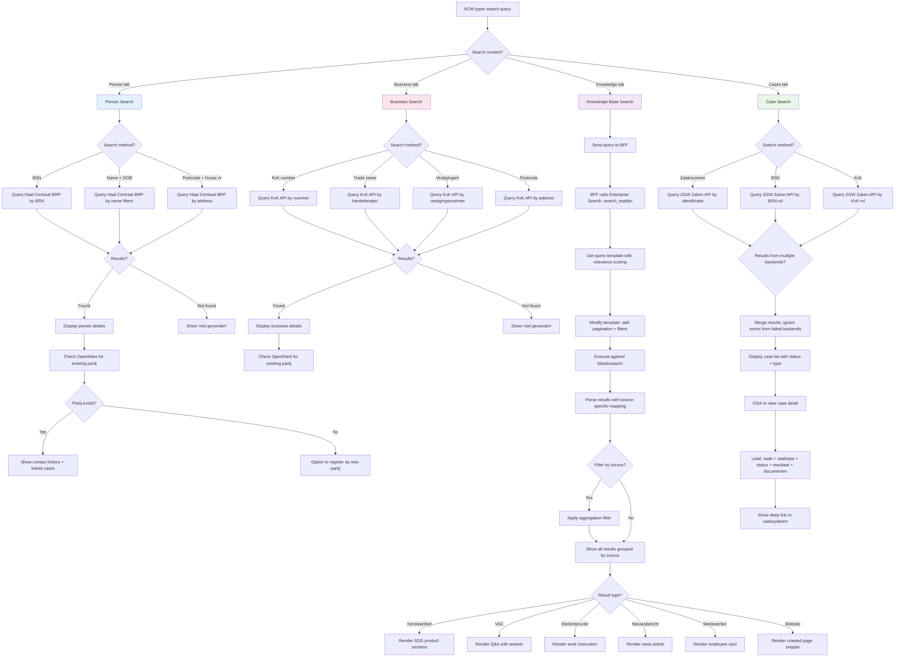
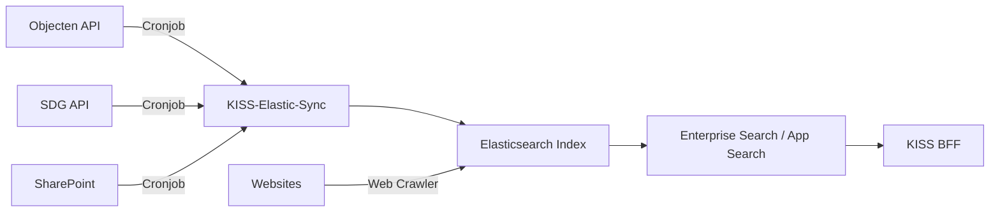

# Search Flow - KISS

Unified search across BRP, KvK, Elasticsearch knowledge base, and zaaksysteem

## Search Architecture Notes

### Two-Step Elasticsearch Query
KISS uses Elastic Enterprise Search (App Search) as a query builder, not just as a direct Elasticsearch client:
1. **search_explain** returns a query template with App Search's relevance tuning applied
2. KISS modifies this template (pagination, filters, suggestions)
3. The modified query is executed directly against Elasticsearch

This approach leverages App Search's relevance tuning UI while maintaining control over the query structure.

### Multi-Backend Case Search
When searching cases, KISS queries all configured zaaksystemen in parallel. If one backend fails (timeout, auth error), results from other backends are still shown. This resilience pattern prevents a single broken integration from blocking the KCM.

### Source Sync Pipeline

Content sources are synced on a schedule (cronjob), not in real-time. This means newly published knowledge articles may take minutes to appear in search results.
