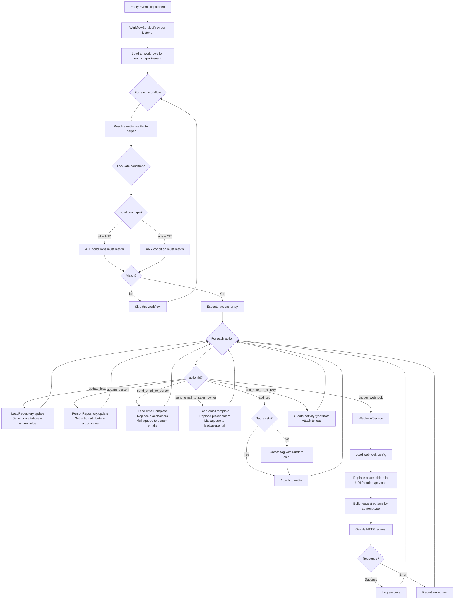
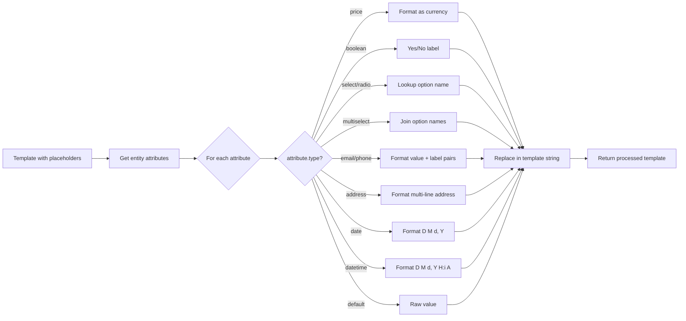
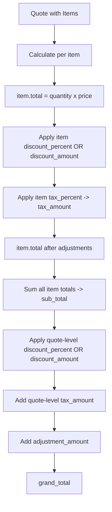

# Workflow Automation Flow

```mermaid
flowchart TD
    A[Entity Event Dispatched] --> B[WorkflowServiceProvider Listener]
    B --> C[Load all workflows for entity_type + event]

    C --> D{For each workflow}
    D --> E[Resolve entity via Entity helper]
    E --> F{Evaluate conditions}

    F --> G{condition_type?}
    G -->|all = AND| H[ALL conditions must match]
    G -->|any = OR| I[ANY condition must match]

    H --> J{Match?}
    I --> J

    J -->|No| K[Skip this workflow]
    J -->|Yes| L[Execute actions array]

    L --> M{For each action}

    M --> N{action.id?}

    N -->|update_lead| O[LeadRepository.update<br/>Set action.attribute = action.value]
    N -->|update_person| P[PersonRepository.update<br/>Set action.attribute = action.value]
    N -->|send_email_to_person| Q[Load email template<br/>Replace placeholders<br/>Mail::queue to person emails]
    N -->|send_email_to_sales_owner| R[Load email template<br/>Replace placeholders<br/>Mail::queue to lead.user.email]
    N -->|add_tag| S{Tag exists?}
    S -->|Yes| T[Attach to entity]
    S -->|No| U[Create tag with random color] --> T
    N -->|add_note_as_activity| V[Create activity type=note<br/>Attach to lead]
    N -->|trigger_webhook| W[WebhookService]

    W --> X[Load webhook config]
    X --> Y[Replace placeholders in URL/headers/payload]
    Y --> Z[Build request options by content-type]
    Z --> AA[Guzzle HTTP request]
    AA --> AB{Response?}
    AB -->|Success| AC[Log success]
    AB -->|Error| AD[Report exception]

    K --> D
    O --> M
    P --> M
    Q --> M
    R --> M
    T --> M
    V --> M
    AC --> M
    AD --> M
```

# Placeholder Replacement

```mermaid
flowchart LR
    A[Template with placeholders] --> B[Get entity attributes]
    B --> C{For each attribute}
    C --> D{attribute.type?}

    D -->|price| E[Format as currency]
    D -->|boolean| F[Yes/No label]
    D -->|select/radio| G[Lookup option name]
    D -->|multiselect| H[Join option names]
    D -->|email/phone| I[Format value + label pairs]
    D -->|address| J[Format multi-line address]
    D -->|date| K[Format D M d, Y]
    D -->|datetime| L[Format D M d, Y H:i A]
    D -->|default| M[Raw value]

    E --> N[Replace in template string]
    F --> N
    G --> N
    H --> N
    I --> N
    J --> N
    K --> N
    L --> N
    M --> N

    N --> O[Return processed template]
```

# Quote Calculation Flow

```mermaid
flowchart TD
    A[Quote with Items] --> B[Calculate per item]

    B --> C[item.total = quantity x price]
    C --> D[Apply item discount_percent OR discount_amount]
    D --> E[Apply item tax_percent -> tax_amount]
    E --> F[item.total after adjustments]

    F --> G[Sum all item totals -> sub_total]
    G --> H[Apply quote-level discount_percent OR discount_amount]
    H --> I[Add quote-level tax_amount]
    I --> J[Add adjustment_amount]
    J --> K[grand_total]
```
