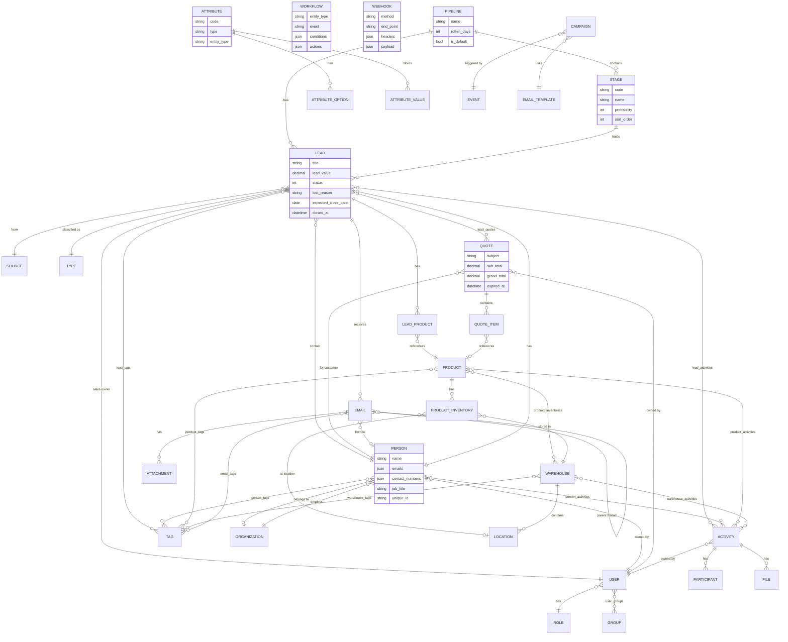
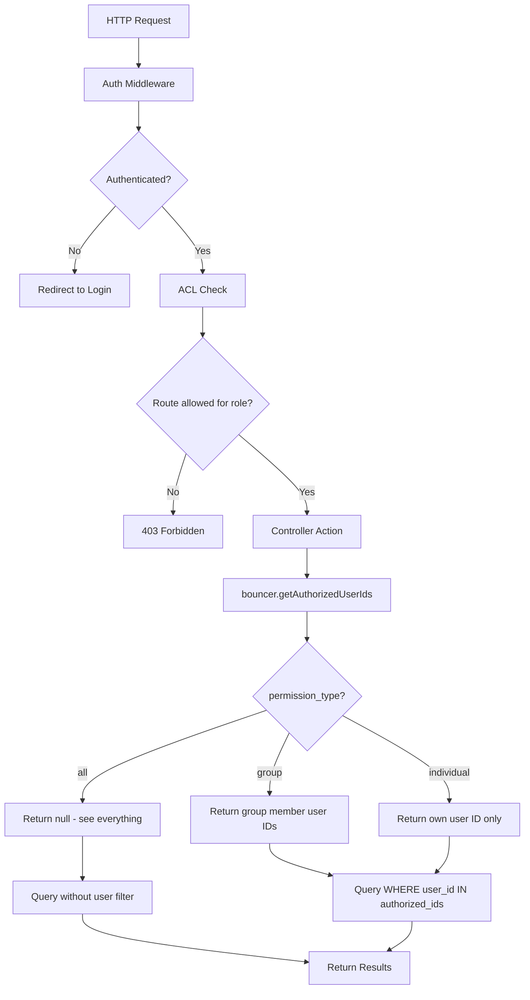

# Krayin CRM Entity Relationship Diagram

```mermaid
erDiagram
    PIPELINE ||--o{ STAGE : contains
    PIPELINE ||--o{ LEAD : has
    STAGE ||--o{ LEAD : holds

    LEAD }o--|| PERSON : "contact"
    LEAD }o--|| USER : "sales owner"
    LEAD }o--|| SOURCE : "from"
    LEAD }o--|| TYPE : "classified as"
    LEAD }o--o{ ACTIVITY : "lead_activities"
    LEAD }o--o{ TAG : "lead_tags"
    LEAD }o--o{ QUOTE : "lead_quotes"
    LEAD ||--o{ LEAD_PRODUCT : has
    LEAD ||--o{ EMAIL : receives

    PERSON }o--o| ORGANIZATION : "belongs to"
    PERSON }o--|| USER : "owned by"
    PERSON }o--o{ ACTIVITY : "person_activities"
    PERSON }o--o{ TAG : "person_tags"
    PERSON ||--o{ LEAD : has

    ORGANIZATION ||--o{ PERSON : employs

    LEAD_PRODUCT }o--|| PRODUCT : references

    PRODUCT }o--o{ WAREHOUSE : "product_inventories"
    PRODUCT }o--o{ TAG : "product_tags"
    PRODUCT }o--o{ ACTIVITY : "product_activities"
    PRODUCT ||--o{ PRODUCT_INVENTORY : has

    PRODUCT_INVENTORY }o--|| WAREHOUSE : "stored in"
    PRODUCT_INVENTORY }o--o| LOCATION : "at location"

    WAREHOUSE ||--o{ LOCATION : contains
    WAREHOUSE }o--o{ TAG : "warehouse_tags"
    WAREHOUSE }o--o{ ACTIVITY : "warehouse_activities"

    QUOTE ||--o{ QUOTE_ITEM : contains
    QUOTE }o--|| PERSON : "for customer"
    QUOTE }o--|| USER : "owned by"

    QUOTE_ITEM }o--o| PRODUCT : references

    ACTIVITY }o--|| USER : "owned by"
    ACTIVITY ||--o{ PARTICIPANT : has
    ACTIVITY ||--o{ FILE : has

    EMAIL }o--o| PERSON : "from/to"
    EMAIL }o--o| EMAIL : "parent thread"
    EMAIL ||--o{ ATTACHMENT : has
    EMAIL }o--o{ TAG : "email_tags"

    WORKFLOW {
        string entity_type
        string event
        json conditions
        json actions
    }

    WEBHOOK {
        string method
        string end_point
        json headers
        json payload
    }

    ATTRIBUTE {
        string code
        string type
        string entity_type
    }
    ATTRIBUTE ||--o{ ATTRIBUTE_OPTION : has
    ATTRIBUTE ||--o{ ATTRIBUTE_VALUE : stores

    USER }o--|| ROLE : has
    USER }o--o{ GROUP : "user_groups"

    CAMPAIGN }o--|| EVENT : "triggered by"
    CAMPAIGN }o--|| EMAIL_TEMPLATE : uses

    PIPELINE {
        string name
        int rotten_days
        bool is_default
    }

    STAGE {
        string code
        string name
        int probability
        int sort_order
    }

    LEAD {
        string title
        decimal lead_value
        int status
        string lost_reason
        date expected_close_date
        datetime closed_at
    }

    PERSON {
        string name
        json emails
        json contact_numbers
        string job_title
        string unique_id
    }

    QUOTE {
        string subject
        decimal sub_total
        decimal grand_total
        datetime expired_at
    }
```

# Authorization Flow

```mermaid
flowchart TD
    A[HTTP Request] --> B[Auth Middleware]
    B --> C{Authenticated?}
    C -->|No| D[Redirect to Login]
    C -->|Yes| E[ACL Check]

    E --> F{Route allowed for role?}
    F -->|No| G[403 Forbidden]
    F -->|Yes| H[Controller Action]

    H --> I[bouncer.getAuthorizedUserIds]
    I --> J{permission_type?}
    J -->|all| K[Return null - see everything]
    J -->|group| L[Return group member user IDs]
    J -->|individual| M[Return own user ID only]

    K --> N[Query without user filter]
    L --> O[Query WHERE user_id IN authorized_ids]
    M --> O

    N --> P[Return Results]
    O --> P
```
