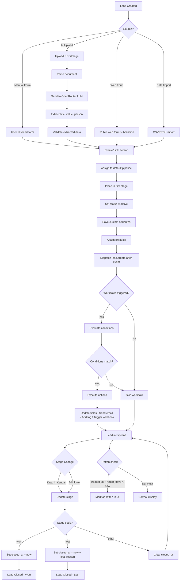
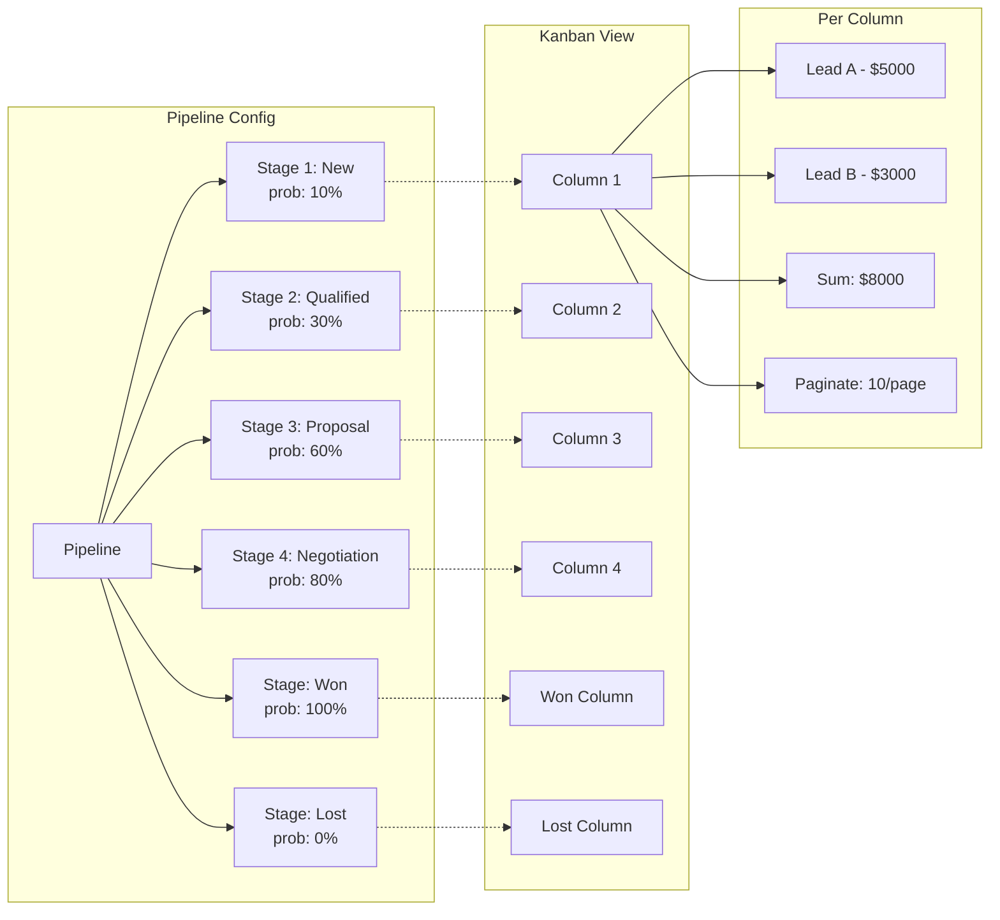

# Lead Lifecycle Flow

```mermaid
flowchart TD
    A[Lead Created] --> B{Source?}
    B -->|Manual Form| C[User fills lead form]
    B -->|AI Upload| D[Upload PDF/Image]
    B -->|Web Form| E[Public web form submission]
    B -->|Data Import| F[CSV/Excel import]

    D --> G[Parse document]
    G --> H[Send to OpenRouter LLM]
    H --> I[Extract title, value, person]
    I --> J[Validate extracted data]

    C --> K[Create/Link Person]
    E --> K
    F --> K
    J --> K

    K --> L[Assign to default pipeline]
    L --> M[Place in first stage]
    M --> N[Set status = active]
    N --> O[Save custom attributes]
    O --> P[Attach products]
    P --> Q[Dispatch lead.create.after event]

    Q --> R{Workflows triggered?}
    R -->|Yes| S[Evaluate conditions]
    S --> T{Conditions match?}
    T -->|Yes| U[Execute actions]
    U --> V[Update fields / Send email / Add tag / Trigger webhook]
    T -->|No| W[Skip workflow]
    R -->|No| W

    W --> X[Lead in Pipeline]
    V --> X

    X --> Y{Stage Change}
    Y -->|Drag in Kanban| Z[Update stage]
    Y -->|Edit form| Z

    Z --> AA{Stage code?}
    AA -->|won| AB[Set closed_at = now]
    AA -->|lost| AC[Set closed_at = now + lost_reason]
    AA -->|other| AD[Clear closed_at]

    AB --> AE[Lead Closed - Won]
    AC --> AF[Lead Closed - Lost]
    AD --> X

    X --> AG{Rotten check}
    AG -->|created_at + rotten_days < now| AH[Mark as rotten in UI]
    AG -->|still fresh| AI[Normal display]
```

# Lead-Pipeline Data Flow

```mermaid
flowchart LR
    subgraph Pipeline Config
        P[Pipeline] --> S1[Stage 1: New<br/>prob: 10%]
        P --> S2[Stage 2: Qualified<br/>prob: 30%]
        P --> S3[Stage 3: Proposal<br/>prob: 60%]
        P --> S4[Stage 4: Negotiation<br/>prob: 80%]
        P --> SW[Stage: Won<br/>prob: 100%]
        P --> SL[Stage: Lost<br/>prob: 0%]
    end

    subgraph Kanban View
        S1 -.-> K1[Column 1]
        S2 -.-> K2[Column 2]
        S3 -.-> K3[Column 3]
        S4 -.-> K4[Column 4]
        SW -.-> KW[Won Column]
        SL -.-> KL[Lost Column]
    end

    subgraph Per Column
        K1 --> L1[Lead A - $5000]
        K1 --> L2[Lead B - $3000]
        K1 --> SUM1[Sum: $8000]
        K1 --> PAG1[Paginate: 10/page]
    end
```
