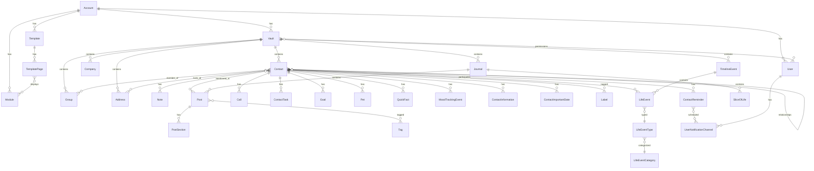
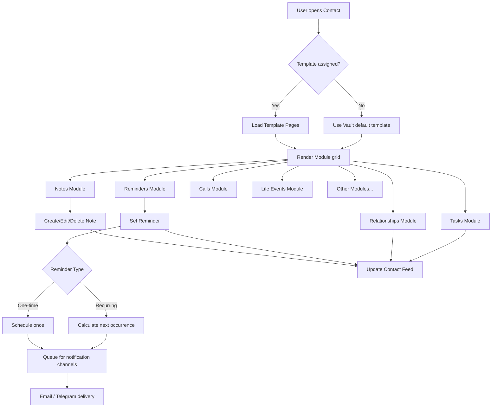
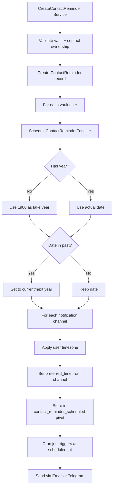
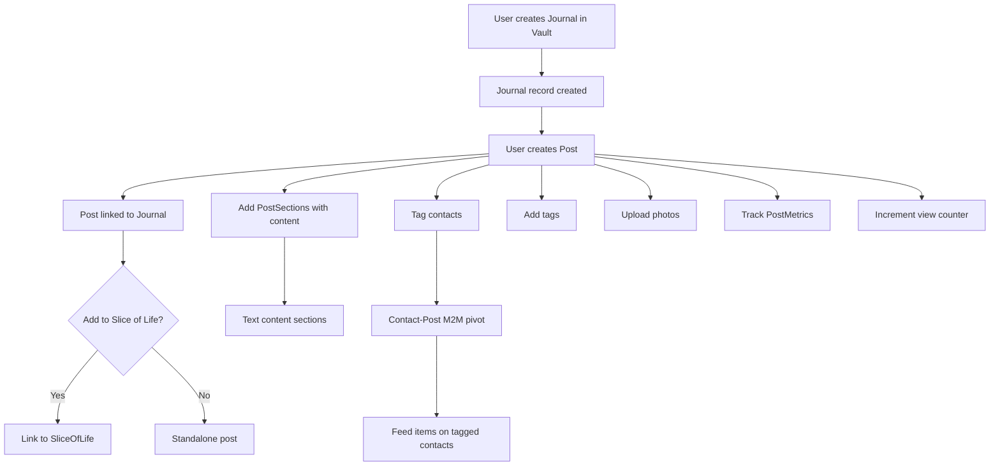

# Monica CRM -- Competitive Analysis for Pipelinq

## Product Summary

Monica (github.com/monicahq/monica) is an open-source **Personal Relationship Management** (PRM) tool. It helps individuals track interactions, remember important details, and maintain personal relationships. Licensed under AGPL-3.0.

**Core value proposition:** "Remember everything about your friends, family, and business relationships."

## Architecture Overview

### Tech Stack
- **Backend:** Laravel 12 (PHP 8.3+), Sanctum API auth, Fortify 2FA, Jetstream
- **Frontend:** Vue 3 + Inertia.js (SSR), Tailwind CSS 4, Ant Design Vue, Vite
- **Search:** Laravel Scout with Meilisearch or Typesense
- **DAV:** CardDAV + CalDAV via Sabre/DAV (contact & calendar sync)
- **File Storage:** Uploadcare (cloud-hosted image CDN)
- **Notifications:** Email + Telegram channels
- **Auth:** Local, WebAuthn, OAuth (GitHub, Google, Facebook, LinkedIn, Azure, Keycloak, Kanidm)
- **Database:** MySQL/PostgreSQL (Doctrine DBAL)

### Domain-Driven Design

Monica uses a **Domain-oriented** architecture under `app/Domains/`:

```
Domains/
  Contact/          -- All contact-specific features
    ManageContact/       Services + Web controllers
    ManageNotes/         CRUD notes
    ManageCalls/         Call logging
    ManageRelationships/ Bidirectional relationships
    ManageReminders/     Scheduled reminders
    ManageTasks/         Per-contact tasks
    ManageGoals/         Streak-based goals
    ManageLifeEvents/    Timeline events
    ManageLabels/        Tag/label system
    ManageGroups/        Contact grouping
    ManagePets/          Pet tracking
    ManageLoans/         Debt/loan tracking
    ManageDocuments/     File uploads
    ManagePhotos/        Photo gallery
    ManageMoodTracking/  Mood rating events
    ManageQuickFacts/    Key-value facts
    ManageAvatar/        Avatar management
    ManageReligion/      Religion tracking
    ManagePronouns/      Pronoun preferences
    ManageJobInformation/ Employment details
    ManageContactAddresses/ Address management
    ManageContactInformation/ Email/phone/social
    ManageContactImportantDates/ Birthdays, anniversaries
    ManageContactFeed/   Activity feed
    Dav/                 CardDAV/CalDAV server
    DavClient/           External CardDAV sync
  Vault/             -- Vault-level features
    ManageVault/         CRUD vaults
    ManageJournals/      Journal + posts + slices of life
    ManageCalendar/      Calendar view
    ManageCompanies/     Company management
    ManageTasks/         Vault-wide task view
    ManageReports/       Address + date reports
    ManageLifeMetrics/   Quantified self metrics
    ManageFiles/         Vault file browser
    ManageVaultSettings/ Vault configuration
    Search/              Full-text search
  Settings/          -- Account-level settings
    ManageUsers/         User management (+ API)
    ManageTemplates/     Contact page layout
    ManageModules/       Module configuration
    ManageNotificationChannels/ Email/Telegram setup
    ...20+ personalization managers
```

Each domain follows the pattern: `Services/` (business logic), `Web/Controllers/`, `Web/ViewHelpers/`.

### Multi-Tenancy Model

```
Account (top level, has storage_limit_in_mb)
  |-- Users (multiple per account, with permissions)
  |-- Vaults (data containers, types: personal/family/community)
       |-- Contacts (people being tracked)
       |-- Journals, Groups, Companies, Tags, etc.
```

- **Account:** Billing/admin boundary. Owns templates, modules, genders, pronouns, currencies, etc.
- **Vault:** Data isolation within an account. Users get per-vault permissions (view=300, edit=200, manage=100). Each user has a Contact record in every vault they belong to.
- **Contact:** Central entity. Belongs to a vault. Has UUIDs, soft deletes, full-text search indexing.

### Permissions System

Three-tier vault permissions checked by services via declarative permission arrays:
```php
public function permissions(): array {
    return [
        'author_must_belong_to_account',
        'vault_must_belong_to_account',
        'author_must_be_vault_editor',
        'contact_must_belong_to_vault',
    ];
}
```

### Template & Module System

Monica has a unique **modular contact page** system:
- **Templates** define the layout of a contact page (which modules appear on which page/tab)
- **Modules** are reusable UI blocks (notes, calls, tasks, goals, addresses, etc.)
- **Template Pages** organize modules into tabs
- Each account can have multiple templates; each vault gets a default template
- 22+ built-in module types

### Activity Feed

Every contact has a polymorphic **ContactFeedItem** log that tracks 30+ action types (note created, label assigned, mood tracked, etc.). The feed provides a chronological history of all interactions.

## Data Model Summary

### Core Entities (70+ models)

| Entity | Key Fields | Relationships |
|--------|-----------|---------------|
| Contact | first/last/middle/maiden_name, nickname, prefix, suffix, job_position | vault, gender, pronoun, template, company, religion |
| Note | title, body, emotion_id | contact, author (user), emotion |
| ContactReminder | label, day/month/year, type (one_time/recurring_day/month/year), frequency_number | contact, userNotificationChannels |
| Call | called_at, duration, type (audio/video), who_initiated, answered, description | contact, author, callReason, emotion |
| ContactTask | label, description, completed, due_at | contact, author (CalDAV-synced) |
| Goal | name, active | contact, streaks |
| Loan | type (debt/loan), amount_lent, loaned_at, settled | vault, currency, loaners, loanees |
| Group | name | vault, groupType, contacts (M2M) |
| Journal | name, description | vault, posts, slicesOfLife, journalMetrics |
| Post | title, published, written_at | journal, sliceOfLife, postSections, contacts, tags, files |
| LifeEvent | summary, description, happened_at, costs, duration_in_minutes, distance, place | timelineEvent, lifeEventType, emotion, currency, participants |
| TimelineEvent | label, started_at, collapsed | vault, lifeEvents, participants |
| MoodTrackingEvent | rated_at, note, number_of_hours_slept | contact, moodTrackingParameter |
| Address | line_1/2, city, province, postal_code, country, latitude, longitude | vault, addressType, contacts (M2M with is_past_address) |
| ContactInformation | data, kind | contact, contactInformationType |
| ContactImportantDate | label, day/month/year, type (birthdate/etc) | contact, contactImportantDateType |
| RelationshipType | name, name_reverse_relationship, type | relationshipGroupType |
| File | uuid, original_filename, size, mime_type | vault (polymorphic: contact, post) |
| Label | name, colour, description | vault, contacts (M2M) |
| Tag | name | vault, posts (M2M) |
| QuickFact | value | contact, vaultQuickFactsTemplate |

### Relationship System

Bidirectional relationships between contacts using a pivot table with `relationship_type_id`:
- **RelationshipGroupType** (family, love, work, etc.) -- account-level
- **RelationshipType** (parent/child, spouse, colleague, etc.) -- has `name_reverse_relationship` for inverse
- Self-referential M2M: `contacts` -> `relationships` pivot -> `contacts`

### Notification System

- **UserNotificationChannel:** Supports email + Telegram, with verified_at, preferred_time
- **ContactReminder** schedules linked to channels via `contact_reminder_scheduled` pivot (scheduled_at, triggered_at)
- Timezone-aware scheduling per user
- Recurring types: one_time, recurring_day, recurring_month, recurring_year

## Key Features for Pipelinq Comparison

### 1. Contact Management
- Rich name handling (first, last, middle, maiden, nickname, prefix, suffix)
- Gender, pronoun, religion tracking
- Company/job association
- Avatar (SVG generated or Uploadcare URL)
- Archive/unarchive, favorite, soft delete
- Full-text search (Scout + Meilisearch/Typesense)
- Contact sorting (asc, desc, last_updated)
- Copy/move contacts between vaults

### 2. Notes & Documentation
- Per-contact notes with title, body, emotion
- Full-text searchable
- Author tracking
- Feed item integration

### 3. Reminders & Notifications
- One-time or recurring (daily, monthly, yearly)
- Multi-channel delivery (email, Telegram)
- Per-user timezone scheduling
- Preferred notification time per channel

### 4. Relationships
- Bidirectional with reverse naming
- Grouped by type (family, love, work)
- Translatable names
- Custom relationship types

### 5. Journal & Timeline
- Multiple journals per vault
- Posts with sections (structured content)
- Slices of Life (thematic groupings with cover images)
- Tags, contacts linked to posts
- Journal metrics (quantified tracking)
- Timeline events spanning multiple days with life events

### 6. Tasks & Goals
- Per-contact tasks with due dates, completion tracking
- CalDAV sync for tasks
- Goals with streak tracking (habit building)
- Vault-wide task dashboard

### 7. Groups & Labels
- Groups with typed roles (configurable group types)
- Labels with colors for contact categorization
- Both are vault-scoped

### 8. Life Events
- Categorized (travel, health, career, education, etc.)
- Rich data: costs, duration, distance, places
- Multiple participants
- Collapsible timeline view
- Emotion tracking per event

### 9. Mood Tracking
- Configurable mood parameters per vault
- Per-contact mood events with notes + sleep hours
- Feed integration

### 10. CardDAV/CalDAV Sync
- Built-in Sabre/DAV server for contact + calendar sync
- Client-side sync with external CardDAV servers
- vCard import/export

## Architecture Diagrams

### Entity Relationship Overview



### Contact Interaction Flow



### Reminder Scheduling Flow



### Journal & Post Creation Flow



## Strengths (relevant to Pipelinq)

1. **Modular template system** -- contacts can have different layouts with different modules; highly configurable
2. **Rich activity feed** -- every action creates a feed item, providing full audit trail per contact
3. **Bidirectional relationships** -- automatic inverse relationship management
4. **Multi-channel reminders** -- timezone-aware, supports email + Telegram with preferred delivery times
5. **Journal with structured posts** -- sections, metrics, slices of life, tags, contact linking
6. **DAV sync** -- CardDAV/CalDAV integration for external tool compatibility
7. **Domain-driven architecture** -- clean separation of concerns with service pattern
8. **Multi-vault isolation** -- data segregation with per-vault permissions
9. **Streak-based goals** -- habit tracking built into the contact context
10. **Comprehensive test coverage** -- unit tests mirror domain structure

## Weaknesses / Gaps

1. **Minimal REST API** -- only users + vaults exposed via API; all other features are Inertia/web-only
2. **No workflow/pipeline concept** -- purely a data recording tool, no process automation
3. **No role-based access** -- simple three-tier permissions (view/edit/manage), no fine-grained RBAC
4. **Single-user focused** -- designed for individual use, not team collaboration
5. **No integrations beyond DAV** -- no webhooks, no API-driven automation, no n8n-style workflows
6. **Cloud file dependency** -- Uploadcare for images (no self-hosted file storage)
7. **No search faceting** -- basic full-text search without filters/aggregations
8. **No reporting/analytics** -- limited to address + important date reports
9. **No mobile app** -- web-only, responsive but no native experience
10. **No import/export beyond vCard** -- no CSV, no bulk operations API
