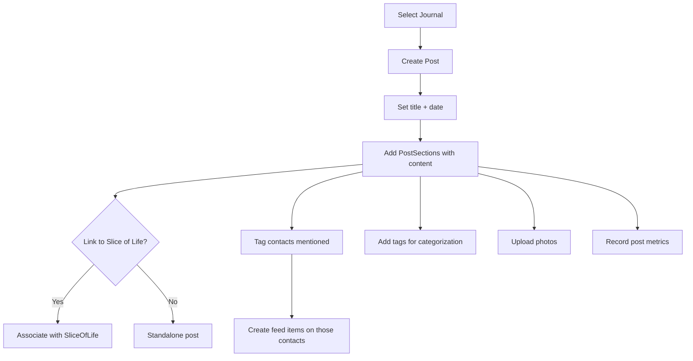
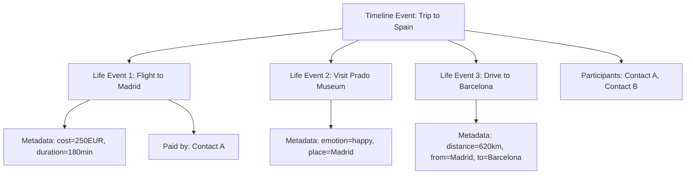

# Journal & Timeline System

## Overview

Monica provides two complementary systems for recording history: **Journals** (structured long-form entries) and **Timeline Events** (contact-centric life events). Journals are vault-scoped, while timeline events connect to specific contacts.

## Journal System

### Data Model

**Journal** (vault-scoped)
- Fields: name, description
- Relations: posts, slicesOfLife, journalMetrics

**Post** (journal entry)
- Fields: title, published, written_at, view_count
- Relations: journal, sliceOfLife, postSections, contacts (M2M), tags (M2M), files (polymorphic), postMetrics
- Computed: excerpt (first 200 chars of first non-null section)

**PostSection** (structured content block)
- Belongs to Post
- Contains the actual content (text sections)

**SliceOfLife** (thematic grouping)
- Fields: name, description, file_cover_image_id
- Groups posts by theme/period (e.g., "Summer 2024", "College Years")
- Has cover image support

**Tag** (vault-scoped)
- Simple name-based tagging for posts
- M2M with Posts

**JournalMetric** (quantified tracking)
- Per-journal custom metrics
- Tracked via PostMetric records on individual posts

### Journal Services (25 services)

| Service | Purpose |
|---------|---------|
| CreateJournal / UpdateJournal / DestroyJournal | Journal CRUD |
| CreatePost / UpdatePost / DestroyPost | Post CRUD |
| AddContactToPost / RemoveContactFromPost | Link contacts to posts |
| AddPhotoToPost | Attach photos |
| AssignTag / RemoveTag | Post tagging |
| CreateSliceOfLife / UpdateSliceOfLife / DestroySliceOfLife | Slice management |
| AddPostToSliceOfLife / RemovePostFromSliceOfLife | Group posts |
| SetSliceOfLifeCoverImage / RemoveSliceOfLifeCoverImage | Cover images |
| CreateJournalMetric / UpdateJournalMetric / DestroyJournalMetric | Metric definitions |
| CreatePostMetric / UpdatePostMetric / DestroyPostMetric | Metric values per post |
| IncrementPostReadCounter | View tracking |

## Timeline System

### Data Model

**TimelineEvent** (vault-scoped)
- Fields: label, started_at, collapsed
- Relations: lifeEvents, participants (contacts M2M)
- Computed: range (date range from first to last life event)
- Represents a period/event that may span multiple days

**LifeEvent** (individual occurrence)
- Fields: summary, description, happened_at, costs, currency_id, paid_by_contact_id, duration_in_minutes, distance, distance_unit, from_place, to_place, place, collapsed
- Relations: timelineEvent, lifeEventType, emotion, currency, paidBy (contact), participants (contacts M2M)
- Rich data capture: costs, duration, distance, places

**LifeEventCategory** (vault-scoped)
- Fields: label, position, can_be_deleted
- Default categories (translatable): Activities, Work & Education, Travel, Milestones, etc.

**LifeEventType** (belongs to category)
- Fields: label, position, can_be_deleted
- Examples: New job, Graduation, Wedding, Trip, etc.

### Timeline Services

| Service | Purpose |
|---------|---------|
| CreateTimelineEvent / UpdateTimelineEvent / DestroyTimelineEvent | Timeline CRUD |
| ToggleTimelineEvent | Collapse/expand |
| CreateLifeEvent / UpdateLifeEvent / DestroyLifeEvent | Life event CRUD |
| ToggleLifeEvent | Collapse/expand |

## Flow Diagrams

### Journal Post Creation

### Timeline Event Structure

## Pipelinq Relevance

- The **Journal + Post + Section** structure is a good model for structured process documentation
- **Slices of Life** concept maps to process phases or project milestones
- **Timeline Events** with nested life events mirror process stages with sub-tasks
- **Post metrics** (quantified values per entry) could inform pipeline KPI tracking
- The contact-linking on posts/events creates a person-process graph that Pipelinq could leverage
