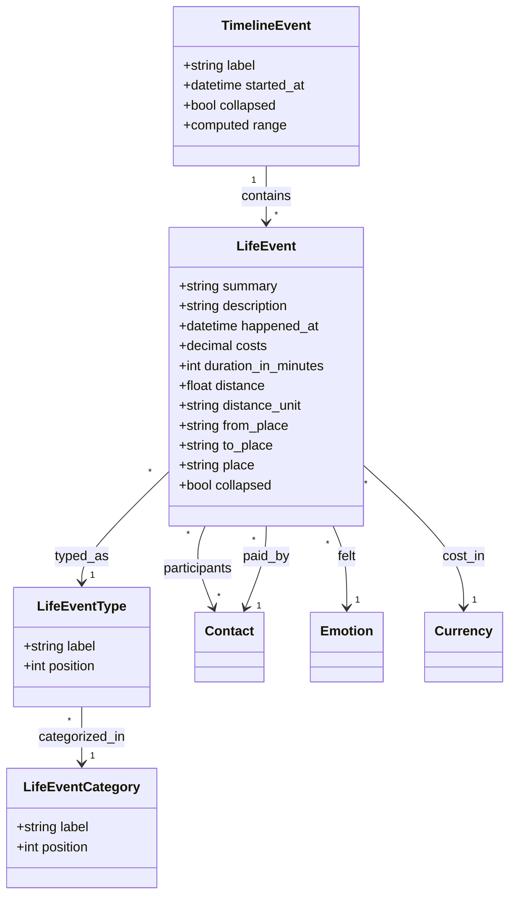

# Life Events

## Overview

Life events are Monica's most richly-modeled feature. They capture significant occurrences in a contact's life with detailed metadata including costs, duration, distance, places, and emotions. Life events are grouped into timeline events for chronological presentation.

## Data Model

### LifeEventCategory (vault-scoped)
- **Fields:** label, label_translation_key, position, can_be_deleted
- Default categories: Activities, Work & Education, Travel, Milestones, Health
- Translatable with custom override, ordered by position

### LifeEventType (belongs to category)
- **Fields:** label, label_translation_key, position, can_be_deleted
- Examples per category:
  - Activities: Sport event, Concert, Party
  - Work: New job, Promotion, Retirement
  - Travel: Trip, Move, Immigration
  - Milestones: Wedding, Baby, Graduation
  - Health: Surgery, Diagnosis, Recovery

### LifeEvent
- **Fields:** summary, description, happened_at, costs, currency_id, paid_by_contact_id, duration_in_minutes, distance, distance_unit, from_place, to_place, place, collapsed
- **Relations:** timelineEvent, lifeEventType, emotion, currency, paidBy (contact), participants (contacts M2M)
- Very rich metadata model

### TimelineEvent (vault-scoped)
- **Fields:** label, started_at, collapsed
- **Relations:** lifeEvents, participants (contacts M2M)
- Groups multiple life events into a coherent narrative
- Computed `range` attribute shows date span from first to last life event

## Services

| Service | Purpose |
|---------|---------|
| CreateTimelineEvent | Creates timeline container |
| UpdateTimelineEvent | Updates label/start date |
| DestroyTimelineEvent | Removes timeline + cascade |
| ToggleTimelineEvent | Collapse/expand in UI |
| CreateLifeEvent | Creates event within timeline |
| UpdateLifeEvent | Updates event details |
| DestroyLifeEvent | Removes event |
| ToggleLifeEvent | Collapse/expand individual event |

## Event Metadata Model

## Pipelinq Relevance

- The **TimelineEvent -> LifeEvent** nesting pattern directly maps to Pipeline Stages -> Activities
- **Cost tracking** per event with currency is relevant for budget-tracked processes
- **Duration and distance** metadata could map to process efficiency metrics
- **Multiple participants** per event is essential for collaborative process tracking
- The **collapsible UI** pattern for event grouping is useful for pipeline visualization
- **Categorized types** (hierarchical: Category -> Type) is a strong pattern for classifying pipeline activities
