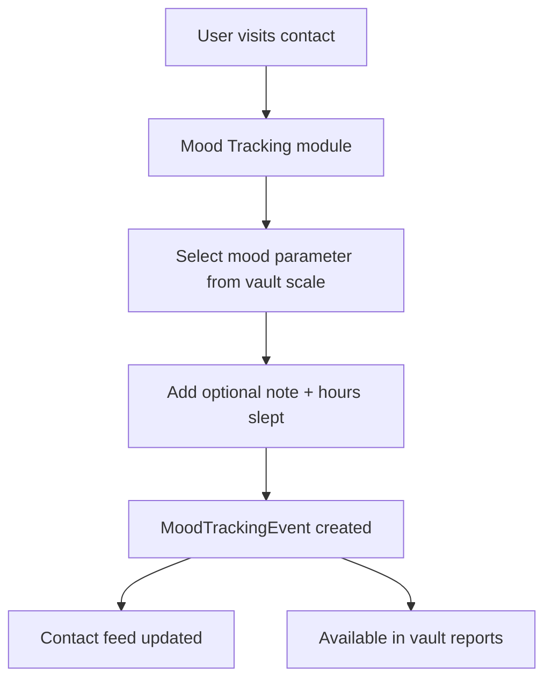

# Mood Tracking

## Overview

Monica includes a mood tracking system that allows users to rate their emotional state in the context of a contact. This is a unique feature in the PRM space, combining relationship management with personal well-being tracking.

## Data Model

### MoodTrackingParameter (vault-scoped)
- Configurable mood scale per vault
- Defines the available mood options (e.g., "Great", "Good", "Okay", "Bad")

### MoodTrackingEvent
- **Fields:** contact_id, mood_tracking_parameter_id, rated_at, note, number_of_hours_slept
- **Relations:** contact, moodTrackingParameter
- **Feed:** Creates feed items (mood_tracking_event_added/updated/deleted)

## Services

| Service | Purpose |
|---------|---------|
| CreateMoodTrackingEvent | Records mood event for a contact |
| UpdateMoodTrackingEvent | Updates mood rating or note |
| DestroyMoodTrackingEvent | Removes mood event |

## Reporting

The vault has a dedicated **Mood Tracking Events** report view under Reports:
```
/vault/{id}/reports/mood-tracking-events
```

## Flow



## Pipelinq Relevance

- Mood tracking is a unique differentiation feature but niche
- The pattern of **configurable parameters per vault** is reusable for any rated/scored metric
- Sleep tracking alongside mood is an interesting personal analytics pattern
- For Pipelinq, this pattern could inspire process health scoring or team satisfaction metrics
