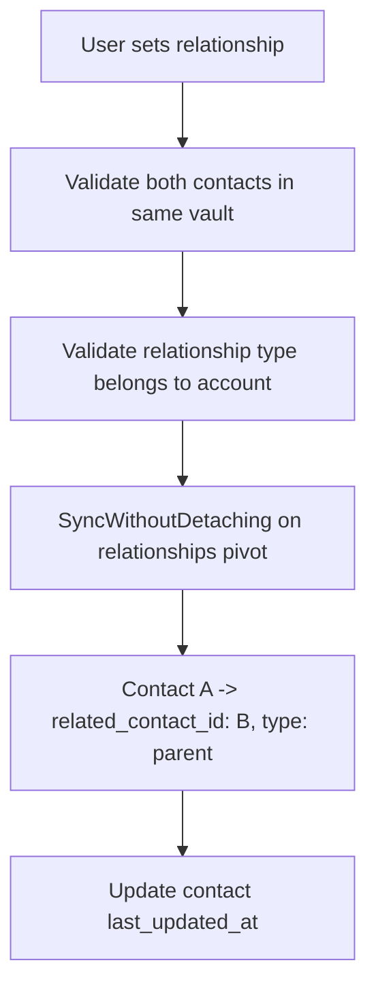

# Relationships

## Overview

Monica tracks bidirectional relationships between contacts using a typed, grouped system. When a relationship is created (e.g., "parent of"), the inverse ("child of") is automatically understood through the reverse naming system.

## Data Model

### RelationshipGroupType (account-scoped)
- **Fields:** name, name_translation_key, type, can_be_deleted
- **Built-in types:** family, love (and custom)
- Translatable names with fallback to translation key

### RelationshipType (belongs to RelationshipGroupType)
- **Fields:** name, name_translation_key, name_reverse_relationship, name_reverse_relationship_translation_key, type, can_be_deleted
- **Key feature:** Each type has both a forward name ("parent") and reverse name ("child")
- Translatable with custom override

### Relationships Pivot
- Self-referential M2M: `contacts` table joined to itself via `relationships` pivot
- Pivot fields: contact_id, related_contact_id, relationship_type_id

## Services

| Service | Purpose |
|---------|---------|
| SetRelationship | Creates relationship between two contacts with type validation |
| UnsetRelationship | Removes relationship between contacts |

## Relationship Flow

## Built-in Relationship Groups

1. **Family:** parent/child, sibling, grandparent/grandchild, uncle-aunt/nephew-niece, cousin, godparent/godchild, stepparent/stepchild
2. **Love:** partner, spouse, ex-partner, ex-spouse
3. **Custom:** Users can create additional groups and types

## Design Notes

- Relationships are stored as a single direction in the pivot table, but the UI shows both directions using `name_reverse_relationship`
- The system uses `syncWithoutDetaching` to prevent duplicates while allowing updates
- All relationship types are translatable (i18n keys with custom override)

## Pipelinq Relevance

- The bidirectional relationship model with reverse naming is elegant for entity linking
- Could be adapted for process-to-process or object-to-object relationships in Pipelinq
- The grouped type system (family/love/work) maps well to categorized link types in a pipeline context
