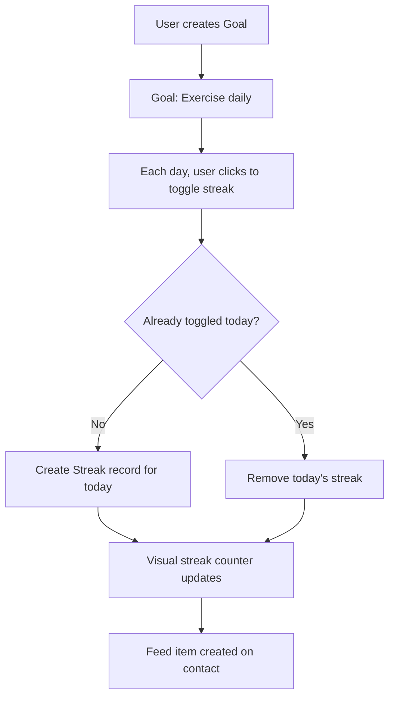

# Tasks & Goals

## Overview

Monica provides two distinct productivity features: **Tasks** (traditional to-do items linked to contacts) and **Goals** (streak-based habit tracking). Both are contact-scoped but have vault-level dashboard views.

## Tasks

### Data Model (ContactTask)
- **Fields:** label, description, completed, completed_at, due_at, author_id, author_name
- **DAV sync:** vcalendar, distant_uuid, distant_etag, distant_uri (CalDAV compatible)
- **Features:** UUIDs, soft deletes, completion scopes (notCompleted, completed)
- **Relations:** contact, author (User)

### Task Services

| Service | Purpose |
|---------|---------|
| CreateContactTask | Creates task linked to contact, with author |
| UpdateContactTask | Updates label, description, due_at |
| ToggleContactTask | Toggles completed status + sets completed_at |
| DestroyContactTask | Soft-deletes task |

### Vault-Level Task View
- Dedicated vault tab (toggleable via show_tasks_tab)
- Aggregates tasks across all contacts in the vault
- Separate views for open and completed tasks

## Goals

### Data Model

**Goal**
- **Fields:** name, active (boolean)
- **Relations:** contact, streaks

**Streak**
- Tracks consecutive completions for a goal
- Enables habit-building visualization

### Goal Services

| Service | Purpose |
|---------|---------|
| CreateGoal | Creates goal for contact |
| UpdateGoal | Updates goal name/active status |
| DestroyGoal | Removes goal |
| ToggleStreak | Records a streak entry for today |

### Goal Mechanism

## CalDAV Integration

Tasks sync with external CalDAV clients:
- Export via `ExportVCalendar` service (VTODO format)
- Import via `ImportVCalendar` service
- Sync tracked via `distant_uuid`, `distant_etag`, `distant_uri`
- Enables Apple Reminders, Thunderbird, etc. integration

## Pipelinq Relevance

- Tasks are simple but the **CalDAV sync** is notable -- allows external task management integration
- **Streak-based goals** are unique in the CRM space and could inspire pipeline health metrics
- The vault-level task dashboard (cross-contact aggregation) maps to pipeline-level task views
- Tasks lack priority, assignee (beyond author), and workflow state -- areas where Pipelinq can differentiate
