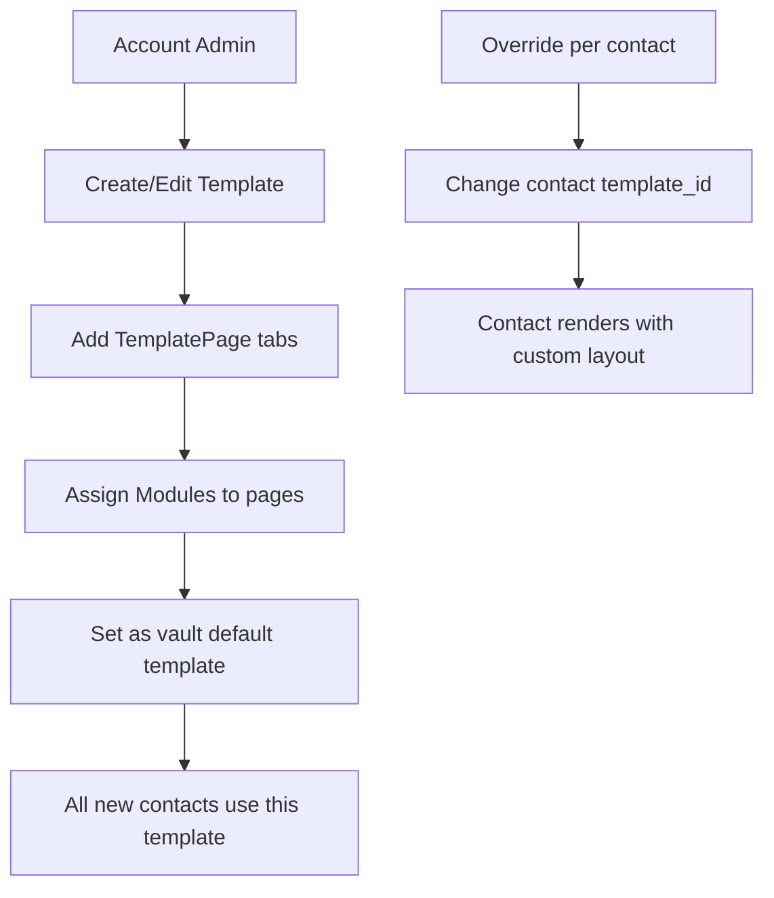

# Vault System (Multi-Tenancy & Permissions)

## Overview

Monica's vault system provides data isolation and permission management within an account. Vaults are the primary container for all contact-related data, with configurable features and per-user access control.

## Data Model

### Account (top-level)
- **Fields:** storage_limit_in_mb
- UUIDs
- Owns: users, vaults, templates, modules, genders, pronouns, currencies, callReasonTypes, giftOccasions, giftStates, postTemplates, religions, contactInformationTypes, addressTypes, petCategories, emotions, groupTypes, relationshipGroupTypes

### Vault (data container)
- **Fields:** name, description, type, default_template_id, default_activity_tab
- **Types:** personal, family, community
- **Toggleable tabs:** show_group_tab, show_tasks_tab, show_files_tab, show_journal_tab, show_companies_tab, show_calendar_tab
- **Relations:** account, template, contacts, labels, users (M2M), companies, groups, journals, tags, loans, files, moodTrackingParameters, lifeEventCategories, timelineEvents, addresses, quickFactsTemplateEntries, lifeMetrics, contactImportantDateTypes

### User-Vault Permissions
- M2M pivot with `permission` and `contact_id`
- **Permission levels:**
  - VIEW (300): Read-only access
  - EDIT (200): Can modify data
  - MANAGE (100): Full control including settings
- Each user automatically gets a Contact record in every vault they join

## Permission Enforcement

Services declare required permissions:
```php
public function permissions(): array {
    return [
        'author_must_belong_to_account',
        'vault_must_belong_to_account',
        'author_must_be_vault_editor',   // requires EDIT (200) or better
        'contact_must_belong_to_vault',
    ];
}
```

The `BaseService` validates these declarations before executing business logic.

## Template System

### Template (account-scoped)
- **Fields:** name, name_translation_key, can_be_deleted
- Defines the layout structure for contact pages

### TemplatePage (belongs to Template)
- Organizes modules into tabs/pages

### Module (account-scoped)
- **22 built-in types:** notes, contact_names, avatar, family_summary, company, feed, gender_pronoun, important_dates, labels, reminders, loans, relationships, tasks, calls, pets, goals, addresses, groups, contact_information, documents, photos, posts, religions, life_events
- **Fields:** name, type, can_be_deleted, reserved_to_contact_information, pagination
- M2M with TemplatePages to define layout

### Module Configuration Flow



## Vault Features

| Feature | Tab Toggle | Description |
|---------|-----------|-------------|
| Contacts | Always visible | Core contact list |
| Groups | show_group_tab | Contact groups with types |
| Tasks | show_tasks_tab | Cross-contact task dashboard |
| Files | show_files_tab | Vault file browser |
| Journal | show_journal_tab | Journals, posts, slices |
| Companies | show_companies_tab | Company directory |
| Calendar | show_calendar_tab | Date-based view |
| Reports | show_reports_tab | Address + mood reports |

## Life Metrics (Vault-level)

**LifeMetric** (vault-scoped)
- Quantified self-tracking metrics
- M2M with contacts (contact_life_metric pivot with timestamps)
- Enables tracking arbitrary numeric values over time

## Pipelinq Relevance

- The **vault isolation** pattern maps to project/workspace isolation in pipeline management
- **Three-tier permissions** are simpler than RBAC but effective for small teams
- The **template + module** system is a powerful pattern for configurable entity pages
  - Pipelinq could offer configurable pipeline stage views using a similar module grid
- **Toggleable tabs** allow vaults to be customized per use case
- The **user-as-contact** pattern (each user has a Contact in their vault) is interesting for process participant tracking
- **Life metrics** (quantified tracking) could inspire pipeline KPI dashboards
