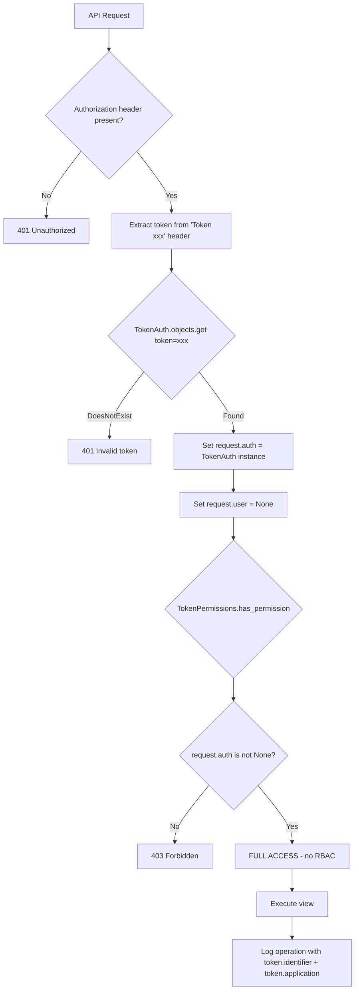

# Authentication & Authorization Flow

## Key Design Decisions

1. **No user association**: Tokens are NOT linked to Django User objects. `request.user` is always `None`.
2. **No RBAC whatsoever**: Any valid token has full read/write/delete access to ALL endpoints.
3. **Audit via token metadata**: Each token has `identifier`, `application`, `organization` fields that are logged with every operation for traceability.
4. **Setup configuration**: Tokens can be provisioned automatically via YAML config during deployment (TokenAuthConfigurationStep).
